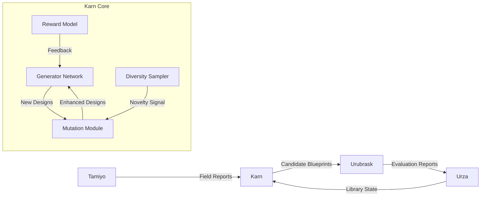
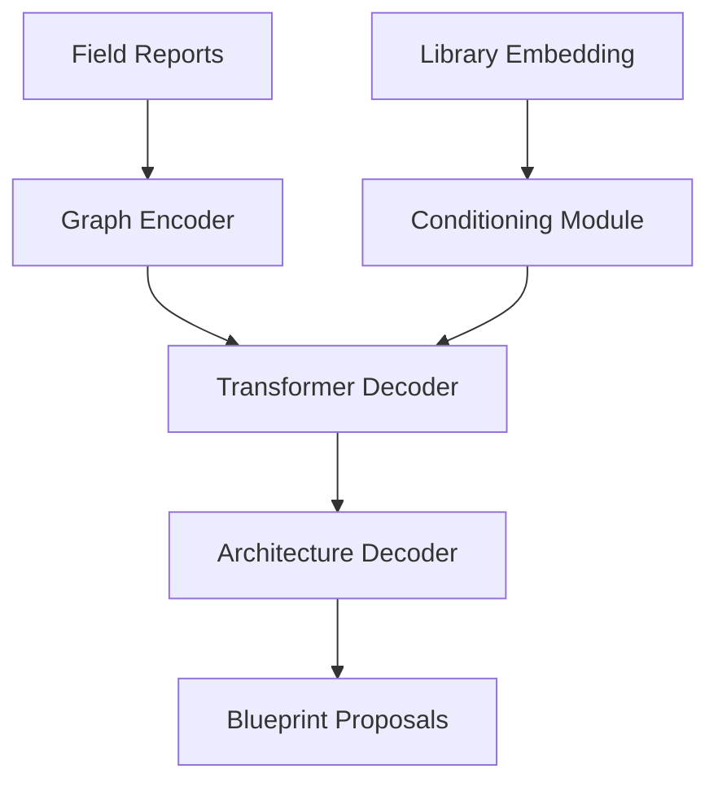
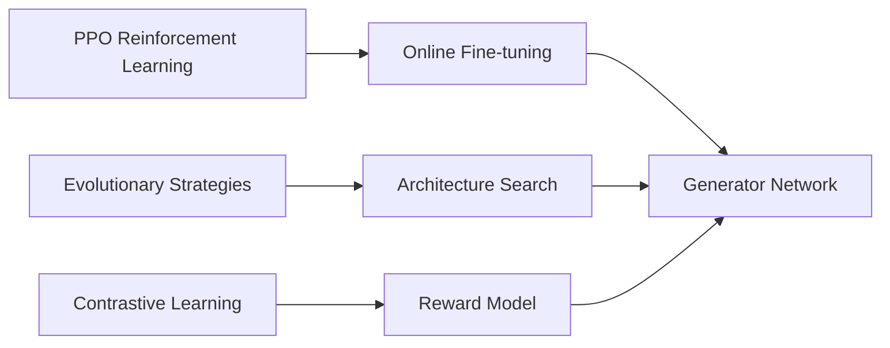
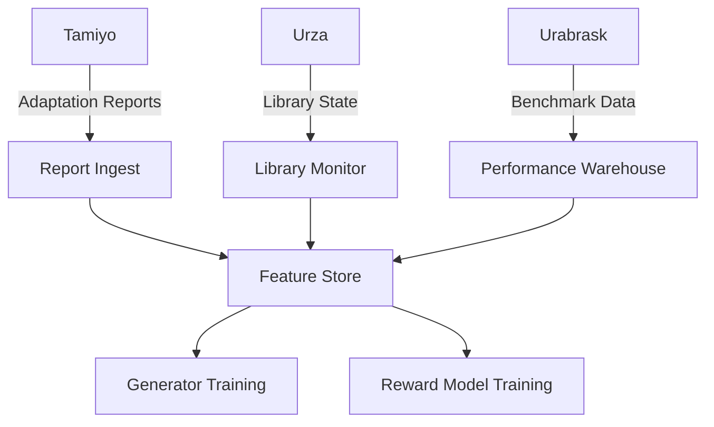
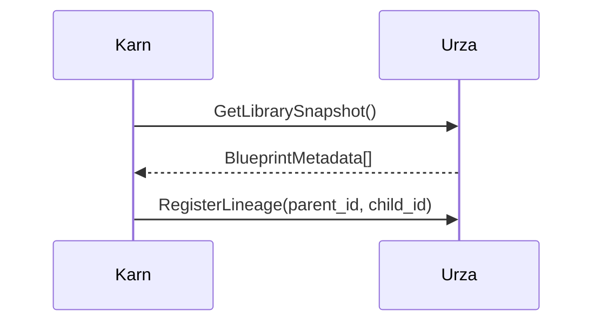
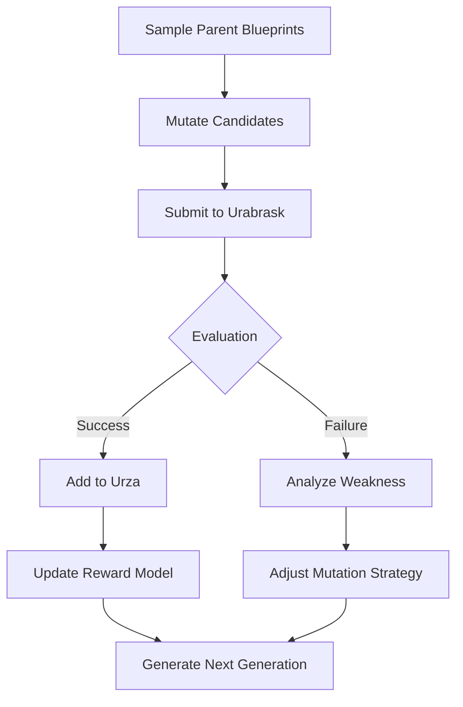

# **System Design Document: Karn - Evolutionary Blueprint Architect**

**Version:** 0.1a
**Status:** Drafting
**Date:** 23 June 2025
**Author:** John Morrissey, Gemini AI

---

## 1. Executive Summary  

Karn is the **generative engine** of the Morphogenetic Architecture, responsible for continuous innovation of seed blueprints. Functioning as the system's R&D department, Karn:

1. Discovers novel neural architectures through evolutionary algorithms  
2. Optimizes blueprints using multi-objective reinforcement learning  
3. Maintains genetic diversity in the blueprint library  
4. Adapts to emerging problem domains  

Karn solves the **architectural innovation problem** by transforming adaptation outcomes into improved future designs while maintaining safety and efficiency constraints.

---

## 2. System Architecture  

### Component Diagram  



---

## 3. Component Deep Dive  

### 3.1 Generator Network  

*Neural architecture search engine*  

**Architecture:**  



**Parameters:**  

- 12-layer transformer decoder  
- 768-dimensional embeddings  
- 150M trainable parameters  
- Graph neural network encoder  

#### 3.2 Reward Model  

*Multi-objective performance predictor*  

**Reward Function:**  

```python  
R = w₁·Δaccuracy - w₂·Δlatency - w₃·Δpower + w₄·novelty  
where:  
  w₁ = 0.6, w₂ = 0.2, w₃ = 0.15, w₄ = 0.05  
```

**Input Features:**  

- Task performance metrics  
- Adaptation stability signals  
- Energy efficiency measurements  

### 3.3 Mutation Module  

*Controlled architecture evolution*  

**Operators:**  

```python  
def mutate(blueprint):  
    op = random.choice([  
        add_attention_head,  
        remove_redundant_layer,  
        substitute_activation,  
        insert_adapter,  
        quantize_block  
    ])  
    return safety_check(op(blueprint))  
```

### 3.4 Diversity Sampler  

*Genetic library management*  

**Novelty Metric:**  

```python  
novelty_score = 1 - max(  
    graph_edit_distance(blueprint, lib_sample)  
    for lib_sample in library_samples  
)  
```

---

## 4. Intelligence Framework  

### Training Methodology  



**Curriculum:**  

1. **Warm-up Phase:** Supervised learning on expert blueprints  
2. **Exploration Phase:** High mutation rate (ε=0.3)  
3. **Exploitation Phase:** Low mutation rate (ε=0.05)  
4. **Convergence Phase:** Diversity-preserving updates  

---

## 5. Data Pipeline  



**Key Datasets:**  

- Field adaptation outcomes (1M+ records)  
- Architectural genealogy graphs  
- Failure mode analysis  

---

## 6. Interfaces  

### Unified Communication Protocol

All inter-component communication follows these patterns:

1. **Commands**: Unary RPC (request-response)
2. **Telemetry**: Client streaming (client-initiated flow)
3. **Bulk Data**: Server streaming (server-pushed chunks)
4. **Control Channels**: Bidirectional streaming (persistent connections)

```protobuf
// Standardized Bulk Transfer Service
service BulkDataService {
  // Server streaming for large payloads
  rpc StreamBlueprints(BlueprintRequest) returns (stream BlueprintChunk);
  rpc StreamEvaluationData(EvalRequest) returns (stream EvalDataset);
  
  // Client streaming for feedback
  rpc StreamFieldReports(stream FieldReport) returns (Ack);
}
```

```protobuf
// Standard Security Envelope
message SecureEnvelope {
  bytes payload = 1;
  string component_id = 2;
  bytes signature = 3;  // ECDSA-SHA256 signature
  uint64 nonce = 4;     // Anti-replay counter
}
```

```protobuf
// Command Error Handling
message CommandError {
  uint32 code = 1;
  string message = 2;
  enum Severity {
    WARNING = 0;
    FATAL = 1;
    RETRYABLE = 2;
  }
  Severity severity = 3;
  string origin_component = 4;
}
```

### 6.1 Tamiyo Feedback Interface  

```protobuf  
message FieldReport {  
  string blueprint_id = 1;  
  string seed_id = 2;  
  double pre_metric = 3;  
  double post_metric = 4;  
  enum Outcome {  
    SUCCESS = 0;  
    FAILURE = 1;  
    ROLLBACK = 2;  
  }
  message EvaluationMetrics {
    float max_latency = 1;
    float avg_memory = 2;
    float gradient_variance = 3;
  }
  EvaluationMetrics eval_metrics = 6;
}  
```

### 6.2 Urubrask Integration  

```python  
class UrubraskClient:  
    def submit_candidate(blueprint: Blueprint) -> str:  
        """Returns submission ID"""  
        
    def get_report(submission_id: str) -> UrubraskReport:  
        """Retrieves evaluation results"""  
```

### 6.3 Urza Library Sync  



---

## 7. Evolutionary Workflow  



---

## 8. Safety Framework  

**Innovation Guardrails:**  

1. **Stability Checks**  

   ```python  
   def is_stable(blueprint):  
       return (  
           blueprint.gradient_norm < 3.0 and  
           blueprint.lipschitz_constant < 5.0  
       )  
   ```  

2. **Failure Analysis**  
   - Automatic root cause classification  
   - Vulnerability pattern detection  

---

## 9. Technology Stack  

TBA.

---

## 10. Performance Targets  

| Metric | Target |  
|--------|--------|  
| Blueprint generation rate | 500/day |  
| Urabrask pass rate | ≥65% |  
| Novelty preservation | ≥0.3 diversity score |  
| Improvement rate | ≥5% Δreward/generation |  
| Training efficiency | 3h/generation (A100x8) |  

*Sample metrics are illustrative; actual targets will be defined post-initial deployment.*

---

## 11. Peer Review Checklist  

1. [ ] Verify mutation operator safety constraints  
2. [ ] Validate reward function weighting  
3. [ ] Test diversity preservation mechanisms  
4. [ ] Audit failure analysis coverage  
5. [ ] Review hardware compliance checks  
6. [ ] Benchmark evolutionary progression  
