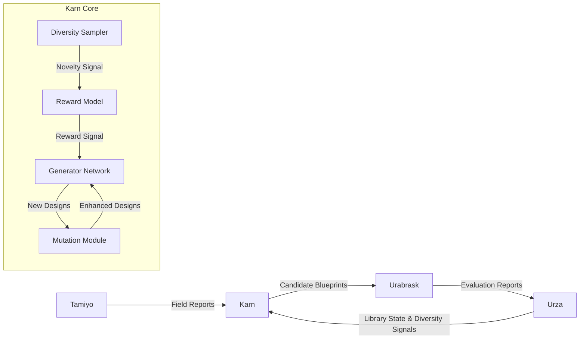
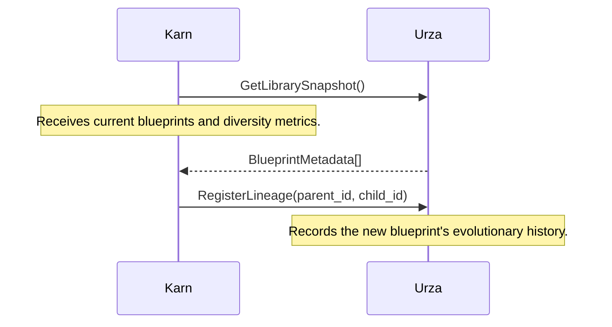

# **System Design Document: Karn - Evolutionary Blueprint Architect**

**Version:** 0.2
**Status:** Drafting
**Date:** 24 June 2025
**Author:** John Morrissey, Gemini AI

-----

## 1. Executive Summary

Karn is the **generative engine** of the Esper Morphogenetic Platform, functioning as the system's autonomous research and development architect. Its primary mandate is to drive the continuous innovation of the neural network sub-modules, or "blueprints," that form the basis of all adaptations within the Esper ecosystem. By discovering novel architectures through evolutionary algorithms and optimizing them with multi-objective reinforcement learning, Karn ensures the platform's toolkit of solutions never stagnates.

Karn systematically solves the **architectural innovation problem**. It transforms the real-world performance outcomes of adaptations, as reported by the Tamiyo controller, into a reward signal that guides the creation of superior future designs. In doing so, it maintains the genetic diversity of the blueprint library, adapts to emerging problem domains, and operates within the safety and efficiency constraints established by the platform, making it the engine of Esper's long-term evolution.

-----

## 2. System Architecture

Karn operates as a central, asynchronous component that learns from the results of the entire Esper platform to generate new, improved blueprints. Its architecture is designed as a closed loop, where its proposals are tested, deployed, and the results of those deployments directly inform the next generation of designs.

### 2.1. Component Diagram

The following diagram illustrates Karn's core components and its interactions with other major systems within the Esper platform.



**Architectural Flow:**

1. Karn receives `Field Reports` from **Tamiyo**, detailing the in-situ performance of blueprints in the live environment. It also monitors the overall state and diversity of the **Urza** library.
2. This data is used to train Karn's internal `Reward Model` and `Generator Network`.
3. The `Generator Network` proposes novel blueprint architectures, which are refined by the `Mutation Module`.
4. These `Candidate Blueprints` are submitted to **Urabrask**, the testing crucible, for rigorous evaluation and risk scoring.
5. Blueprints that pass Urabrask's gauntlet are certified and stored in the **Urza** library, making them available to Tamiyo for future adaptations.

-----

## 3. Component Deep Dive

Karn's intelligence is derived from four key internal components working in concert.

### 3.1. Generator Network

The Generator Network is the neural architecture search (NAS) engine at the heart of Karn. It is a generative model responsible for designing novel blueprint architectures from the ground up.

* **Architecture:** It utilizes a 12-layer transformer decoder with 768-dimensional embeddings, totaling approximately 150 million trainable parameters. A graph neural network (GNN) encoder processes incoming `Field Reports` and existing blueprint structures, which are used to condition the transformer decoder. The decoder then proposes a new architectural graph.
* **Function:** By learning from the vast history of successful and failed adaptations, the generator learns to produce designs that are increasingly likely to be performant, stable, and efficient.

### 3.2. Reward Model

The Reward Model is a multi-objective performance predictor that translates the complex outcomes of a live adaptation into a single, scalar reward signal for training the Generator Network. This model is critical for guiding the evolutionary process toward desirable outcomes.

The reward function balances performance gains against resource costs and novelty:
$$R = w_{1} \cdot \Delta_{\text{accuracy}} - w_{2} \cdot \Delta_{\text{latency}} - w_{3} \cdot \Delta_{\text{power}} + w_{4} \cdot \text{novelty}$$

* **Weights:** $w\_{1}=0.6, w\_{2}=0.2, w\_{3}=0.15, w\_{4}=0.05$.
* **Inputs:** The model ingests task performance metrics (e.g., accuracy improvements from `Field Reports`), adaptation stability signals (e.g., gradient variance), and energy efficiency measurements from Urabrask benchmarks. The novelty score is provided by the Diversity Sampler.

### 3.3. Mutation Module

The Mutation Module enables controlled, fine-grained evolution of existing blueprint architectures. Rather than generating every design from scratch, this module applies discrete, semantics-aware operators to promising parent blueprints, allowing for efficient exploration of the design space.

**Mutation Operators:** The module applies a randomly selected operator from a predefined set, after which a safety check is performed to ensure the mutated blueprint remains valid and stable.

```python
def mutate(blueprint):
    op = random.choice([
        add_attention_head,
        remove_redundant_layer,
        substitute_activation,
        insert_adapter,
        quantize_block
    ])
    return safety_check(op(blueprint))
```

### **3.4 Diversity Sampler**

The Diversity Sampler is responsible for managing the genetic health of the Urza blueprint library. It actively works to prevent architectural stagnation, where the generator might overfit to a narrow set of successful patterns (a local optimum).

* **Novelty Metric:** It calculates a `novelty_score` for each new blueprint by measuring its structural difference from a sample of existing blueprints in the library, using graph edit distance as the primary metric. This score is fed into the Reward Model to incentivize the exploration of new architectures.
* **Exotic Generation via KPI Monitoring:** The Diversity Sampler continuously monitors the "Genetic Diversity" KPI maintained by the Urza library. If Urza reports that this KPI has dropped below the target threshold (e.g., \< 40% unique tensor graphs), the Sampler temporarily increases the weight ($w\_4$) of the novelty score in the Reward Model. This action directly instructs the Generator Network to prioritize creating "exotic" blueprints from less-explored branches of the design space, ensuring the library does not converge prematurely.

-----

## 4. Interfaces

Karn interacts with other Esper components through a set of well-defined, versioned API contracts. All communication utilizes a unified protocol with standardized security envelopes and error handling to ensure robustness and interoperability.

### 4.1. Tamiyo Feedback Interface

The most critical input for Karn is the `FieldReport`, which provides real-world feedback on blueprint performance. This report is generated by Tamiyo at the conclusion of an adaptation lifecycle (`FOSSILIZED` or `CULLED`) or after an emergency `ROLLBACK`. The protobuf schema for this message is as follows, corrected to use the authoritative lifecycle state names.

```protobuf
message FieldReport {
  string blueprint_id = 1;
  string seed_id = 2;
  double pre_metric = 3;  // Global metric before adaptation
  double post_metric = 4; // Global metric after adaptation
  
  // Authoritative outcome mapped directly from the KasminaSeed terminal state.
  enum Outcome {
    FOSSILIZED = 0; // The adaptation was successful and is permanent.
    CULLED = 1;     // The adaptation failed a gate and was discarded.
    ROLLED_BACK = 2;// A catastrophic failure triggered a system checkpoint restore.
  }
  Outcome outcome = 5;

  // Rich evaluation metrics collected by Kasmina during the
  // EVALUATING and FINE-TUNING stages and aggregated by Tamiyo.
  message EvaluationMetrics {
    float max_latency = 1;
    float avg_memory = 2;
    float gradient_variance = 3;
  }
  EvaluationMetrics eval_metrics = 6;
}
```

### 4.2. Urabrask Integration

Karn submits its candidate blueprints to Urabrask for testing and certification via a simple client interface.

```python
class UrubraskClient:
    def submit_candidate(blueprint: Blueprint) -> str:
        """
        Submits a new blueprint to the Urabrask crucible for evaluation.
        Returns a unique submission ID for tracking.
        """
        ...

    def get_report(submission_id: str) -> UrubraskReport:
        """
        Retrieves the full evaluation results and risk profile
        for a completed submission.
        """
        ...
```

### 4.3. Urza Library Sync

Karn synchronizes with the Urza library to retrieve the current state of the blueprint collection and to register the lineage of its new creations, ensuring a complete architectural genealogy is maintained.



-----

## 5. Evolutionary Workflow

Karn's process for generating and refining new blueprints follows a continuous, cyclical workflow, transforming feedback into innovation.

```mermaid
flowchart TD
    A[1. Sample Parent Blueprints<br>(from Urza library)] --> B[2. Mutate or Generate Candidates]
    B --> C[3. Submit to Urabrask<br>(for testing & risk scoring)]
    C --> D{4. Await Evaluation}
    D -- Success --> E[5a. Add to Urza Library]
    D -- Failure --> F[5b. Analyze Failure Mode]
    E --> G[6. Update Reward Model<br>(with positive signal)]
    F --> H[7. Adjust Mutation Strategy<br>or Generator Policy]
    G & H --> I[8. Generate Next Generation]
    I --> A
```

1. **Sampling:** Karn begins by selecting a set of high-performing or novel parent blueprints from the Urza library.
2. **Generation/Mutation:** It applies its `Mutation Module` or `Generator Network` to create a new generation of candidate blueprints.
3. **Submission:** Candidates are sent to the `Urabrask` crucible for performance benchmarking and risk analysis.
4. **Evaluation:** Karn awaits the results. A successful blueprint is one that meets performance targets and is assigned an acceptable confidence level by Urabrask.
5. **Learning:** The outcome, whether success or failure, is used as a signal.
      * **Success:** The blueprint is added to the Urza library, and its positive attributes are used to update Karn's `Reward Model`.
      * **Failure:** The failure mode is analyzed, and this data is used to adjust the generative policy to avoid similar anti-patterns in the future.
6. The cycle repeats, ensuring the blueprint library continuously evolves and improves.

-----

## 6. Performance Targets

The following table outlines the key performance indicators (KPIs) and target goals for the Karn subsystem. These targets will be refined following initial deployment and testing.

| Metric | Target | Description |
| :--- | :--- | :--- |
| **Blueprint Generation Rate** | 500 / day | The number of unique, valid candidate blueprints Karn can produce for evaluation. |
| **Urabrask Pass Rate** | ≥ 65% | The percentage of submitted candidates that pass Urabrask's evaluation and are certified. |
| **ELO Rating** | ≥ 1500 | The average competitive performance rating of a blueprint after 10 evaluations in Urabrask. |
| **Novelty Preservation** | ≥ 0.3 diversity score | The target for the library-wide genetic diversity metric maintained by the Diversity Sampler. |
| **Improvement Rate** | ≥ 5% $\\Delta$reward/generation | The average improvement in the reward function score from one generation of blueprints to the next. |
| **Training Efficiency** | 3 hours / generation | The time required to train the Generator and Reward models for one evolutionary cycle on 8x A100 GPUs. |
