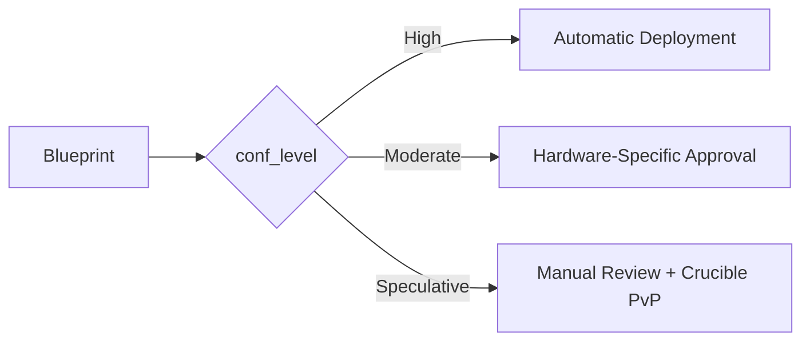

# **Technical Specification: Urabrask, the Blueprint Crucible**

**Version:** 0.1a
**Status:** Drafting
**Date:** 23 June 2025
**Author:** John Morrissey, Gemini AI

## 1  Purpose & Scope

The library is the single source of truth for every seed blueprint that Kasmina can instantiate, Tamiyo can route, and Karn can evolve. It spans the full spectrum—from sub-1 B-parameter “tiny” models that run on micro-controllers right up to >100 B-parameter hyperscale giants—across text, vision, audio, graph, time-series, diffusion and reinforcement-learning domains.

Every entry in the library includes:

* **Tag** – canonical identifier for the blueprint
* **Benefit** – what the seed buys us
* **Sweet‑spot** – model sizes / hardware where it shines
* **Risk (WEP)** – High / Moderate / Speculative

> **Safety note** Primitives flagged with ◊ are considered *risky*; Tamiyo’s outer‑loop shield must enforce a guard‑rail before live deployment.

---

## 2  Universal Metadata Schema

Every `Blueprint` must be exported with a **Universal Metadata Schema** so Tamiyo can make informed decisions about fitness & risk. Urabrask generates blueprint metadata according to a Universal Schema, which is authoritatively defined in the Urza specification. This includes a detailed WEP, a calculated risk_score, and a final conf_level

---

## 3 Initial Seed Catalogue

Section 3 of the detail design for Urza lists the schema for storing blueprints, as well as a set of initial seed blueprints that will be kept as persistent options in the library. These seeds are designed to cover a wide range of tasks and hardware profiles, ensuring that Tamiyo has a rich set of primitives to work with.

---

## 4 Lifecycle, Safety & Ops

### 4.1 Confidence-Gated Deployment Flow



The deployment path for a blueprint is gated by its assigned conf_level. This level is determined by a process executed within Urabrask:

* A comprehensive **Weighted Evaluation Profile (WEP)** is generated from performance, stability, and resource benchmarks.
* A numeric `risk_score` is calculated from the WEP.
* The `risk_score` is mapped to a `conf_level` of 'High', 'Moderate', or 'Speculative'. This ensures that deployment policies are based on a consistent and quantifiable risk assessment.

>
> * **High**: Blueprints with a `conf_level` of "High" are deployed automatically after passing all automated checks.
> * **Moderate**: These blueprints require additional hardware-specific validation to ensure they meet the latency and memory budgets of the target device.
> * **Speculative**: Blueprints tagged as "Speculative" must undergo manual review and may be subjected to further competitive testing before being cleared for deployment.

These updates ensure that the concepts of `conf_level`, `risk_score`, and `WEP` are clearly defined and used consistently, resolving the ambiguity identified in correction #3.

### 4.2 Hardware‑Aware Constraints

```python
class Blueprint(BlueprintBase):
    def __init__(self, *args, 
                 hardware_compatibility: List[str] = ["CUDA", "CPU"],
                 neuromorphic_support: bool = False,
                 quantum_ready: bool = False,
                 **kwargs):
        super().__init__(*args, **kwargs)
        self.hardware_compatibility = hardware_compatibility  # e.g. ["TPUv4", "Loihi2"]
        self.neuromorphic_support = neuromorphic_support      # Supports spike encoding
        self.quantum_ready = quantum_ready                    # Compatible with Pennylane/Qiskit
        
    def validate_hardware(self, target: HardwareProfile) -> bool:
        """Check compatibility with neuromorphic/quantum targets"""
        if target.arch == "NEUROMORPHIC" and not self.neuromorphic_support:
            return False
        if target.arch == "QUANTUM" and not self.quantum_ready:
            return False
        return super().validate_hardware(target)
```

Each blueprint carries lower (min_tflops) and upper (max_mem_gb) hardware bounds. Tamiyo’s planner discards any graft whose silicon envelope does not overlap the target device, preventing an edge sensor hub from even seeing seeds intended for an A100 and vice-versa.

### 4.3 Provenance & Audit Logging

All blueprint CRUD operations append an immutable hash-chained record to Postgres (mirrored nightly to cold storage). Every graft event logs the previous and current hash, blueprint ID, author, timestamp, and WEP rating.

Each graft event logs:

```plaintext
(hash_prev  |  hash_curr  |  blueprint_id  |  author  |  timestamp  |  WEP)
```

### 4.4 Curator KPIs & Auto‑Retirement

Within Urza, a nightly curator pipeline enforces key metrics. These KPIs ensure that the library maintains a healthy balance of performance, safety, and innovation. The full list can be found in section 6 of the detailed design for Urza.

---

## 5  Operational Safety Framework

Tamiyo’s runtime safety net is layered. First, a deterministic Shield enforces hard rules: busts its latency or energy budget, or carries a WEP tag below the host’s minimum, it is vetoed instantly and rolled back. Second, within those guard-rails a Safe-RL policy lets Tamiyo experiment: she learns which seeds boost task fitness while staying inside the shield’s envelope. Finally, promotion follows a disciplined canary pipeline—simulation → shadow traffic → 1 % live rollout—so even an allowed graft has to survive real-world noise before controlling mission-critical traffic. If a fault is detected at any stage, the offending seed is snap-rolled-back, marked “moderate confidence-card”, and Karn is tasked with breeding a safer variant. This tri-layer approach means we gain exploratory freedom without gambling on core functionality.

1. **Shield First:** A heuristic-based veto on latency, energy, risk rating (`conf_level`), and other constraints applied by the parent model. This deterministic Shield is implemented by the `SafetyValidator` within the Tamiyo controller, which uses a `SafetyConfig` profile to enforce these hard limits at runtime before an adaptation can begin.
2. **Safe‑RL Inner Loop:** Tamiyo learns to maximise Δ‑fitness subject to shield.
3. **Canary Pipeline:** sim → shadow‑traffic → 1 % live rollout. Rollback SLA: 150 ms (edge) / 2 s (cloud).

---

## 6  Lifecycle & Curation

New blueprints reach the library through an automated ingestion path: Karn scrapes fresh research, proposes seed graphs, and packages them with the metadata schema. Static analysis checks graph integrity and licence compliance; hardware validation then benchmarks the seed across representative devices. Successful candidates enter the main catalogue tagged Speculative by default. Their WEP rating is upgraded only after they clear the curator KPIs over multiple nightly cycles and hardware profiles. Conversely, seeds that under-perform—falling below the 90 % success line for three consecutive hardware generations or being out-scored by newer designs in more than 80 % of tasks—are automatically retired to an archival tier. The curator also monitors our novelty metric; if diversity dips below 0.25, Karn is instructed to inject “exotic” seeds from less-explored branches of the design space, ensuring the library doesn’t converge prematurely on a local optimum.

* **Automated pipeline** ingests new research via Karn ➔ static checks ➔ hardware validation.
* **Retirement**: success < 90 % over 3 HW gens *or* beaten in >80 % tasks.
* **Novelty preservation**: maintain diversity metric > 0.25 to avoid converging on local minima.

---

## 7  Open Items (v1.0 todo)

Edge-benchmarks for FlashAttention Lite vs MQA. We need a clean apples-to-apples run on a Jetson Orin Nano, capturing perplexity, latency and joules-per-token, so Tamiyo has solid priors when choosing attention variants on low-power probes.

End-to-end JSON-schema validation in CI. A lightweight pytest plugin will parse every blueprint stub on each pull request, guaranteeing the metadata contract stays intact as the library grows.

Risk-index population from fresh Crucible data. The current risk_level_idx numbers are seeded from historical runs; they must be refreshed once the new canary system starts producing live failure-rate metrics.
