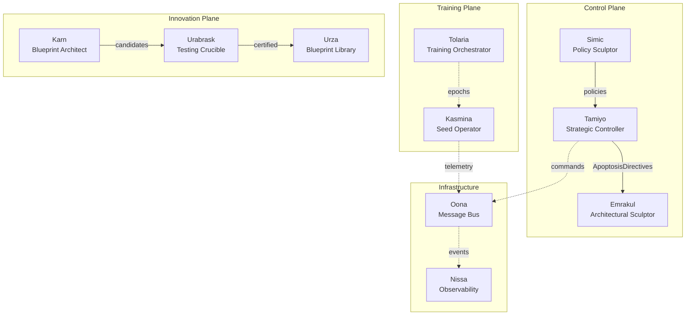
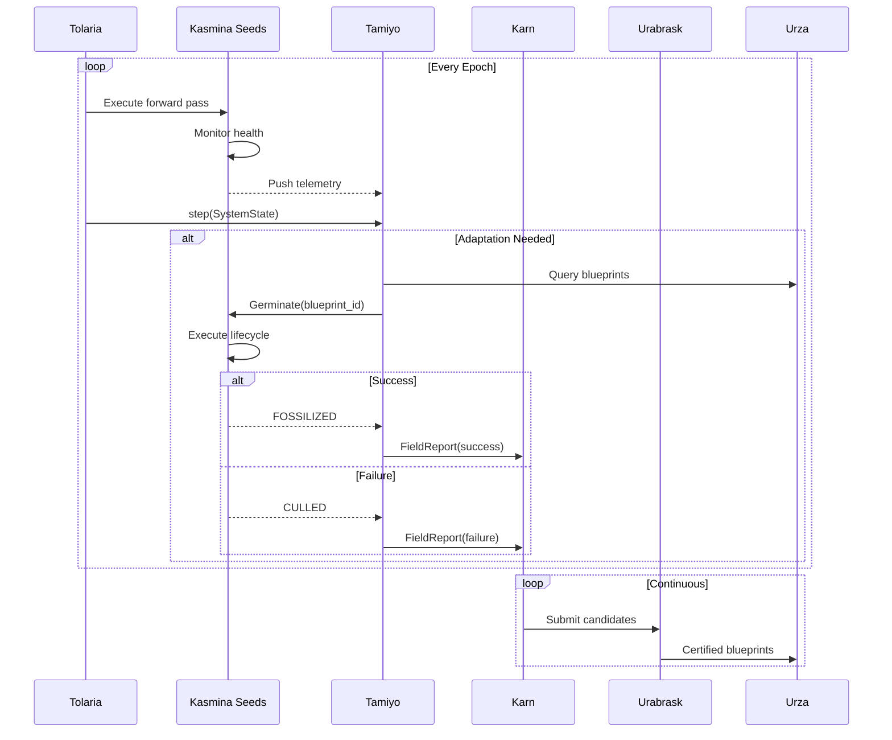
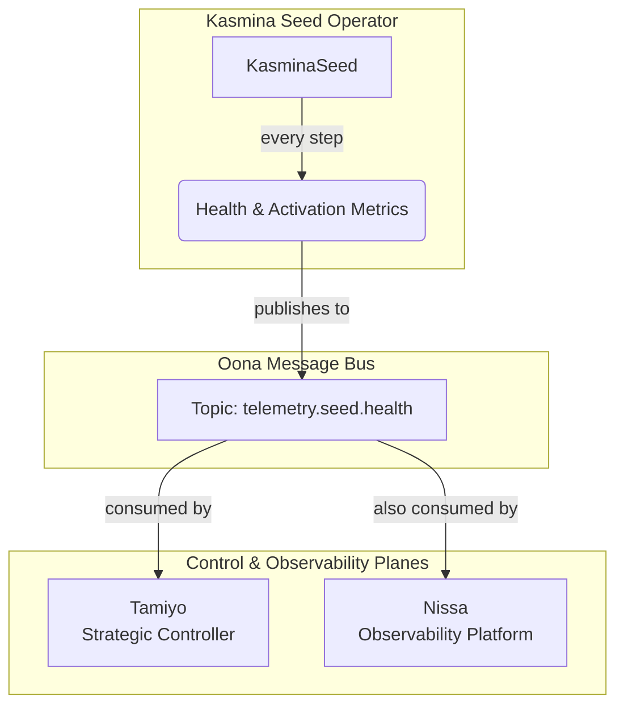
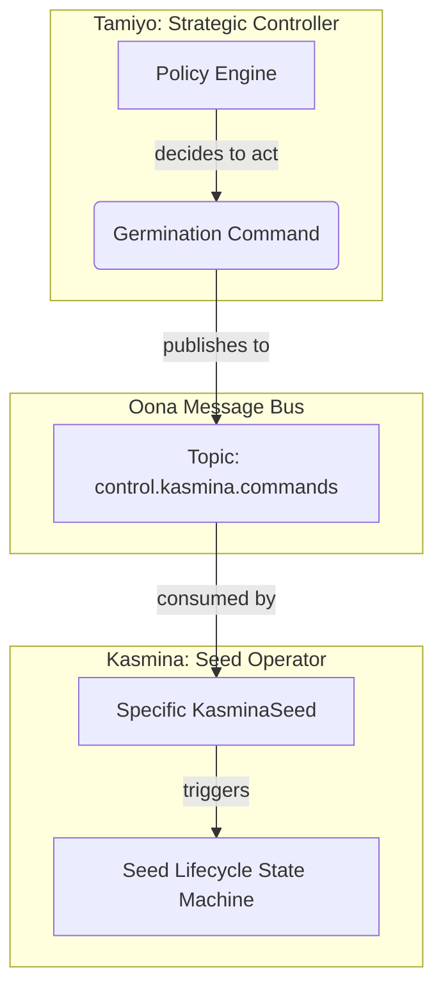
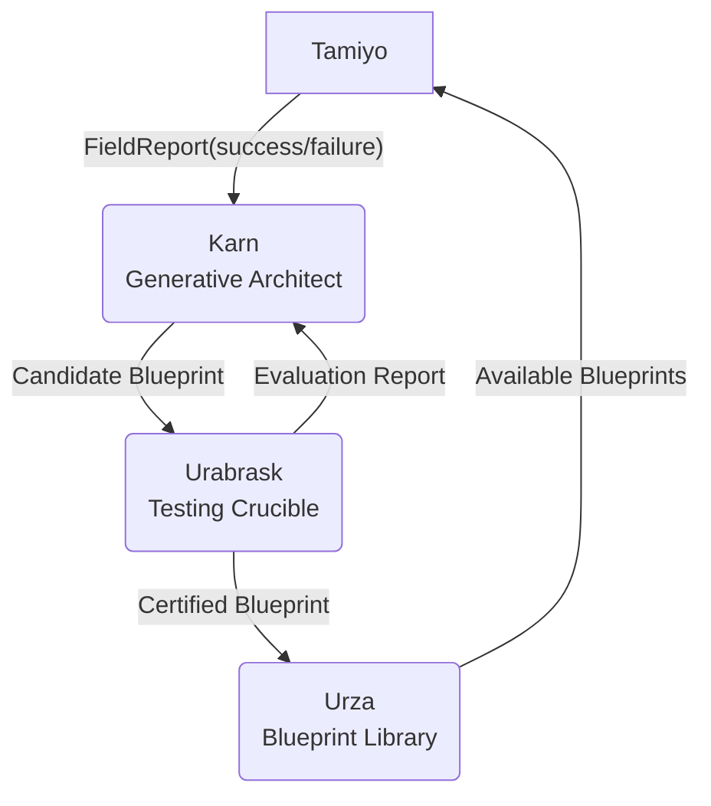
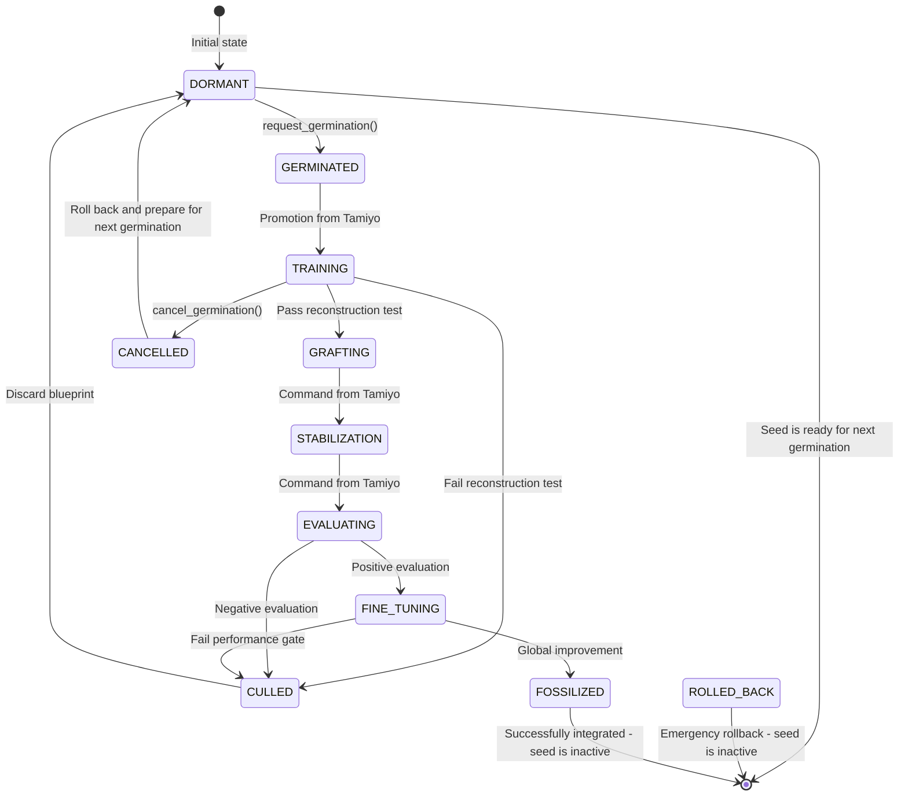
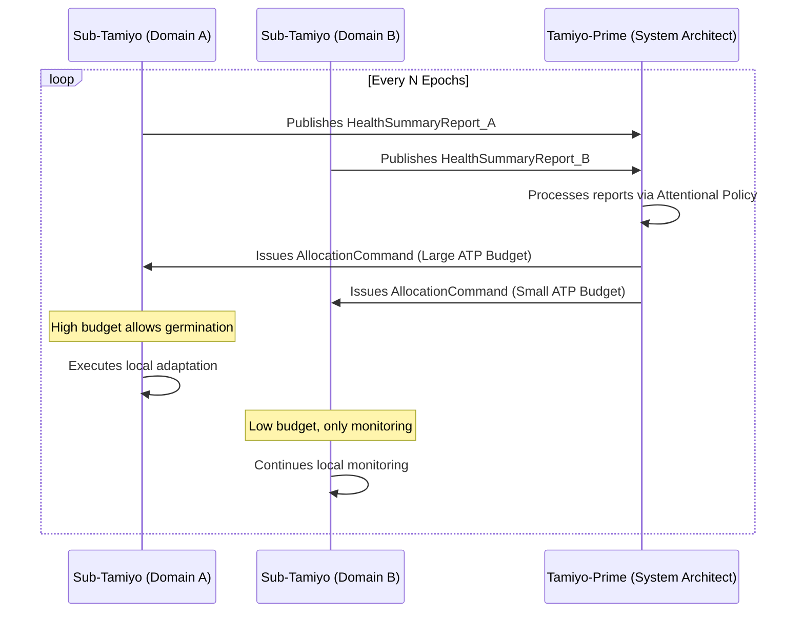

# **High Level Design: Esper - Morphogenetic Training Platform**

**Version:** 1.1  
**Status:** Draft  
**Date:** 28 June 2025  
**Author:** John Morrissey  
**Document Type:** High Level Design (HLD)

## Executive Summary

### Overview

The Esper Morphogenetic Training Platform represents a fundamental shift in how neural networks are designed, trained, and deployed. Rather than treating neural networks as static artifacts that must be carefully architected and then frozen, Esper enables models to function as adaptive, evolving entities capable of autonomous structural modification while they are being trained.

This High Level Design document specifies the complete architectural framework for implementing morphogenetic architectures—neural networks that can detect their own computational bottlenecks and patch them in-situ by grafting specialized sub-networks called Blueprints into their structure. The result is a system that delivers targeted performance improvements with exceptional parameter efficiency while maintaining rigorous safety guarantees.

### Core Innovation

The central innovation of Esper lies in its use of two sophisticated neural network agents that govern the entire adaptation process. The Strategic Controller (Tamiyo) continuously analyzes the host model during its training loop, treating it as a complex adaptive system, and identifying precisely where and when architectural interventions will yield the greatest benefit. The Generative Architect (Karn) operates as an automated research and development engine, continuously inventing and refining new architectural primitives that expand the system's problem-solving capabilities. This creates a Nested Learning Paradigm where multiple learning processes operate simultaneously: the base model learns its primary task, the controller learns optimal intervention strategies, and the architect learns to design better solutions.

This approach fundamentally addresses the limitations of current neural network architectures. Traditional models must be over-provisioned for worst-case scenarios, wasting computational resources on uniform capacity distribution. They cannot adapt to changing requirements without expensive retraining. Most critically, they cannot improve themselves—every enhancement requires human intervention. Esper changes this paradigm by enabling models that grow capacity precisely where needed, continuously improve their architecture, and adapt to new requirements while maintaining stable performance on existing capabilities.

### Architectural Approach

The Esper reference architecture implements these concepts through ten specialized subsystems organized into three functional planes. The Training Plane manages the core learning process through Tolaria (the training orchestrator) and Kasmina (the distributed seed operators that perform low-level monitoring and adaptation). The Control Plane provides intelligent decision-making through Tamiyo (the strategic controller), Simic (the policy training environment) and Emrakul (the architectural sculptor). The Innovation Plane drives continuous improvement through Karn (the generative architect), Urabrask (the testing crucible), and Urza (the blueprint library). Additionally, Oona serves as the message bus for inter-component communication, while Nissa provides observability and auditing capabilities.

These components communicate through an event-driven architecture using the Oona message bus, ensuring loose coupling and enabling independent evolution of subsystems. The Nissa observability platform provides comprehensive monitoring and auditing capabilities, creating complete transparency into the system's operation and decision-making processes.

The architecture incorporates multiple safety mechanisms to ensure that autonomous adaptation never compromises system stability. Every potential adaptation undergoes an 11-stage lifecycle with three distinct validation phases. The Testing Crucible (Urabrask) rigorously evaluates every new blueprint before it can be deployed. The Strategic Controller includes both learned policies and deterministic safety checks. Failed adaptations can be rolled back instantly, and the entire evolutionary history is cryptographically tracked for complete auditability.

### Implementation Strategy

The implementation follows a carefully planned two-phase approach. Phase 1 focuses on validating the core morphogenetic mechanics through a single-server deployment suitable for smaller models and research environments. This phase, targeted for completion within three months, will demonstrate the fundamental viability of autonomous architectural evolution and establish baseline performance metrics.

Phase 2 expands the system into a fully distributed, production-ready platform leveraging Kubernetes for orchestration and capable of handling large-scale models and concurrent training runs. This phase, planned over twelve months, will add enterprise-grade security, comprehensive MLOps integration, and the scalability required for production deployment.

### Expected Outcomes

Organizations implementing the Esper platform can expect transformative improvements in how they develop and deploy neural networks. The system delivers dramatic parameter efficiency, requiring 10 to 100 times fewer parameters than traditional fine-tuning approaches while achieving comparable or superior performance gains. Models demonstrate exceptional stability, maintaining less than 5% performance degradation on original tasks even after numerous adaptation cycles.

From an operational perspective, Esper enables the deployment of truly adaptive AI in domains where traditional retraining is infeasible or dangerous. The platform's comprehensive audit trail and safety mechanisms make it suitable for regulated industries where model behavior must be traceable and predictable. The automated architectural exploration accelerates research and development cycles, allowing organizations to discover optimal architectures without manual intervention.

### Current Status and Next Steps

The project has successfully validated its foundational concepts and established the core architecture. A functional single-node prototype demonstrates the end-to-end morphogenetic process on benchmark tasks. The immediate priorities for the next quarter focus on implementing the neural policies for the Strategic Controller and Generative Architect, conducting comprehensive benchmarking against traditional approaches, and hardening the security architecture.

This High Level Design provides the blueprint for building a new class of self-improving AI systems. By enabling neural networks to evolve their own architecture while maintaining safety and predictability, Esper represents a fundamental advance in how we conceptualize, train, and deploy artificial intelligence. The framework transforms machine learning models from static artifacts requiring constant human oversight into autonomous systems capable of continuous self-improvement within rigorously defined safety boundaries.

---

## **1. Document Purpose and Scope**

### **1.1. Purpose**

The purpose of this document is to provide the formal framework and technical reference architecture for implementing **Morphogenetic Architectures**. It serves as the primary engineering counterpart to the foundational research on the topic, translating the theoretical principles of seed-based evolution into a concrete, reproducible system design.

A core innovation detailed in this framework is the move beyond simple, heuristic-based adaptation. This document specifies an architecture driven by two distinct, learning-based agents:

1. A **Strategic Controller Network** that learns to analyze the entire host model as a system, identifying and targeting the most critical areas of underperformance with contextual awareness.
2. A **Generative Architect Network** that continuously invents, tests, and refines novel sub-network primitives (Blueprints), ensuring the system's problem-solving capabilities evolve over time.

By detailing the design for these intelligent agents, this framework provides the blueprint for a truly autonomous system that learns not only how to fix itself, but how to get better at inventing solutions.

### **1.2. Scope**

To effectively define the system, the scope of this document is bounded as follows:

**In Scope:**

* **Primary Use Case (Proof of Concept):** The framework's initial validation focuses on demonstrating Tamiyo's role as a strategic architect that monitors a host model during its initial training, identifying learning bottlenecks and patching in new capacity to improve the final trained artifact.
* **Architectural Framework:** A detailed description of the logical components, including the design for a **learning-based Strategic Controller** (for intelligent targeting) and a **Generative Architect** (for creating new structural primitives).
* **Data Contracts:** Precise schemas and definitions for core entities, including `Seeds`, `Blueprints`, and the `telemetry` signals required by the controller.
* **The Morphogenetic Lifecycle:** A formal definition of the state machine governing a seed's evolution from `DORMANT` through `GERMINATED`, `TRAINING`, `GRAFTING`, and finally to `FOSSILIZED` or `CULLED`.
* **Architectural & Training Constraints:** The set of rules that a host network must satisfy to support adaptation, and the MLOps/RL training requirements for the controller and architect agents.
* **Reference Interfaces:** High-level API and communication protocol definitions for interaction between the system's components.
* **Evaluation Strategies:** Methodologies for assessing the stability of adaptations and the performance of the controller and architect networks.
* **MVP Reference Design:** A high-level design for a prototype system demonstrating the core concepts on benchmark tasks.

**Out of Scope:**

* **Re-derivation of Foundational Theory:** This document will assume the reader is familiar with the general concepts of monitoring and germination as detailed in the parent research paper. It will not reproduce the mathematical proofs.
* **Exhaustive Literature Review:** While prior art is surveyed, this is not intended as a comprehensive academic review of reinforcement learning for NAS or graph neural networks.
* **Low-Level Implementation Details:** This document specifies architectures and interfaces, not specific code implementations, function signatures, or class-level designs.
* **Production-Hardening:** The focus is on a functional MVP framework. Concerns such as advanced security, large-scale deployment orchestration, and enterprise-grade observability are noted but not specified in detail.
* **Specific Hardware Optimization:** The framework is designed to be hardware-aware, but it is not a compiler or optimization guide for specific GPU/TPU/NPU targets.
* **Post-Training Adaptation:** Enhancing already trained and frozen models is a valuable future application but is out of scope for the initial proof-of-concept, which focuses on in-training adaptation.

### **1.3. Relationship to Prior Work**

This framework is the direct successor to the research presented in **[Morphogenetic Architectures: A Formal Framework for Localized Structural Evolution in Frozen Neural Networks]**. That paper examined the theoretical possibility and core process for localized structural evolution. This document takes the next logical step by defining the robust, extensible architecture—including the intelligent agents required—to realize and autonomously guide that process in a functioning software system.

---

## **2. Conceptual Framework & Value Proposition**

### **2.1 A Paradigm of Living Architectures**

This framework introduces **Morphogenetic Architectures**, a class of neural networks that rejects the paradigm of static, immutable design. Instead, it enables models to function as adaptive, evolving entities. The core purpose of this framework is to provide the technical means for a neural network to **autonomously detect its own computational or representational bottlenecks and patch them in-situ** by intervening directly in the training process itself.

This is achieved by grafting specialized, trainable sub-networks, or **Blueprints**, into a larger host model as it is being trained, transforming the training loop itself into a dynamic process of architectural discovery. This process transforms models from rigid, pre-compiled artifacts into dynamic systems capable of targeted, surgical growth in response as its needs emerge through the training process.

### **2.2 Key Innovation: The Learning-Based Control System**

The central innovation of the Morphogenetic Framework is its use of a **learning-based control system** to guide the entire evolutionary process. This replaces static rules or simple heuristics with a pair of intelligent, symbiotic neural networks that govern adaptation:

1. **The Strategic Controller:** A dedicated policy network that analyzes the entire host model as a complex system. It learns to **identify and target systemic weaknesses** with high precision, going beyond simple local metrics to understand the contextual source of underperformance. It acts as the system's "diagnostician," deciding *where* and *when* intervention is most needed.
2. **The Generative Architect:** A generative model responsible for continuously **inventing novel architectural primitives (Blueprints)**. By creating and proposing new solutions for testing, it provides an evolutionary pressure on the system's library of available adaptations. It acts as the system's "R&D lab," ensuring the platform's problem-solving capacity is never static.

These two agents enable a **Nested Learning Paradigm**, where multiple learning cycles operate simultaneously at different scales: the foundational training of the host model, the policy training of the Strategic Controller, and the generative training of the Architect.

### **2.3 Core Value Proposition**

A system built on this framework delivers fundamental advantages over traditional static models:

* **Adaptive Performance:** Models automatically grow capacity precisely where needed, resolving bottlenecks without wasteful, uniform parameter scaling.
* **Continuous Innovation:** The architecture is a self-improving asset, capable of inventing and integrating novel solutions through its own evolutionary design process.
* **Operational Safety:** A multi-stage validation lifecycle for every adaptation prevents unstable or harmful modifications from being permanently integrated into the host model.
* **Resource Efficiency:** Targeted capacity injection is dramatically more parameter-efficient than full model retraining or fine-tuning. This is best demonstrated by the framework's core application: enhancing knowledge distillation. By embedding a seed lattice into a smaller "student" model (e.g., 3B parameters) at the start of its training, the system can distill knowledge from a larger "teacher" model (e.g., 7B parameters) more effectively. While Tolaria manages the distillation training, Tamiyo monitors the student model's learning process in real-time. She can then concurrently grow targeted capacity via germination precisely where the student model struggles most to absorb the teacher's complexity. This unified process directly solves the core industry trade-off between model size and performance, producing an efficient, edge-ready model that retains the critical capabilities of its much larger parent.

### **2.4 Capabilities of a Morphogenetic System**

A system successfully implementing this framework will demonstrate the following capabilities, establishing significant advances in how neural networks are trained, deployed, and maintained.

#### **2.4.1 Theoretical & Foundational Validation**

* Demonstrates the viability of **seed-driven local evolution**, establishing that targeted structural adaptation can occur within frozen networks without catastrophic forgetting.
* Validates that neural networks can achieve **autonomous architectural self-modification** while maintaining global functional stability.
* Establishes formal methods for verifying **interface contract preservation** and **gradient isolation**, ensuring the safety of grafting live, trainable modules into a frozen host.

#### **2.4.2 Novel Training & Adaptation Paradigms**

* Successfully implements the **Nested Learning Paradigm**, where the controller and architect agents are trained based on feedback from the host model's performance.
* Demonstrates **policy-governed germination** as a safe and intelligent alternative to unconstrained neural architecture search.
* Proves that **local objective encapsulation** enables targeted capacity expansion and localized learning without requiring global retraining.

#### **2.4.3 Architectural & Engineering Innovations**

* Implements **cryptographic lineage tracking**, creating auditable, biographical architectures where every modification is securely recorded.
* Achieves robust **multi-stage lifecycle validation** (e.g., isolated training, controlled grafting, stabilization, evaluation) to rigorously test and de-risk every potential adaptation.
* Provides **open-source reference implementations and formalisms** (seeds, germination, grafting, fossilization) to enable broader research in adaptive architectures.

#### **2.4.4 Empirical Benchmarks & Performance**

* **High-Fidelity Germination:** The ability to resolve identified bottlenecks with >90% accuracy on canonical benchmark tasks (e.g., XOR, CIFAR-10).
* **Stability & Low-Impact Adaptation:** Demonstrates <5% performance degradation on original tasks after numerous (20+) successful germination events.
* **Exceptional Parameter Efficiency:** Achieves targeted performance gains with >80% greater parameter efficiency compared to full model fine-tuning approaches.
* **Representational Integrity:** Maintains <0.05 cosine drift in the latent representations of un-modified sections of the network, proving the effectiveness of gradient isolation.

These capabilities collectively enable a fundamental shift from building static ML artifacts to engineering dynamic, evolving, and truly adaptive intelligent systems.

---

## **3 Scientific Context & Validation**

### **3.1 Scientific Challenge**

Current neural network training paradigms face fundamental limitations that constrain their deployment in real-world adaptive systems:

* **Architectural Rigidity**: Once a network topology is defined, it remains immutable throughout its operational lifetime, preventing adaptation to emergent computational needs or changing task requirements.
* **Catastrophic Forgetting**: Traditional continual learning approaches that modify weights globally suffer from destructive interference, making safe, incremental capability expansion infeasible.
* **Monolithic Optimization**: Current training methods optimize all parameters simultaneously, preventing targeted capacity injection at identified bottlenecks.
* **Opaque Evolution**: Existing neural architecture search methods lack interpretability, auditability, and safety guarantees required for deployment in critical systems.
* **Resource Inefficiency**: Models must be over-provisioned for worst-case scenarios, wasting computational resources on uniform capacity distribution.

### **3.2 Research Approach**

The morphogenetic approach introduces a novel scientific framework that fundamentally reimagines neural networks as systems capable of controlled, localized structural evolution. This approach synthesizes insights from:

#### **3.2.1 Biological Morphogenesis**

* Seeds as multipotent stem cells with latent developmental potential.
* Germination as controlled differentiation in response to local signals.
* Apoptosis-inspired rollback mechanisms for failed adaptations.

#### **3.2.2 Distributed Systems Theory**

* Separation of control (the **Strategic Controller**) from execution (the **Seed Operator**).
* Event-driven architecture for loose coupling and fault tolerance.
* Immutable audit logs for system observability.

#### **3.2.3 Continual Learning**

* Elastic Weight Consolidation principles applied at the architectural level.
* Gradient isolation to prevent interference with frozen parameters.
* Local objective encapsulation for targeted learning.

The research methodology follows three complementary investigation threads:

1. **Theoretical Foundations**: Establishing formal frameworks for seed-based evolution, interface contracts, and safety bounds.
2. **Systems Engineering**: Building robust, scalable infrastructure for managing distributed morphogenetic processes.
3. **Empirical Validation**: Comprehensive evaluation across diverse tasks, architectures, and deployment scenarios.

### **3.3 Scientific Validation Criteria**

Success will be measured through rigorous empirical and theoretical validation across multiple dimensions.

From a theoretical perspective, the research must establish fundamental guarantees about system behavior. This includes developing a formal proof that gradient isolation mechanisms maintain the integrity of frozen parameters throughout the adaptation process, ensuring that no unintended modifications occur to the base model. Additionally, we will derive mathematical bounds on cumulative drift over extended evolution cycles, quantifying the maximum deviation from original model behavior after successive adaptations. The work will also establish a theoretical framework for local function approximation under frozen priors, providing the mathematical foundation for understanding how seeds can learn meaningful transformations within constrained parameter spaces. Finally, we aim to prove convergence guarantees for seed-specific optimization objectives, demonstrating that local learning processes reliably reach stable solutions.

Empirical validation will focus on demonstrating practical effectiveness across diverse scenarios. The system must achieve greater than 90% success rate in resolving identified computational bottlenecks, validating that the morphogenetic approach reliably addresses the problems it detects. Critically, stability preservation must be maintained, with less than 0.5% degradation on original tasks even after 20 or more adaptation cycles. The parameter efficiency of the approach should yield dramatic improvements, requiring 10 to 100 times fewer parameters than traditional full model retraining while achieving comparable performance gains. All of this must be accomplished with minimal computational overhead, maintaining inference latency increases below 5% to ensure practical deployability.

The system itself must exhibit robust engineering properties that enable reliable deployment. Deterministic reproduction is essential, guaranteeing identical outcomes given the same seed state and inputs, which is crucial for debugging and regulatory compliance. The rollback mechanism must achieve 100% reliability in restoring systems to their pre-germination state when adaptations fail validation. Every structural modification must be fully traceable through comprehensive audit logs, enabling complete reconstruction of a model's evolutionary history. The approach must demonstrate cross-architecture generalization, successfully operating across MLPs, CNNs, and Transformer architectures to validate its broad applicability.

Safety validation represents a critical component of the research, ensuring the system can be trusted in production environments. Interface integrity must be absolute, with zero tolerance for shape mismatches or type violations that could cause runtime failures. Resource consumption must strictly adhere to predefined memory and compute budgets, preventing runaway growth. The system must demonstrate adversarial robustness, resisting attempts to force unnecessary germination through crafted inputs. Long-term stability is paramount, with bounded drift guaranteed even after thousands of adaptation cycles, ensuring that deployed systems remain predictable and reliable over extended operational periods.

### **3.4 Scientific Impact**

This research aims to establish morphogenetic architectures as a foundational paradigm shift in machine learning, with cascading implications across the field.

The immediate contributions to the scientific community include establishing a new vocabulary and conceptual framework for understanding and designing adaptive neural systems. By providing an open-source reference implementation, the work enables reproducible research and accelerates adoption of morphogenetic principles. The comprehensive evaluation methodologies developed will serve as benchmarks for future work in local evolution systems, while the formal safety protocols establish standards for responsible architectural modification in deployed systems.

In the medium term, this research opens pathways for significant advances in how we deploy and manage AI systems. It enables the deployment of truly adaptive AI in safety-critical domains where traditional retraining is infeasible or dangerous. By allowing targeted capacity allocation only where needed, it dramatically reduces computational waste in overprovisioned models. The automated exploration capabilities accelerate neural architecture research by orders of magnitude, while bridging the currently vast gap between static inference models and true lifelong learning systems.

The long-term vision extends beyond incremental improvements to fundamentally transform our relationship with neural networks. By establishing neural ontogeny as a discrete engineering discipline, we create a new field of study focused on the developmental aspects of artificial intelligence. This enables the creation of self-improving AI systems with rigorous safety guarantees, moving beyond the current paradigm of static, manually designed architectures. The foundations laid by this work will enable ambient intelligence that naturally adapts to its environment without human intervention. Ultimately, this research transforms neural networks from static artifacts that must be carefully crafted and frozen, into living, evolving systems that grow and adapt throughout their operational lifetime while maintaining safety and predictability.

### **3.5 Research Questions**

This work addresses fundamental questions at the intersection of machine learning, systems engineering, and theoretical computer science:

1. Can neural networks safely modify their own architecture during deployment without compromising learned capabilities?
2. What minimal infrastructure is required to ensure controlled, auditable structural evolution?
3. How can we formally verify that local adaptations preserve global system properties?
4. What are the theoretical limits of expressivity for seed-based architectural growth?
5. Can morphogenetic systems achieve better parameter efficiency than traditional transfer learning?

---

## **4. Reference Architecture Overview**

This chapter outlines the logical reference architecture, codenamed **Esper**, that implements the principles of the Morphogenetic Framework. It provides a concrete example of how the framework's concepts can be realized in a functioning system. While this design describes functionally distinct subsystems, the initial **Phase 1 implementation** will co-locate these components on a single server to validate the core mechanics on smaller-scale models.

### **4.1 High-Level Architecture**

The Esper reference implementation operates as a system of ten specialized subsystems organized into three functional planes. This ensures a clear separation of concerns between training, control, and innovation, and is designed for future distribution, even when co-located in Phase 1.



*Note: In the Phase 1 single-server implementation, these "planes" and "subsystems" represent logical separations of concern that may be realized as distinct processes or even modules within a single application. This design ensures that the system can be scaled out into a fully distributed architecture in subsequent phases.*

### **4.2 Core Concepts**

#### **4.2.1 Seeds**

Seeds represent the fundamental unit of morphogenetic change, embodying the theoretical principle of **localized structural evolution**. Each seed:

* **Monitors** a specific "chunk" of neurons, collecting local performance telemetry. While initial detection may rely on statistical signals (e.g., activation variance), the ultimate decision to intervene is made by the `Strategic Controller (Tamiyo)`.
* **Encapsulates** latent developmental potential, analogous to multipotent stem cells in biological systems.
* **Reports** multi-dimensional health metrics (variance, entropy, correlation) that inform the controller's learned policy.
* **Executes** the 11-stage lifecycle under strict **interface contract** preservation, ensuring gradient isolation.

*Theoretical foundation: Seeds implement the principle of **local objective encapsulation**, enabling targeted optimization without global interference.*

#### **4.2.2 Blueprints**

Blueprints are rigorously validated, self-contained neural modules that embody solutions to recurring computational patterns.

* They are generated as candidate solutions by the `Karn` generative architect.
* They are stored and versioned in the `Urza` Blueprint Library only after being rigorously certified for safety, performance, and stability by the `Urabrask` Testing Crucible.
* Each Blueprint includes standardized interfaces, detailed performance profiles (latency, memory), hardware requirements, and a compressed representation for efficient injection.

*Research insight: Blueprints serve as the "genotype" in our evolutionary framework, encoding successful architectural motifs discovered and validated through the Karn-Urabrask-Urza innovation loop.*

#### **4.2.3 Morphogenetic Lifecycle**

The 11-stage lifecycle implements a rigorous **three-phase validation** process to ensure every adaptation is safe and effective before becoming a permanent part of the host model.

* **Phase 1 - Pre-Integration (Stages 1-3):** A Blueprint is trained in isolation to assess its potential (`DORMANT`, `GERMINATED`, `TRAINING`).
* **Phase 2 - Controlled Integration (Stages 4-6):** The trained Blueprint is gradually integrated and its impact evaluated (`GRAFTING`, `STABILIZATION`, `EVALUATING`).
* **Phase 3 - Final Determination (Stages 7-11):** A final decision is made to make the change permanent, roll it back, or discard it based on global performance (`FINE_TUNING`, `FOSSILIZED`, `CULLED`, `CANCELLED`, `ROLLED_BACK`).

*Scientific validation: This lifecycle prevents the failure modes identified in the parent research paper while enabling the specified seed design patterns.*

### **4.3 System Boundaries**

**Within Scope:**

* **In-Training Adaptation:** The framework targets structural modifications to a host model *during an active training loop*. While the base parameters are temporarily frozen during a specific grafting operation (gradient isolation), the primary scenario involves a concurrently training host model.
* **Synchronous training integration**: Epoch-aligned adaptation during an active training loop.
* **Policy-governed evolution**: Using the learned policies of the `Strategic Controller (Tamiyo)` and `Generative Architect (Karn)` to guide evolution.
* **Multi-architecture support**: Validated on MLPs, CNNs, and Transformer architectures.
* **Distributed coordination**: Event-driven communication between loosely coupled subsystems (in Phase 2).
* **Comprehensive observability**: Full, auditable trail of all morphogenetic events.

**Outside Scope:**

* **Global architecture search**: The framework assumes a frozen base topology.
* **Weight-only adaptation**: The focus is on structural, not parametric, changes.
* **Unsupervised discovery**: All adaptations are guided by performance signals and learned policies.
* **Real-time inference adaptation**: The current design targets training-time evolution.
* **Cross-model knowledge transfer**: Seeds operate within single model boundaries.
* **Hardware-specific compilation**: While hardware-aware, the framework is not a compiler or low-level optimizer.
* **Post-Hoc Enhancement:** The adaptation of fully trained, static models that are no longer in an active training loop is considered a future capability, not part of the initial proof of concept.

**External Interfaces:**

* **Training frameworks**: PyTorch `nn.Module` compatibility.
* **Hardware accelerators**: CUDA/TPU/etc. through standard PyTorch device abstraction.
* **Monitoring systems**: Prometheus/Grafana compatible metrics export.
* **Storage systems**: Checkpoint compatibility with standard model serialization.
* **Container orchestration**: Kubernetes-ready deployment manifests (for Phase 2).

### **4.4 Core Dependencies & Versions**

The framework prioritizes the latest stable versions of its core dependencies to leverage modern features, security patches, and performance improvements.

* **Python:** `~3.12` or later.
* **PyTorch:** `~2.7` or later, for dynamic graph manipulation and `torch.compile` features.
* **Numerical & Statistical Analysis:** `NumPy` / `SciPy`.
* **Message Broker:** `Apache Pulsar` or `NATS` (for distributed Phase 2). `Redis Streams` is sufficient for the single-node Phase 1 prototype.
* **Distributed Coordination:** `etcd` or `Consul` (optional, for multi-node Phase 2 deployments).

**Research Assumptions:**

* Models exhibit identifiable bottlenecks through telemetry analysis.
* Local learning can address computational deficiencies without global impact.
* Gradient isolation is programmatically achievable through careful architectural design.
* Interface contracts can be preserved through mechanisms like residual connections.
* Evolutionary pressure, guided by a learned reward signal, leads to useful architectural innovations.

---

## **5. Architecture Principles & Patterns**

The design of a system capable of autonomous neural network evolution demands a principled approach that transcends traditional software engineering practices. An architecture based on this framework emerges from the intersection of distributed systems theory, machine learning research, and biological inspiration, synthesizing insights from each domain. This section articulates the fundamental principles, patterns, and standards that should govern the design and implementation of any such system.

These architectural decisions are not merely technical choices but reflect deep commitments to safety, scientific rigor, and operational excellence. By establishing clear principles and adhering to proven patterns, a system can be built to safely navigate the uncharted territory of morphogenetic computing while remaining comprehensible, maintainable, and extensible. The architecture must simultaneously support cutting-edge research experimentation and production-grade reliability—a duality that influences every design decision documented herein.

### **5.1 Core Principles**

A morphogenetic architecture should be governed by five foundational principles that ensure the system remains safe, effective, and scientifically rigorous throughout its operation. These principles emerge from the fundamental tension between enabling dynamic structural evolution and maintaining the predictability required for production deployment. Together, they form the philosophical backbone that guides platform design.

1. **Separation of Concerns**
    * Execution (`Seed Operators`) is isolated from strategy (`the Strategic Controller`).
    * Innovation (`the Generative Architect`) is decoupled from operations.
    * Each subsystem should have a single, well-defined responsibility.

2. **Integrity First**
    * Multi-stage validation must occur before any change has production impact.
    * The system must support automatic rollback upon detecting instability.
    * Default behaviors should be conservative and favor stability.

3. **Evolutionary Design**
    * The system must enable continuous learning from operational outcomes.
    * Mechanisms should exist to preserve architectural diversity and prevent premature convergence.
    * The system must manage the balance between exploration (testing novel solutions) and exploitation (deploying proven ones).

4. **Operational Transparency**
    * All architectural modifications must be traceable to a specific trigger and decision.
    * The system state should be observable in real-time.
    * Comprehensive audit trails are required for analysis and accountability.

5. **Phased Implementation & Progressive Complexity**
    * The framework is designed to be realized in phases. **Phase 1** focuses on validating the core morphogenetic mechanics on smaller models within a **single-server environment**.
    * The logical architecture is designed from the outset to support future distribution, but the initial physical deployment prioritizes simplicity and rapid validation.
    * **Phase 2** and beyond will address full distribution, high-throughput performance, and production-grade hardening.

### **5.2 Design Patterns**

The implementation of morphogenetic architectures requires sophisticated coordination between components. The following design patterns provide proven solutions to recurring challenges, from managing asynchronous communication to ensuring deterministic state transitions. These patterns were selected for their ability to make the complex interactions within a morphogenetic system comprehensible, debuggable, and extensible.

* **Event-Driven Architecture:** For loose coupling via asynchronous message passing and creating a complete, auditable system history through event sourcing.
* **State Machine Pattern:** To ensure deterministic lifecycle transitions for each `Seed`, with explicit validation at state boundaries.
* **Strategy Pattern:** To allow for pluggable behaviors, such as different `Grafting Strategies` or `Blueprint` selection policies for the controller.
* **Observer Pattern:** To enable non-blocking, real-time telemetry streaming from `Seeds` to multiple consumers (e.g., the controller and observability platform).

### **5.3 Reference Technology Stack**

The following technology stack is recommended for a reference implementation (like `Esper`) to balance research flexibility with production readiness. Each technology choice reflects specific requirements emerging from the unique challenges of adaptive neural architectures.

#### **5.3.1 Core Runtime**

* **Language**: Python (`~3.12` or later) for its rich scientific ecosystem.
* **Deep Learning Framework**: PyTorch (`~2.7` or later) for its dynamic graph manipulation capabilities.
* **Type System**: Pydantic for runtime data validation and clear schema enforcement.

#### **5.3.2 Scientific Computing & Experimentation**

* **Numerical**: NumPy for efficient array operations.
* **Machine Learning**: Scikit-learn for evaluation metrics and classical ML models.
* **Configuration**: YAML for human-readable experiment configuration.
* **Tracking & Visualization**: MLflow for experiment tracking and TensorBoard for real-time metrics.
* **Data Versioning**: DVC for creating reproducible data pipelines.

#### **5.3.3 System Infrastructure**

* **API Framework**: FastAPI for high-performance, async-native REST endpoints.
* **ASGI Server**: Uvicorn for production-grade serving of async applications.
* **Metrics**: Prometheus client libraries for standardized observability.
* **CLI**: Rich for creating powerful and user-friendly command-line interfaces.

#### **5.3.4 Messaging System**

* **Phase 1 (Single-Node):** Redis Streams, for its simplicity, persistence, and ordering guarantees in a single-node setup.
* **Phase 2 (Distributed):** Apache Pulsar, for its multi-tenancy, geo-replication, built-in schema registry, and tiered storage, which are highly advantageous for a scaled-out, multi-tenant morphogenetic system.

#### **5.3.5 Protocol Standards**

* **Inter-component**: JSON for debugging transparency, with Protobuf as a production optimization.
* **Metrics**: OpenMetrics / Prometheus exposition format.
* **API**: OpenAPI 3.0 specification.

### **5.4 Architectural Patterns**

Beyond the component-level design patterns, a robust implementation should employ several higher-level architectural patterns to shape the overall system structure and information flow.

* **Hexagonal Architecture:** To keep the core domain logic (the morphogenetic algorithms) independent of infrastructure (databases, message brokers), making it highly testable.
* **Repository Pattern:** To abstract the storage of `Blueprints` and model checkpoints, allowing for pluggable backends (e.g., local filesystem, S3, GCS).
* **Command Query Responsibility Segregation (CQRS):** To create separate, optimized paths for state-changing commands (e.g., `germinate`) and state-reading queries (e.g., system telemetry).
* **Circuit Breaker Pattern:** To prevent cascading failures between distributed components, especially during high-load operations like blueprint testing or policy training.

---

## **6. System Architecture of the Reference Implementation**

The translation of morphogenetic principles into a functioning system requires careful orchestration of complex interactions between autonomous components. This chapter details how the `Esper` reference architecture, with its ten specialized subsystems, coordinates to achieve controlled structural evolution while maintaining system integrity and operational safety.

This architecture is designed to solve the fundamental challenges of morphogenetic computing: maintaining consistency when the computational graph itself is mutating, ensuring deterministic behavior when components operate asynchronously, and creating robust feedback loops that enable learning without compromising stability. By examining the component interactions, data flows, and state management strategies, we reveal how theoretical concepts manifest as concrete system behaviors. The architecture presented here represents a tangible blueprint for realizing the morphogenetic framework.

### **6.1 Component Interaction Model**

The choreography of interactions between Esper's subsystems follows a carefully designed protocol that ensures safety while enabling autonomous adaptation. This interaction model balances the need for tight, epoch-aligned synchronization during critical operations with the necessity for loose coupling to enable independent component evolution. The sequence diagram below captures the essential communication patterns for both routine training and exceptional adaptation events, all of which are designed to be deterministic and auditable.



### **6.2 Data Flow Architecture**

The movement of information through Esper follows three distinct pathways, each optimized for its purpose. These flows embody the principle of separation of concerns, ensuring that high-frequency monitoring data, discrete control commands, and asynchronous innovation feedback traverse independent channels.

#### **6.2.1 Telemetry Flow: Sensing the System**

This high-frequency flow provides the `Strategic Controller` with the data needed to make informed decisions.



#### **6.2.2 Control Flow: Acting on the System**

This low-frequency, high-importance flow executes the decisions made by the controller, maintaining strict ordering and atomicity.



#### **6.2.3 Innovation Flow: Evolving the System**

This asynchronous feedback loop allows the system to continuously learn from its actions and improve its library of solutions.



### **6.3 State Management**

Managing state in a morphogenetic system is uniquely challenging, as the state includes not just parameters but the very structure of the computational graph. Esper's approach reflects the principle that evolution must be deterministic and reversible.

The system maintains distributed state across logically separate components:

* **Tolaria**: Training state, global step/epoch, checkpoints, optimizer state.
* **Tamiyo**: Control policy state, historical metrics, germination decision queue.
* **Kasmina**: Lifecycle state and health metric buffers for every seed.
* **Urza**: The catalog of all certified blueprints, their lineage, and deployment history.

State synchronization is the mechanism that ensures global consistency, especially during architectural mutations. **This synchronization is pegged to the training loop's epoch boundaries.** `Tolaria` acts as the master clock, emitting an `EndOfEpoch` event via the message bus. On receiving this event, critical stateful components like `Tamiyo` perform their computations for that discrete time step (e.g., analyzing the epoch's telemetry to make a germination decision). This ensures that decisions are made on a complete, consistent snapshot of the system's state, preventing race conditions and ensuring deterministic, auditable behavior.

Of course. This is the perfect next step. You have provided a wealth of detailed information in the individual subsystem design documents. My role now is to synthesize and distill that information into the main framework document, creating a clear and comprehensive **Component Architecture** chapter.

This updated chapter replaces the placeholders and high-level descriptions with concise but detailed summaries for each of the ten subsystems, drawing directly from the specifications you've provided.

---

## **7 Component Architecture**

This chapter details the roles of the ten subsystems. It is critical to understand that while Tolaria executes the core training loop, the primary innovation of the framework lies within the intelligent agents of the Control and Innovation planes. The system's purpose is not merely to be a 'better trainer' for a static model, but to fuse the process of training with autonomous architectural evolution, guided by the learned policies of Tamiyo and Karn.

### **7.1 Major Subsystems**

#### **7.1.1 Tolaria - The Training Academy**

* **Purpose:** To orchestrate the entire learning process, providing the stable, temporal "world" (epochs and steps) in which the host model lives and evolves.
* **Key Responsibilities:**
  * Manages the master training and validation loops.
  * Owns the core optimizer and learning rate schedulers.
  * Provides the system "heartbeat" by invoking the `Tamiyo` controller at the end of each epoch.
  * Checks the `AdaptationSignal` from Tamiyo to trigger optimizer rebuilds or emergency rollbacks.
  * Acts as the final authority on system stability and is the sole executor of emergency rollbacks. It performs its own independent, heuristic-based health monitoring. A rollback, which restores the entire system state (host model, Tamiyo controller, Kasmina seeds) from the last known-good checkpoint, is triggered either by its own stability checks or by a "force rollback" command received from Tamiyo via the AdaptationSignal.
  * Manages the checkpointing and restoration of both the host model and the `Tamiyo` controller's state to ensure synchronized recovery.
* **Core Logic:** Tolaria's logic is defined by its **Epoch Lifecycle**. It runs a standard training loop, followed by a validation loop. The crucial work happens in the **End-of-Epoch Hook**, where it assembles a `SystemStatePacket` with global metrics, passes control to `Tamiyo` for a decision, and then acts on the returned `AdaptationSignal`. A key internal component is the `DynamicOptimizerManager`, which can rebuild the optimizer to include parameters from newly grafted Blueprints.
* **Key Interfaces:**
  * Invokes `tamiyo.step(SystemStatePacket)`.
  * Consumes `AdaptationSignal` to drive its actions.
  * Provides `create_checkpoint()` and `restore_from_checkpoint()` methods.

#### **7.1.2 Kasmina - The Seed Operator**

* **Purpose:** To serve as the foundational execution layer, responsible for the low-level mechanics of monitoring, adaptation, and safely grafting new Blueprints into the host model.
* **Key Responsibilities:**
  * Manages the 11-stage lifecycle state machine for each individual `Seed`.
  * Monitors its assigned "chunk" of the network and generates health telemetry.
  * Executes `Grafting Strategies` as commanded by `Tamiyo`.
  * Reports blueprint-specific performance metrics during evaluation to facilitate `FieldReports`.
* **Core Logic:** Kasmina employs a **Chunked Architecture**, splitting a layer's activation tensor so each chunk can be processed by an independent `KasminaSeed` module. This allows for parallel monitoring and intervention without compromising the host model's structural integrity. The `KasminaSeed` is a stateful agent that acts as a deterministic operator, executing commands given to it by the controller.
* **Key Interfaces:**
  * Publishes `Health Signal` reports to the `telemetry.seed.health` topic on the message bus.
  * Exposes `request_germination()` and `cancel_germination()` methods to be called directly by `Tamiyo`.

#### **7.1.3 Tamiyo - The Strategic Controller**

* **Purpose:** To act as the strategic decision-making brain of the platform, deciding *if, when, where,* and *how* to adapt the host model to maximize long-term performance and stability.
* **Key Responsibilities:**
  * Analyzes global metrics and seed telemetry to detect performance plateaus and identify systemic weaknesses.
  * In cases of critical instability detected by its sensor net after an adaptation, it can issue a "force rollback" command to Tolaria to trigger an immediate emergency rollback.
  * Selects the optimal dormant `Seed` to activate for intervention.
  * Selects the most appropriate `Blueprint` from the `Urza` library based on a configurable strategy (e.g., Performance, Stability, Risk).
  * Calculates and updates a `tamiyo_interest` score for blueprints, reflecting their historical usage and predicted future utility. This signals a blueprint's "strategic importance" and protects essential "workhorse" modules from being retired by curation policies that only consider raw performance.
  * Selects the correct `GraftingStrategy` for Kasmina to execute based on network conditions.
  * Generates comprehensive `FieldReports` for `Karn` upon the completion of an adaptation lifecycle.
* **Core Logic:** Tamiyo's intelligence is pluggable. The initial version uses a robust set of heuristics, while the advanced version uses a **Heterogeneous Graph Neural Network** to model the host network and make more sophisticated, context-aware decisions.
* **Key Interfaces:**
  * Consumes `SystemStatePacket` and telemetry from the message bus.
  * Publishes `Germination Commands` to `Kasmina`.
  * Publishes `FieldReports` to `Karn`.
  * Provides `save_state_dict()` and `load_state_dict()` for synchronized checkpointing.

#### **7.1.4 Karn - The Blueprint Architect**

* **Purpose:** To serve as the generative R&D engine, driving the continuous evolution of the `Urza` blueprint library by inventing novel, performant, and efficient sub-architectures.
* **Key Responsibilities:**
  * Generates novel candidate blueprint architectures.
  * Applies intelligent mutations to existing high-performing blueprints.
  * Trains a `Reward Model` to predict the value of a blueprint based on real-world performance.
  * Monitors and maintains the genetic diversity of the blueprint library.
* **Core Logic:** Karn operates on a continuous **Invention Loop**. Its `Generator Network` (a G2G Transformer) proposes new designs. The `Reward Model` (a GNN) evaluates them based on `FieldReports` from Tamiyo and `EvaluationReports` from Urabrask. The `Mutation Module` applies semantics-aware changes, and the `Diversity Sampler` prevents architectural stagnation. This entire process is bootstrapped via a formal "Apprentice to Master" training curriculum.
  * TThe selection of parent blueprints for mutation or inspiration is guided by a rich set of factors: their historical performance (FieldReports), their novelty score, the strategic importance signaled by `tamiyo_interest`, and the R&D value signaled by `urabrask_interest`. This allows Karn to dynamically focus its efforts on improving foundational architectures, exploring novel concepts, or challenging established benchmarks.
* **Key Interfaces:**
  * Consumes `FieldReports` from `Tamiyo` and `Library State` from `Urza`.
  * Submits `Candidate Blueprints` to `Urabrask` for testing.

### **7.2 Minor Subsystems**

#### **7.2.1 Urabrask - The Testing Crucible**

* **Purpose:** To act as the independent, automated quality assurance and risk analysis engine, certifying the safety and performance of all candidate blueprints before they can be used.
* **Key Responsibilities:**
  * Subjects candidate blueprints to a gauntlet of static analysis, dynamic benchmarks, and stress tests.
  * Generates a detailed **Weighted Evaluation Profile (WEP)** for each candidate.
  * Calculates a quantitative `risk_score` based on the WEP.
  * Calculates and updates a `urabrask_interest` score for blueprints. This score reflects a blueprint's value to the testing process itself, flagging candidates that are either highly novel (providing high information gain) or that serve as valuable canonical benchmarks for evaluating new architectures.
  * Calculates and updates an 'interest score' for blueprints that provide high information gain during testing or are useful as a 'benchmark' for new blueprints (e.g., those that reveal new failure modes or are on the cusp of a performance breakthrough).
  * Assigns a final, human-readable `conf_level` (High, Moderate, Speculative).
* **Core Logic:** Urabrask uses an **Evaluation Gauntlet** pipeline to systematically test blueprints. The critical `risk_score` is not calculated by a fixed formula but by a trained **XGBoost model** that learns to predict the probability of real-world failure based on the WEP and historical outcomes from `FieldReports`.
* **Key Interfaces:**
  * Receives `Candidate Blueprints` from `Karn`.
  * Publishes `Certified Blueprints` and their full `WEP` metadata to the `Urza` library.

#### **7.2.2 Urza - The Blueprint Library**

* **Purpose:** To be the immutable, versioned, and auditable single source of truth for every certified `Blueprint` available to the Esper ecosystem.
* **Key Responsibilities:**
  * Stores and versions all certified blueprints and their associated metadata (WEP, `conf_level`, etc.).
  * Owns and enforces the **Universal Metadata Schema**.
  * Tracks the evolutionary lineage of every blueprint.
  * Runs a nightly curation pipeline to manage the library's health, retiring underperforming blueprints and calculating KPIs like `Genetic Diversity`.
* **Core Logic:** Urza is architected as a robust repository, using an object store (e.g., S3) for blueprint artifacts and a relational database (e.g., PostgreSQL) for queryable metadata, lineage, and KPIs.
* **Key Interfaces:**
  * Provides a query API for `Tamiyo` (e.g., `get_compatible_blueprints`).
  * Receives `Certified Blueprints` from `Urabrask`.
  * Provides `Library State` and diversity metrics to `Karn`.

#### **7.2.3 Simic - The Policy Sculptor**

* **Purpose:** To provide the dedicated, offline training environment for the advanced neural network policies used by `Tamiyo` and `Karn`.
* **Key Responsibilities:**
  * Ingests and manages the Replay Buffer of `FieldReports` and other operational logs.
  * Executes nightly training sessions using reinforcement learning (e.g., IMPALA) and imitation learning.
  * Implements advanced training techniques like Elastic Weight Consolidation (EWC) and curriculum learning.
  * Manages the validation and versioning of new policy adapters (e.g., LoRA adapters) before they are deployed.
* **Core Logic:** Simic is an MLOps pipeline, likely orchestrated by a tool like Kubeflow or Ray. It consumes data from the live environment, runs complex training jobs in a sandboxed environment, and publishes validated policy updates for the live controllers to consume.
* **Key Interfaces:**
  * Consumes `FieldReports` and other logs from the message bus to build its experience dataset.
  * Publishes new, validated policy versions to a model registry accessible by `Tamiyo` and `Karn`.

#### **7.2.4 Oona - The Message Bus**

* **Purpose:** To provide reliable, asynchronous event distribution, decoupling all subsystems and enabling a resilient, scalable architecture.
* **Key Responsibilities:**
  * Guarantees message delivery according to the configured policy.
  * Provides topic-based, publish-subscribe communication channels.
  * Enables event sourcing for a complete, auditable history of system events.
* **Core Logic:** Implemented with a production-grade messaging system like Apache Pulsar (for Phase 2) or Redis Streams (for the Phase 1 prototype). It organizes communication into clear, hierarchical topics.
* **Key Topics:**
  * `telemetry.seed.health`: For high-frequency health reports from `Kasmina`.
  * `control.kasmina.commands`: For low-frequency, high-importance commands from `Tamiyo`.
  * `innovation.field_reports`: For adaptation outcomes sent from `Tamiyo` to `Karn`.
  * `system.events.epoch`: For `EndOfEpoch` signals from `Tolaria`.

#### **7.2.5 Nissa - The Observability Platform**

* **Purpose:** To provide real-time monitoring, historical analysis, and alerting for the entire Esper platform.
* **Key Responsibilities:**
  * Aggregates metrics and logs from all subsystems.
  * Provides dashboards for visualizing system health, training progress, and morphogenetic activity.
  * Manages alerts for critical events (e.g., high rollback rate, low blueprint certification rate).
  * Provides a queryable interface for the audit trail of all adaptations.
* **Core Logic:** A standard, robust monitoring stack, typically comprising Prometheus for metrics, Grafana for dashboards, and a logging aggregator like Loki or the ELK stack. It subscribes to all relevant topics on the Oona message bus to gather its data.
* **Key Interfaces:**
  * Receives events and metrics from `Oona`.
  * Provides a web-based UI (e.g., Grafana) for operators and researchers.

#### **7.2.6 Emrakul - The Architectural Sculptor**

* **Purpose:** To serve as the system's "housekeeper," safely executing the removal of obsolete, redundant, or inefficient modules to manage model complexity and ensure long-term health.
* **Key Responsibilities:**
  * Receives pruning commands (ApoptosisDirectives) from Tamiyo
  * performs a "simulated pruning" in a sandboxed environment to measure performance impact before affecting the live model
  * executes the surgical removal of the target module if the impact is within tolerance
  * updates the Urza lineage graph to log the apoptosis event.

*Note: While Emrakul is a key component of the complete long-term vision for managing model complexity and enabling true architectural apoptosis, its implementation is a lower priority than the core growth mechanics being validated in Phase 1.*

---

## **8. Data Architecture**

A morphogenetic system generates and consumes a rich variety of data, from high-frequency seed telemetry to the immutable genetic code of blueprints. A robust data architecture is therefore essential for ensuring system stability, auditability, and the effectiveness of the learning-based agents. This chapter defines the core data models, flow patterns, and storage strategies for the `Esper` reference implementation.

### **8.1 Data Models (Contracts)**

To ensure stable, versioned communication between subsystems, the framework relies on a set of well-defined data contracts. These are specified below using Pydantic-style models for their clarity and runtime validation capabilities.

#### **8.1.1 The Universal Blueprint Schema**

The `Blueprint` is the most complex data entity. Its metadata is the **Universal Metadata Schema** owned by `Urza`, which is populated by different components throughout the blueprint's lifecycle.

```python
# Pydantic models for type validation and clarity

from pydantic import BaseModel, Field
from typing import List, Dict, Any, Optional, Tuple

# Sub-schemas populated by different components
class KarnMetadata(BaseModel):
    parent_id: Optional[str] = None
    novelty_score: float = 0.0

class TamiyoMetadata(BaseModel):
    # Score (0-1) set by Tamiyo. Reflects the blueprint's strategic importance
    # based on historical usage and predicted future utility. Protects foundational
    # modules from being retired.
    tamiyo_interest: float = 0.0
    use_cases: List[str] = []
    rollback_flag: bool = False

class UrabraskMetadata(BaseModel):
    elo_score: int = 1200
    risk_score: float
    conf_level: str  # 'High', 'Moderate', or 'Speculative'
    wep: Dict[str, Any] = Field(default_factory=dict) # Weighted Evaluation Profile
    # Score (0-1) set by Urabrask. Reflects the blueprint's value to the
    # testing process itself, either due to its novelty (high info gain)
    # or its utility as a canonical benchmark.
    urabrask_interest: float = 0.0

class UrzaMetadata(BaseModel):
    author: str
    description: str
    tags: List[str] = []
    lifecycle_state: str = "active" # active, archived
    hardware_profiles: List[str] = []

# The complete, unified Blueprint metadata model
class UniversalBlueprintSchema(BaseModel):
    blueprint_id: str
    created_at: str
    updated_at: str
    karn_meta: KarnMetadata
    tamiyo_meta: TamiyoMetadata
    urabrask_meta: UrabraskMetadata
    urza_meta: UrzaMetadata

class Blueprint(BaseModel):
    """The core Blueprint entity, combining the artifact with its metadata."""
    id: str
    # The actual TorchScript model would be stored separately, referenced by ID
    architecture_ref: str 
    metadata: UniversalBlueprintSchema
```

#### **8.1.2 Core Operational Entities**

```python
class HardwareContext(BaseModel):
    device_type: str  # "GPU", "TPU", etc.
    memory_available_gb: float
    supports_quantization: bool = False

class SystemStatePacket(BaseModel):
    """Snapshot of system state passed from Tolaria to Tamiyo at each epoch boundary."""
    current_epoch: int
    validation_accuracy: float
    validation_loss: float
    hardware_context: HardwareContext
    health_map: Dict[Tuple[int, int], Dict[str, float]]
    seed_states: Dict[Tuple[int, int], str]

class AdaptationSignal(BaseModel):
    """Command signal returned from Tamiyo to Tolaria."""
    optimizer_rebuild_required: bool
    # This is the "force rollback" signal. If True, Tamiyo is requesting
    # that Tolaria immediately halt training and execute a system-level
    # restore from the last known-good checkpoint due to critical instability.
    emergency_rollback_required: bool

class FieldReport(BaseModel):
    """Feedback from Tamiyo to Karn about a blueprint's real-world performance."""
    blueprint_id: str
    seed_id: str
    pre_metric: float
    post_metric: float
    outcome: str  # 'FOSSILIZED', 'CULLED', 'ROLLED_BACK'
    eval_metrics: Dict[str, float]
```

### **8.2 Data Management & Flow Patterns**

The architecture's data flows are built on modern, event-driven patterns to ensure scalability and auditability.

* **Event Sourcing:** The `Oona` message bus functions as the primary event log. Every significant state change in the system—a seed reporting telemetry, a controller issuing a command, a blueprint being certified—is published as an immutable event. This creates a complete, replayable history of the system, which is invaluable for debugging, auditing, and training the RL agents.

* **Command Query Responsibility Segregation (CQRS):** The system naturally separates state-changing operations (**Commands**) from data-reading operations (**Queries**).

  * **Commands:** Are lightweight, asynchronous messages (e.g., `GerminationCommand`) published to specific topics on the bus. They are designed to be processed by a single consumer.
  * **Queries:** Are performed by components reading from the event stream. For example, `Tamiyo` queries the state of the system by analyzing the stream of `HealthSignal` events, and `Nissa` queries it to build observability dashboards. This separation allows the read and write paths to be scaled and optimized independently.

* **Data Lifecycle & Retention:**

  * **Blueprint & Metadata (Urza):** Retained indefinitely. Blueprints are versioned and never hard-deleted; underperforming ones are moved to an "archived" state.
  * **Operational Events (Oona):** High-frequency telemetry (e.g., `telemetry.seed.health`) is retained on the bus for a short period (e.g., 72 hours). Critical events like `FieldReports` are consumed and persisted indefinitely by the relevant subsystems (`Karn`, `Simic`).
  * **Checkpoints (Tolaria):** A rolling window of the last N known-good checkpoints is maintained (e.g., N=5).

### **8.3 Data Storage Architecture**

The reference architecture uses a polyglot persistence strategy, choosing the best storage technology for each type of data.

| Data Type | Storage System | Phase 1 Implementation | Phase 2 Implementation | Rationale |
| :--- | :--- | :--- | :--- | :--- |
| **Blueprint Artifacts** | Object Storage | Local Filesystem / MinIO | AWS S3, GCS, or other cloud object store | Ideal for storing large, immutable binary files (TorchScript models) in a scalable and cost-effective way. |
| **Blueprint Metadata & Lineage** | Relational Database | SQLite / PostgreSQL | Managed PostgreSQL (e.g., AWS RDS) | Supports complex queries, transactions, and relational integrity needed for searching the library and tracking evolutionary history. |
| **Time-Series Metrics** | Time-Series Database (TSDB) | Prometheus | Managed Prometheus / VictoriaMetrics / TimescaleDB | Optimized for high-throughput ingestion and time-based querying of metrics for monitoring and alerting by `Nissa`. |
| **Event Stream / Messages** | Message Broker | Redis Streams | Apache Pulsar | Provides the real-time, persistent, pub/sub backbone. Pulsar is chosen for Phase 2 for its multi-tenancy and tiered storage. |
| **RL Replay Buffer** | Hybrid In-Memory + Data Lake | In-memory Python `deque` | Redis (Hot Storage) + Parquet on S3 (Cold Storage) | Balances the need for fast, random sampling of recent experiences (hot) with efficient storage and batch processing of large historical datasets (cold). |
| **System Checkpoints** | Object Storage | Local Filesystem | AWS S3, GCS, or other cloud object store | Provides a simple and reliable location for `Tolaria` to save and restore model and controller state dictionaries. |

---

## **9. Integration Architecture**

A key strength of the Morphogenetic Framework is its modular, decoupled design. This chapter specifies how the ten subsystems of the `Esper` reference architecture integrate internally and how the platform as a whole interfaces with external systems, developers, and MLOps tooling.

### **9.1 Internal Integration: The Event-Driven Backbone**

All internal communication between the major planes (Training, Control, Innovation) is mediated by the `Oona` message bus. This event-driven pattern is a core architectural principle that ensures resilience, scalability, and loose coupling.

* **Mechanism:** The system uses a "Fat Envelope, Thin Payload" approach. Every message published to the bus is wrapped in a standard envelope containing rich metadata (`event_id`, `sender_id`, `timestamp`, `trace_id`), while the payload contains the specific data model for that event. This provides excellent observability and debugging capabilities.

* **Key Topics and Payloads:** The following table defines the primary communication channels on the message bus:

| Topic | Publisher | Consumer(s) | Payload Data Model | Purpose |
| :--- | :--- | :--- | :--- | :--- |
| `telemetry.seed.health` | `Kasmina` | `Tamiyo`, `Nissa` | `HealthSignal` | High-frequency reporting of individual seed health to inform the controller and observability platform. |
| `control.kasmina.commands` | `Tamiyo` | `Kasmina` | `GerminationCommand` | Low-frequency, high-importance commands to initiate or cancel an adaptation lifecycle for a specific seed. |
| `innovation.field_reports` | `Tamiyo` | `Karn`, `Simic` | `FieldReport` | Feeds real-world adaptation outcomes back to the architect and policy trainer, closing the reinforcement learning loop. |
| `innovation.certification.results` | `Urabrask` | `Urza`, `Karn` | `CertificationResult` | Notifies the library and architect when a candidate blueprint has been successfully certified or has failed evaluation. |
| `system.events.epoch` | `Tolaria` | `Tamiyo`, `Nissa` | `EpochEvent` | The master "heartbeat" signal that drives epoch-boundary state synchronization across the system. |

### **9.2 External Integration: The MLOps Ecosystem**

The `Esper` platform is designed to be a component within a larger MLOps ecosystem, not a completely isolated environment.

* **Model Ingestion & Export:**

  * **Ingestion:** `Esper` consumes a standard, pre-trained PyTorch `nn.Module`. The injection of `KasminaSeed` operators is handled by a helper utility that wraps specified layers of the user's model without requiring manual modification.
  * **Export:** The final, evolved model is exported as a standard `torch.save` artifact. Critically, it is accompanied by a `lineage.json` file containing the full history of all `FOSSILIZED` adaptations, sourced from the `Urza` library. This provides a complete, auditable record of the model's architectural evolution.

* **Monitoring & Observability (`Nissa`):**

  * The `Nissa` subsystem exposes all platform and model metrics via a standard Prometheus `/metrics` endpoint. This allows `Esper` to be scraped by any Prometheus-compatible monitoring service (e.g., Grafana Cloud, Datadog) for dashboarding and alerting.

* **CI/CD Pipeline Integration:**

  * A training run is typically initiated via a command-line interface (CLI) that configures and launches the `TolariaTrainer`. This allows `Esper` to be easily integrated into any CI/CD pipeline (e.g., GitHub Actions, Jenkins, GitLab CI) for automated training, evaluation, and deployment of evolved models.

* **External Storage (`Urza` & Checkpoints):**

  * The architecture uses the **Repository Pattern** for storing `Blueprints` and model checkpoints. This allows the system to be configured with different storage backends. For the Phase 1 MVP, this can be the local filesystem. For a distributed Phase 2, this can be configured to use cloud object storage like AWS S3 or GCS.

### **9.3 Primary API & SDK Specification**

This section defines the primary "front doors" for a human researcher or an external automated system to interact with `Esper`.

#### **9.3.1 Researcher-Facing Python SDK (Conceptual)**

The primary interaction model is through a user-friendly Python SDK that abstracts away the complexity of the underlying subsystems.

**Example User Journey:**

```python
import esper
from my_models import MySimpleCNN

# 1. Load configurations for each component from YAML files
# These configs specify everything from learning rates to Tamiyo's patience
config = esper.load_config("./configs/phase1_mnist.yaml")

# 2. Instantiate the host model and wrap it for morphogenesis
# The 'wrap' function injects KasminaSeeds into all 'nn.Linear' layers
model = MySimpleCNN()
morphable_model = esper.wrap(model, config.kasmina)

# 3. Instantiate the controller and trainer
tamiyo_controller = esper.TamiyoController(morphable_model, config.tamiyo)
tolaria_trainer = esper.TolariaTrainer(morphable_model, tamiyo_controller, config.tolaria)

# 4. Start the training and evolution process
print("Starting morphogenetic training...")
final_model, training_history = tolaria_trainer.train()

# 5. Save the final, evolved model and its lineage
esper.save_model(final_model, "./outputs/evolved_cnn")
print("Training complete. Evolved model saved.")

```

#### **9.3.2 Control & Query REST API**

For operational monitoring and control, key components expose a simple, secure REST API.

* **`Urza`: Blueprint Library API**

  * `GET /api/v1/blueprints`: List all available blueprints.
  * `GET /api/v1/blueprints?conf_level=High&tags=attention`: Query for blueprints matching specific criteria.
  * `GET /api/v1/blueprints/{blueprint_id}/lineage`: Retrieve the full evolutionary history of a specific blueprint.

* **`Tamiyo`: System Control API**

  * `GET /api/v1/system/status`: Get the current status of the training run, including current epoch, model metrics, and active adaptations.
  * `GET /api/v1/system/health_map`: Retrieve the latest full-system health map from the seed telemetry.
  * `POST /api/v1/control/pause`: An administrative endpoint to pause all new germination decisions.
  * `POST /api/v1/control/resume`: Resume germination decisions.

---

## **10. Security Architecture**

The autonomous and evolutionary nature of the Morphogenetic Framework necessitates a security architecture that is robust, multi-layered, and secure by design. The security of the platform is paramount, not only to protect the intellectual property embodied in the models and blueprints, but also to ensure the safety and predictability of the adaptations themselves. This chapter outlines the security principles, threat model, and specific controls for the `Esper` reference implementation.

### **10.1 Security Principles**

The architecture adheres to a set of foundational security principles that inform all design and implementation decisions.

* **Principle of Least Privilege:** Every component, user, and service account is granted the minimum level of permission required to perform its function. For example, `Karn` can submit blueprints to `Urabrask` for testing, but it has no permissions to directly write to the `Urza` library.
* **Defense in Depth:** Security is not reliant on a single control. The system employs multiple, layered defenses—including network policies, application-level authentication, and data encryption—so that the failure of one layer does not lead to a total system compromise.
* **Zero Trust:** No implicit trust is granted between components, even within the same logical plane or network. All communication must be mutually authenticated and explicitly authorized before access is granted.
* **Secure by Design:** Security is not an afterthought but an integral part of the system's architecture. Components and interfaces are designed from the ground up with security considerations in mind.
* **Immutable Audit Trail:** All significant actions, especially those that alter the state or architecture of a model or the blueprint library, must be logged in an immutable, verifiable manner.

### **10.2 Threat Model & Mitigations**

The following table outlines key potential threats to the `Esper` platform and the primary architectural mitigations in place to counter them.

| Threat | Description | Attacker's Goal | Mitigation Strategy |
| :--- | :--- | :--- | :--- |
| **Malicious Blueprint Injection** | An attacker attempts to introduce a malicious or compromised blueprint into the `Urza` library. | To execute arbitrary code during training or inference; to create a denial-of-service backdoor. | **Urabrask Crucible as a Gateway:** All blueprints *must* pass `Urabrask`'s static and dynamic analysis gauntlet. **Digital Signatures:** Certified blueprints in `Urza` are digitally signed, and their checksums are validated before use. **Strict AuthZ:** Only `Urabrask` has write-access to the `Urza` library. |
| **Adversarial Germination Trigger** | An attacker crafts specific input data to trigger unnecessary and wasteful germination events. | To cause a denial-of-service by consuming computational resources and destabilizing the model. | **Policy Robustness:** The `Tamiyo` policy is trained on diverse scenarios to be robust against spurious signals. |
| **Policy Poisoning** | An attacker attempts to corrupt the `Replay Buffer` used by `Simic`, influencing `Tamiyo` or `Karn` to learn malicious or suboptimal policies. | To degrade system performance, create backdoors via specific adaptations, or cause the generative architect to produce flawed blueprints. | **Replay Buffer Access Control:** The data store for the replay buffer has strict write permissions, limited only to the trusted `Tamiyo` logger. **Anomaly Detection:** Outlier `FieldReports` (e.g., with extreme metric changes) are flagged for review before being added to the training set. |
| **Unauthorized API Access** | An attacker gains access to the external REST APIs to exfiltrate proprietary blueprint architectures or disrupt training runs. | Intellectual property theft; system disruption. | **Strong API Authentication (JWTs):** All external API endpoints require a valid, short-lived JSON Web Token. **Role-Based Access Control (RBAC):** Granular permissions ensure a user can only access the resources and perform the actions allowed by their role. |

### **10.3 Authentication & Authorization (AuthN/AuthZ)**

Access control is strictly enforced for both inter-service communication and external users.

* **Service-to-Service Authentication (Phase 2):** In a distributed deployment, all internal communication between subsystems (e.g., `Tamiyo` to `Kasmina`, `Karn` to `Urabrask`) must be secured using **mutual TLS (mTLS)**. A service mesh like Istio or Linkerd can be used to automate certificate rotation and enforce this policy.
* **User-to-System Authentication:** All external access via the Python SDK or the REST API must be authenticated using an OIDC-compliant identity provider (e.g., Okta, Auth0). The provider issues short-lived JWTs that are validated by the API gateway.
* **Authorization (Role-Based Access Control):** The system defines several roles to enforce the principle of least privilege:
  * **Researcher:** Can submit and monitor training runs; can query the `Urza` library.
  * **Operator:** Has all Researcher permissions, plus the ability to manage system operations (e.g., pause/resume control, trigger rollbacks).
  * **Curator:** Can manage the lifecycle of blueprints in `Urza` (e.g., manually approve a "Speculative" blueprint).
  * **Admin:** Can manage user roles and system-wide configurations.

### **10.4 Data Security**

Data is protected at all stages of its lifecycle.

* **Data in Transit:** All network traffic, including API calls to external endpoints and messages on the `Oona` bus, must be encrypted using **TLS 1.3**.
* **Data at Rest:**
  * **Blueprint Artifacts & Checkpoints:** All model files and blueprint artifacts stored in object storage (e.g., S3) must be encrypted using server-side encryption (e.g., SSE-S3 with AES-256).
  * **Metadata & Lineage Database:** The PostgreSQL database used by `Urza` must have Transparent Data Encryption (TDE) enabled.
* **Secrets Management:** Sensitive information such as database credentials, API keys, and signing keys must not be stored in configuration files or source code. They must be managed by a dedicated secrets management solution like **HashiCorp Vault** or a cloud provider's equivalent (e.g., AWS Secrets Manager, Google Secret Manager).

### **10.5 Infrastructure & Network Security**

The underlying infrastructure where `Esper` runs must be secured, particularly for a Phase 2 distributed deployment.

* **Container Security:** All application services are deployed as containers. Images must be built from hardened base images, regularly scanned for vulnerabilities (e.g., with Trivy or Clair), and configured to run as non-root users.
* **Network Isolation:** The entire `Esper` platform should be deployed within a dedicated Virtual Private Cloud (VPC). Within a Kubernetes deployment, **NetworkPolicies** must be used to strictly enforce communication flow. For example, a policy would ensure that only the `Tamiyo` pod can publish to the `control.kasmina.commands` topic, and only `Karn` can make requests to the `Urabrask` service.

### **10.6 Compliance & Auditability**

The architecture is designed with auditability as a core feature.

* **Architectural Audit Trail:** As defined in the `Urza` specification, every blueprint and every modification is recorded in an immutable, hash-chained ledger. This provides a complete, verifiable history of the model's architectural evolution.
* **Action Audit Trail:** The event-sourcing pattern used by the `Oona` message bus ensures that every command and state change is logged as a discrete event, providing a full audit trail of system actions.

---

## **11. Infrastructure & Deployment**

The `Esper` reference architecture is designed to be deployed in distinct phases, moving from a simplified single-node environment for initial validation (Phase 1) to a fully distributed, scalable, and resilient architecture for production use (Phase 2). This chapter details the deployment topology, hardware requirements, and scalability strategy for both phases.

### **11.1 Deployment Architecture**

#### **11.1.1 Phase 1: Single-Node MVP Deployment**

The primary goal of the Phase 1 deployment is to validate the core morphogenetic mechanics in a simple, low-overhead environment.

* **Deployment Model:** All ten subsystems are deployed as containers on a single, powerful server. `docker-compose` is the recommended tool for orchestrating the services, providing a simple, declarative way to manage the entire stack.
* **Networking:** Standard `docker-compose` bridge networking is sufficient, allowing all containers to communicate directly over the internal Docker network.
* **Data Persistence:** Lightweight databases like SQLite and the local filesystem are used for `Urza`'s metadata and blueprint storage, minimizing external dependencies. Redis Streams serves as the message bus.

#### **11.1.2 Phase 2: Distributed Production Architecture**

The Phase 2 architecture is designed for scalability, resilience, and security, leveraging Kubernetes as the core container orchestrator.

```mermaid
graph TD
    subgraph "Kubernetes Cluster"
        direction LR
        
        subgraph "Ingress & API Gateway"
            A[Ingress Controller<br/>(e.g., NGINX)] --> B{API Gateway};
        end

        subgraph "Control Plane (CPU Nodes)"
            B --> C[Tamiyo<br/>(Deployment)];
            B --> D[Urza API<br/>(Deployment)];
            D -- reads from --> E[<br>Urza DB<br/>(StatefulSet, e.g., PostgreSQL)];
            F[Oona Message Bus<br/>(StatefulSet, e.g., Pulsar)];
            G[Nissa Platform<br/>(StatefulSet, e.g., Prometheus/Grafana)];
        end

        subgraph "Innovation & Training Planes (GPU Nodes)"
            H[Simic Policy Trainer<br/>(Job/Argo Workflow)];
            I[Karn Architect<br/>(StatefulSet)];
            J[Tolaria Trainer<br/>(Job/Argo Workflow)];
            K[Urabrask Workers<br/>(Deployment, HPA/KEDA)];
        end

        subgraph "Service Mesh (Optional but Recommended)"
            L[e.g., Istio / Linkerd<br/>Provides mTLS, Observability, Traffic Control];
        end
    end
    
    U[User/Researcher] --> A;
    C -- Pub/Sub --> F;
    I -- Pub/Sub --> F;
    J -- Pub/Sub --> F;
    K -- Pub/Sub --> F;
    E -- uses --> S[Persistent Storage<br/>(e.g., Ceph, Cloud Volumes)];

    style E fill:#f9f,stroke:#333,stroke-width:2px
    style F fill:#f9f,stroke:#333,stroke-width:2px
    style G fill:#f9f,stroke:#333,stroke-width:2px
    style I fill:#f9f,stroke:#333,stroke-width:2px
```

* **Container Orchestration:** Kubernetes is the target platform. The architecture utilizes distinct node pools for CPU-bound control plane services and GPU-intensive training workloads to optimize resource allocation and cost.
* **Component Deployment Model:**
  * **Deployments:** Used for stateless services that can be easily scaled horizontally (`Tamiyo`, `Urabrask` testing workers, API services).
  * **StatefulSets:** Used for stateful services that require stable network identities and persistent storage (`Urza`'s database, `Oona` message bus, `Nissa`'s TSDB).
  * **Jobs/Workflows:** Used for ephemeral, task-based workloads like a specific `Tolaria` training run or a `Simic` policy training session.
* **Service Mesh:** An optional but highly recommended service mesh (like Istio or Linkerd) provides a critical infrastructure layer for enforcing Zero Trust security via automatic mTLS, rich L7 observability, and fine-grained traffic control.
* **Load Balancing:** An Ingress Controller manages all external traffic, routing requests to the appropriate backend services (e.g., the `Urza` API or administrative endpoints on `Tamiyo`).

### **11.2 Hardware Requirements**

| Phase | Component | Specification | Rationale |
| :--- | :--- | :--- | :--- |
| **Phase 1** | **Single Server** | 1x Server with: \<br/\> - 2x High-VRAM GPUs (e.g., NVIDIA A100/H100 80GB) \<br/\> - 64+ CPU Cores \<br/\> - 512GB+ RAM \<br/\> - Fast NVMe Storage | A single powerful machine capable of running the entire stack, including GPU-intensive training for `Karn` and `Tolaria` alongside the control plane services. |
| **Phase 2** | **GPU Worker Nodes** | Multi-node cluster with: \<br/\> - 4-8x GPUs per node (A100/H100) \<br/\> - High-speed GPU interconnect (e.g., NVLink) \<br/\> - High-throughput networking | Dedicated, powerful nodes optimized for parallel, large-scale training and generation workloads for `Karn`, `Simic`, and multiple concurrent `Tolaria` runs. |
| **Phase 2** | **CPU Control Plane Nodes**| Multi-node cluster with: \<br/\>- Standard compute instances (e.g., 16-32 vCPUs) \<br/\>- 64-128GB RAM per node | Cost-effective nodes for running the less computationally intensive but critical stateful services (`Urza` DB, `Oona`, `Nissa`) and stateless controllers (`Tamiyo`). |
| **Phase 2** | **Storage** | High-performance, network-attached storage solution (e.g., Ceph, AWS EFS/EBS) | Provides reliable, scalable Persistent Volumes for Kubernetes, required by all stateful services. |

### **11.3 Scalability Strategy**

The Phase 2 architecture is designed to scale horizontally to meet increasing demand.

* **Stateless Services (`Tamiyo`, API gateways):** These services are scaled horizontally using the Kubernetes **Horizontal Pod Autoscaler (HPA)** based on standard metrics like CPU and memory utilization.
* **Testing Workloads (`Urabrask`):** The pool of `Urabrask` workers that execute blueprint tests is a prime candidate for event-driven autoscaling. A tool like **KEDA** can be used to scale the number of worker pods based on the depth of the blueprint testing queue in the `Oona` message bus.
* **Training Workloads (`Tolaria`, `Karn`, `Simic`):** These large, stateful jobs do not typically scale by adding pods to a single run. Instead, the system scales by running **more training jobs in parallel** across the GPU cluster, managed by the Kubernetes scheduler.
* **Data Services (`Urza` DB, `Oona` Pulsar):** The scalability of these critical stateful components relies on their native clustering capabilities. The architecture defers to the proven scaling patterns of the chosen technologies (e.g., PostgreSQL read replicas, adding more Pulsar brokers and bookies).

---

## **12. Performance & Scalability**

This chapter defines the performance targets, scalability limits, and optimization strategies for the `Esper` reference architecture. These non-functional requirements are essential for ensuring the system is not only effective but also efficient and viable for both research and production scenarios.

### **12.1 Performance Targets**

The following targets are defined for the distributed Phase 2 implementation of the system. They represent the key performance indicators for a responsive and efficient morphogenetic platform.

| Metric | Target | Description |
| :--- | :--- | :--- |
| **Dormant Seed Overhead** | < 1% | The additional latency introduced by dormant `KasminaSeed` operators during a standard forward pass. |
| **Telemetry Latency** | < 10ms | The time from a `KasminaSeed` capturing a metric to it being available for processing by `Tamiyo`. |
| **Decision Latency** | < 100ms | The time taken by `Tamiyo`'s policy to make an adaptation decision after receiving the `SystemStatePacket`. |
| **Blueprint Generation Rate** | > 500 / day | The number of unique, valid candidate blueprints `Karn` can produce for evaluation by `Urabrask`. |
| **Blueprint Certification Throughput** | > 400 / day | The number of candidate blueprints `Urabrask` can fully test and certify, ensuring the testing crucible is not a bottleneck. |
| **Grafting Time** | < 30 epochs | The typical number of epochs required for a blueprint to complete the entire lifecycle from `GERMINATED` to `FOSSILIZED`. |
| **Memory Overhead** | < 5% | The additional host memory required per `KasminaSeed` module relative to the host model's size. |

These will be validated through extensive benchmarking on representative models and datasets during the development of the Phase 2 system.

### **12.2 Scalability Limits**

The architecture is designed to scale, but certain components have practical limits that must be understood.

* **Maximum Model Size:** The raw parameter count of the host model is not directly limited by the `Esper` framework but by the available hardware (i.e., GPU VRAM). The primary constraint on the control plane is the number of seeds, not the size of the layers they monitor.
* **Maximum Seed Count:** This is the most significant scalability constraint. The GNN-based policy in `Tamiyo` has a practical limit on the number of nodes (seeds) it can process in its graph representation.
  * **Phase 1:** The system is designed to be effective for up to **~10,000 seeds**.
  * **Phase 2:** For models requiring more seeds, the system will employ the Hierarchical Attentional Controller pattern. This designated scaling strategy partitions the model into domains managed by subordinate Tamiyo instances, which are in turn governed by a top-level meta-controller. This approach is detailed in Appendix H.
* **Blueprint Library Limits:** The `Urza` storage backend (PostgreSQL and S3) can scale to millions of blueprints. The practical limit is on the decision-making process within `Tamiyo`. As specified in its design, `Tamiyo` uses **Blueprint Candidate Filtering**, querying `Urza` for a small, relevant subset (e.g., top 20 by WEP score + a diversity sample) for each decision. This makes the decision process independent of the total library size.
* **Concurrent Adaptation Limits:** This is a policy-based limit set in `Tamiyo`'s configuration to manage system stability and resource contention.
  * **Phase 1:** Limited to **1** concurrent adaptation to ensure simplicity and deterministic validation.
  * **Phase 2:** Can be configured to support multiple concurrent adaptations, limited primarily by the number of available GPU resources to run the `TRAINING` stage for each germinated seed in parallel.

### **12.3 Performance Optimization**

Several strategies are employed across the architecture to ensure high performance and efficient resource utilization.

* **Caching Strategies:**
  * **`Urza` Metadata Cache:** Frequently accessed blueprint metadata and query results are cached in a high-speed in-memory store (e.g., Redis) to reduce load on the primary PostgreSQL database.
  * **`Tamiyo` Graph Cache:** The computed graph structure of the host model is cached by `Tamiyo` between epochs. If the model topology has not changed (i.e., no `FOSSILIZED` events), only the node/edge features (telemetry) are updated, avoiding the cost of full graph reconstruction.

* **Batch Processing:**
  * **Telemetry Batching:** `Kasmina` seeds batch their telemetry signals before publishing to the `Oona` message bus. This significantly reduces the number of individual messages and network overhead, especially with thousands of seeds.
  * **`Simic` Replay Buffer:** `FieldReports` and other experience data are written to the offline Replay Buffer in large batches, optimizing for the write patterns of data lake formats like Parquet.

* **Parallel Execution:**
  * **`Urabrask` Crucible:** This is the most critical area for parallelism. The `Evaluation Gauntlet` is highly parallelizable. The system maintains a pool of `Urabrask` workers that can test dozens or hundreds of candidate blueprints simultaneously, ensuring the innovation pipeline flows smoothly.
  * **`Simic` Data Loading:** The policy training pipelines in `Simic` use parallel data loaders to preprocess the Replay Buffer, ensuring the GPU is never data-starved.

* **Resource Pooling:** The Phase 2 Kubernetes architecture inherently uses resource pooling. The GPU and CPU node pools are shared resources. The Kubernetes scheduler allocates these resources on-demand to ephemeral workloads like `Tolaria` training runs or `Urabrask` test jobs, maximizing hardware utilization and efficiency.
* Resource pooling is further enhanced by the use of spot instances and preemptible VMs in cloud environments, allowing for cost-effective scaling during peak loads.

---

## **13. Development Roadmap**

This chapter outlines the development plan for the `Esper` reference implementation, reflecting the "Phased Implementation" principle. The roadmap is divided into the current state, near-term goals focused on completing the Phase 1 MVP, and a long-term vision for building out the distributed, production-ready Phase 2 system.

### **13.1 Current State (As of June 2025)**

The project has successfully established its foundational architecture and initial capabilities. The following milestones have been achieved:

* **Foundational Concepts Validated:** The core morphogenetic concepts have been implemented and tested on toy models, demonstrating the feasibility of the architecture.
* **Core Architecture Designed:** The logical architecture and data models for all ten subsystems (`Tolaria`, `Kasmina`, etc.) have been specified.
* **Heuristic Policies Operational:** `Tamiyo` is operational with a v1.0 heuristic-based policy, capable of executing the full germination lifecycle based on simple, threshold-based triggers.
* **Single-Node Deployment Functional:** A Phase 1 single-node deployment using `docker-compose` is functional. This setup can run the end-to-end morphogenetic process on toy models (e.g., MLPs on `make_moons`).
* **Initial Blueprint Library Established:** An initial `Urza` blueprint library containing a catalogue of standard, human-designed primitives (e.g., residual blocks, attention heads) has been created and can be queried.

### **13.2 Near-Term Goals: Phase 1 Completion (3-Month Roadmap)**

The primary objective for the next quarter is to deliver a focused proof of concept for Tamiyo as an in-training strategic architect. This involves isolating and validating her decision-making policy against a stable set of tools. To achieve this, the initial experiments will leverage a static, human-curated Urza blueprint library, deferring the full generative loop of Karn to a subsequent phase.

* **Month 1: Implement Core Neural Policies & Data Pipelines**
  * **`Simic`:** Implement the `FieldReport` ingestion pipeline and the Replay Buffer storage backend (Parquet on local disk).
  * **`Urza`/`Karn`:** Finalize and populate the initial, static Urzalibrary with a set of 10-20 high-quality, human-designed blueprints (e.g., residual blocks, attention heads). This provides a stable and reliable toolkit for validatingTamiyo's strategic policy.
  * **`Urabrask`:** Implement the initial XGBoost-based `RiskScoringPolicy` and train it on a hand-labeled set of "good" and "bad" blueprints.

* **Month 2: End-to-End Neural Policy Integration & Benchmarking**
  * **`Tamiyo`:** Train the initial GNN-based `Tamiyo` policy by imitating the v1.0 heuristic policy's decisions on a suite of simulated scenarios.
  * **Integration:** Replace the heuristic policy in the single-node deployment with the new neural policy.
  * **Benchmarking:** Conduct comprehensive benchmarks of the full system on a suite of small-to-medium models (e.g., ResNets on CIFAR-10/100) to validate the "Empirical Benchmarks & Performance" targets from Chapter 2.

* **Month 3: Hardening, Security & Documentation**
  * **Security:** Implement the baseline security architecture for the Phase 1 deployment, including authentication for all APIs and strict validation of all external inputs.
  * **Testing:** Develop a comprehensive integration and end-to-end testing suite to ensure system reliability.
  * **Documentation:** Finalize the v1.0 documentation, including detailed API references and user guides for the Python SDK.
  * **Goal:** Achieve all defined Phase 1 validation criteria, proving the viability of the core morphogenetic mechanics in a controlled environment.

### **13.3 Long-Term Vision: Phase 2 Build-Out (12-Month Roadmap)**

The long-term vision focuses on evolving `Esper` from a validated MVP into a robust, scalable, and fully-featured distributed platform.

* **Q3 2025: Foundation for Distribution**
  * **Infrastructure:** Begin the Phase 2 build-out by implementing the Kubernetes deployment architecture on a cloud provider.
  * **Data Services:** Migrate the `Urza` backend from SQLite/local files to a managed PostgreSQL instance and S3 object storage. Deploy a production-grade `Oona` message bus using Apache Pulsar.
  * **CI/CD:** Establish a full CI/CD pipeline for automated testing and deployment of the containerized subsystems.

* **Q4 2025: Scalability & Production Hardening**
  * **Security:** Implement the full distributed security model, including a service mesh (e.g., Istio) for mTLS and fine-grained network policies.
  * **Scalability:** Implement autoscaling for `Urabrask` testing workers using KEDA.
  * **MLOps:** Mature the `Simic` policy training pipeline into a fully automated MLOps workflow for continuous improvement and deployment of the `Tamiyo` and `Karn` agents.

* **Q1 2026: Expanding Capabilities & Generalization**
  * **Multi-Model Support:** Onboard larger and more diverse model architectures, including Large Language Models (e.g., Llama-class models) and Vision Transformers.
  * **Cross-Domain Adaptation:** Advance the `Tamiyo` and `Karn` training curricula to improve their generalization capabilities across different data modalities (text, vision, time-series).
  * **Observability:** Build out comprehensive `Nissa` dashboards to provide deep insights into the behavior of the learning-based agents and the evolutionary health of the blueprint library.

* **Q2 2026: Exploring the Frontier**
  * **Federated Learning Integration:** Begin research and prototyping for a Phase 3 capability to operate `Esper` in a federated learning setting, where adaptations are proposed centrally but executed securely on decentralized clients.
  * **AutoML Capabilities:** Explore deeper integration with AutoML pipelines, where `Karn` not only evolves sub-modules but can also propose modifications to the macro-architecture of the host model.
  * **Advanced Controllers:** Begin development on advanced controller features, such as the `Temporal Graph Networks (TGNs)` for `Tamiyo` to better handle non-stationary environments.

---

## **14. Risk Assessment**

A comprehensive risk assessment is essential for navigating the challenges inherent in developing a novel and complex platform like `Esper`. This chapter identifies potential risks and outlines the primary mitigation strategy for each.

### **14.1 Technical Risks**

These are risks related to the technology, architecture, and implementation of the platform itself.

| Risk | Probability | Impact | Mitigation Strategy |
| :--- | :--- | :--- | :--- |
| **Unstable Adaptations** | Medium | High | **Multi-stage Lifecycle:** The 11-stage lifecycle in `Kasmina` ensures every `Blueprint` is trained in isolation and validated before it can impact the host model's gradients, preventing unstable modules from being integrated. |
| **Control Policy Instability**| Medium | High | **Phased Curriculum & Safety Fallbacks:** `Tamiyo` and `Karn`'s neural policies are trained via the `Simic` curriculum, which safely builds complexity. `Tamiyo` also includes a heuristic fallback to veto any dangerous actions proposed by a nascent policy. |
| **Blueprint Quality Convergence** | Medium | Medium | **Diversity-Enforced Generation:** `Karn`'s `Diversity Sampler` actively monitors the genetic diversity of the `Urza` library and incentivizes the generation of "exotic" blueprints to prevent the system from settling on a local optimum. |
| **Graceful Rollback Failure**| Low | Critical | **Synchronized Checkpointing:** `Tolaria`'s checkpointing mechanism saves the state of *both* the host model and the `Tamiyo` controller in lockstep. This ensures that a rollback restores the entire system to a consistent state, preventing erroneous post-rollback decisions. |
| **Performance Regression** | Low | High | **Continuous Monitoring & WEP:** The `Nissa` platform provides continuous monitoring of global model metrics. `Urabrask`'s rigorous `WEP` (Weighted Evaluation Profile) for each blueprint provides strong priors on performance before deployment. |
| **Event Bus Saturation** | Low | Medium | **Batching & Scalable Tech:** `Kasmina` seeds batch their high-frequency telemetry before publishing. The choice of `Apache Pulsar` for the Phase 2 `Oona` message bus is specifically to handle high-throughput, multi-tenant workloads. |

### **14.2 Operational Risks**

These are risks related to deploying, running, and maintaining the platform.

| Risk | Probability | Impact | Mitigation Strategy |
| :--- | :--- | :--- | :--- |
| **GPU Scarcity & Cost** | Medium | High | **Phased Implementation & Resource Pooling:** The Phase 1 single-node design minimizes initial hardware costs. The Phase 2 Kubernetes architecture uses resource pooling to efficiently schedule GPU-intensive `Karn` and `Tolaria` jobs, maximizing utilization of available hardware. |
| **High System Complexity** | High | Medium | **Modularity & High-Level SDK:** The system is designed with strong modularity and clear interfaces between the ten subsystems. The researcher-facing Python SDK abstracts away most of the internal complexity, allowing users to leverage the system without needing to be experts in all of its parts. |
| **Difficult Onboarding for New Models** | Medium | Medium | **Standardized Wrapping Utility:** The framework provides an `esper.wrap()` utility designed to automatically inject `KasminaSeeds` into standard PyTorch layers (`nn.Linear`, `nn.Conv2d`, etc.), simplifying the process of making a new model "morphable." |
| **Difficulty Proving Value** | High | High | **Rigorous Benchmarking & Clear Use Cases:** The `Scientific Validation Criteria` (Chapter 3) define a set of concrete benchmarks to prove the system's parameter efficiency and performance gains over simpler methods. The initial focus is on domains where continuous adaptation is a clear requirement (e.g., edge AI, continual learning). |

---

## **15. Appendices**

### **Appendix A: Glossary**

This glossary defines key terms and concepts used throughout the `Esper` architecture documentation. It serves as a reference for understanding the specialized vocabulary associated with the platform.

| Term | Definition |
| :--- | :--- |
| **AdaptationSignal** | A data structure returned by `Tamiyo` to `Tolaria` after its end-of-epoch `step`, indicating if an optimizer rebuild or emergency rollback is required. |
| **Blueprint** | A self-contained, versioned, and validated neural network module with a standardized interface, designed to be grafted into a host model. Stored in `Urza`. |
| **Chunk** | A contiguous slice of neurons or a feature dimension within a model layer that is monitored and operated upon by a single `Seed`. |
| **conf_level** | (Confidence Level) A qualitative tag ('High', 'Moderate', 'Speculative') assigned by `Urabrask` to a `Blueprint`, derived from its `risk_score` to guide deployment decisions. |
| **CQRS** | (Command Query Responsibility Segregation) An architectural pattern that separates state-changing operations (Commands, e.g., `germinate`) from state-reading operations (Queries, e.g., health telemetry). |
| **Culling** | The lifecycle outcome where a failed or underperforming adaptation and its associated `Blueprint` are deactivated and discarded. |
| **EWC** | (Elastic Weight Consolidation) A continual learning technique used to prevent catastrophic forgetting by regularizing changes to weights important for previous tasks. Used by `Simic` to train policies. |
| **FieldReport** | A data structure sent from `Tamiyo` to `Karn` containing the real-world performance outcome (e.g., `FOSSILIZED`, `CULLED`) of a deployed `Blueprint`, serving as a key reinforcement learning signal. |
| **Frozen Base** | The host network, whose parameters are held constant during the local training of a germinated Blueprint. This ensures gradient isolation but does not preclude the host model from being concurrently trained by the main Tolaria orchestrator. |
| **Fossilization** | The lifecycle outcome where a successful adaptation's parameters are permanently frozen and integrated into the host model. |
| **Generative Architect** | The conceptual role of the `Karn` subsystem, responsible for autonomously inventing and refining novel `Blueprint` architectures. |
| **Germination** | The process by which a `Seed` initiates its lifecycle, instantiating and preparing a new `Blueprint` for integration into the host model in response to a command from `Tamiyo`. |
| **GNN** | (Graph Neural Network) A type of neural network designed to operate on graph-structured data. Used by `Tamiyo` to model the host network and by `Karn` for its Reward Model. |
| **Grafting** | The delicate process of integrating a trained `Blueprint` into the host network's computational graph, typically managed by a smooth blending strategy. |
| **Karn** | The **Generative Architect** subsystem. It functions as the platform's R&D engine, responsible for the evolutionary design of new `Blueprints`. |
| **Kasmina** | The **Seed Operator** subsystem. It consists of the distributed `KasminaSeed` modules that perform the low-level mechanics of monitoring and adaptation. |
| **Lifecycle** | The 11-stage state machine (`DORMANT`, `TRAINING`, `FOSSILIZED`, etc.) that governs every adaptation, ensuring safety, stability, and effectiveness. |
| **Lineage** | The auditable evolutionary history of a `Blueprint`, tracking its parent(s) and mutations. This genealogical record is managed by `Urza`. |
| **LoRA** | (Low-Rank Adaptation) An efficient fine-tuning technique that freezes pre-trained model weights and injects trainable low-rank matrices. Used by `Simic` for policy updates. |
| **Nested Learning Paradigm**| The concept of multiple, interconnected learning loops operating at different scales: the host model's training, the controller's policy training, and the architect's generative training. |
| **Nissa** | The **Observability Platform** subsystem, responsible for aggregating metrics and logs, providing dashboards, and managing alerts for the entire platform. |
| **Oona** | The **Message Bus** subsystem, responsible for providing reliable, asynchronous, event-driven communication between all other subsystems. |
| **risk_score** | A quantitative score (0.0-1.0) calculated by `Urabrask` from a `Blueprint`'s `WEP`. It represents the predicted probability of failure or instability upon deployment. |
| **Seed** | A stateful monitoring and adaptation agent injected into the host model. It monitors a `Chunk`, reports telemetry, and executes the `Lifecycle` upon command. |
| **Seed Operator** | The conceptual role of the `Kasmina` subsystem, responsible for the low-level mechanics of monitoring and executing adaptations within the host model. |
| **Simic** | The **Policy Sculptor** subsystem. It provides the offline MLOps environment for training, validating, and versioning the neural network policies used by `Tamiyo` and `Karn`. |
| **Strategic Controller** | The conceptual role of the `Tamiyo` subsystem, responsible for the high-level decision-making of when, where, and how to adapt the host model. |
| **SystemStatePacket** | A data structure assembled by `Tolaria` at each epoch boundary, containing a complete snapshot of the system's global state for consumption by `Tamiyo`. |
| **Tamiyo** | The **Strategic Controller** subsystem. It acts as the decision-making brain of the platform, using a learned policy to guide the morphogenetic process. |
| **Tolaria** | The **Training Academy** subsystem. It orchestrates the master training loop, manages the optimizer, and provides the "heartbeat" for the entire platform. |
| **Urabrask** | The **Testing Crucible** subsystem. It acts as the platform's QA engine, rigorously evaluating candidate `Blueprints` to generate a `WEP` and assign a `risk_score`. |
| **Urza** | The **Blueprint Library** subsystem. It is the immutable, versioned single source of truth for all certified `Blueprints`, their metadata, and their lineage. |
| **WEP** | (Weighted Evaluation Profile) A rich, structured dictionary containing dozens of metrics—covering performance, stability, and resource usage—generated by `Urabrask` during a `Blueprint`'s evaluation. |

### **Appendix B: Seed Lifecycle**

#### B.1 Overview

The lifecycle is the core process model for every adaptation, ensuring a balance of safety and effectiveness. It is an **11-stage** state machine executed by the `KasminaSeed` and orchestrated by the `Tamiyo` controller. Each stage represents a gate that must be passed before proceeding.

Crucially, major state transitions are not autonomous. A seed signals its readiness to advance to `Tamiyo`, and the controller makes the final decision to issue a transition command at the end of an epoch, ensuring all state changes are discrete and centrally managed. Further, seeds MUST include epoch in telemetry events matching their current training epoch. During TRAINING/GRAFTING phases, seeds MUST set is_ready_for_transition=True when their internal processing completes, indicating they are ready for the next command from Tamiyo. This ensures that all state transitions are synchronized with the training loop and epoch boundaries.

#### B.2 State Transition Table

| State | Emoji | Trigger | Key Behavior | Risks Mitigated by this State | Next State |
| :---- | :---- | :---- | :---- | :---- | :---- |
| **DORMANT** | ⚪ | Initial state | Buffers activations, pushes health reports to Tamiyo at the end of each epoch. Identity pass-through in the computational graph. | Inaction; failing to detect a critical bottleneck. | GERMINATED |
| **GERMINATED** | 🌱 | `request_germination()` from Tamiyo | A "waiting" state. The seed is queued for adaptation and awaits promotion from the training queue, which is managed by Tamiyo. | Resource contention from training multiple seeds at once; training instability. | TRAINING or CANCELLED |
| **TRAINING** | 🧑‍🏫 | Promotion from queue by Tamiyo | Learns a self-supervised reconstruction task (e.g., MSE). It has **zero impact** on the main network's forward pass or gradients. Upon passing the reconstruction test, it signals readiness to `Tamiyo` and awaits a command to enter the `GRAFTING` state. | An unstable or poorly initialized blueprint affecting the live model's performance. | GRAFTING, CULLED, or CANCELLED |
| **GRAFTING** | 🔗 | Command from `Tamiyo` (after passing reconstruction) | Blends its child network's output with the original activation via a smooth alpha ramp. Upon ramp completion, it signals readiness to `Tamiyo` and awaits a command to enter the `STABILIZATION` state. | Sudden performance drops or gradient shock caused by an abrupt change in the computational graph. | STABILIZATION |
| **STABILIZATION** | 🛠️ | Command from `Tamiyo` (after alpha ramp) | All child network parameters are temporarily frozen to allow the host network's dynamics (e.g., BatchNorm statistics) to settle. After a set number of steps, it signals readiness to `Tamiyo` and awaits a command to enter the `EVALUATING` state. | Inaccurate performance evaluation due to an unsettled network state. | EVALUATING |
| **EVALUATING** | 🔬 | Command from `Tamiyo` (after stabilization) | Measures the blueprint's impact on global validation metrics without any training to get a clean performance signal. Based on the outcome, it signals readiness for `FINE_TUNING` or `CULLING` to `Tamiyo` and awaits a command. | Wasting resources FINE_TUNING a harmful blueprint. | FINE_TUNING or CULLED |
| **FINE_TUNING** | 📻 | Command from `Tamiyo` (after positive evaluation) | Switches training to the main task loss (e.g., Cross-Entropy) to align the blueprint with the global objective. It is evaluated continuously until it demonstrates global improvement or fails a performance gate. | A blueprint that is good at reconstruction but useless for the main task. | FOSSILIZED or CULLED |
| **FOSSILIZED** | 🦴 | Command from `Tamiyo` (after global improvement) | Parameters are permanently frozen. The adaptation is successful and integrated into the host model. The seed's work is complete. | N/A (Success state) | *Terminal* |
| **CULLED** | 🥀 | Command from `Tamiyo` (after failing a gate) | **Failure state.** The blueprint is deactivated and discarded due to poor performance. The slot is placed under a temporary embargo by Tamiyo. | "Thrashing"—repeatedly trying to fix a persistently unstable part of the network. | DORMANT |
| **CANCELLED** | 🛑 | `cancel_germination()` from Tamiyo | **Stop state.** Immediately ceases all activity and discards any trained child network. Occurs before the parent network is impacted. | Wasting compute on a now-unnecessary adaptation; occupying a training slot needed elsewhere. | DORMANT |
| **ROLLED_BACK** | ⏪ | `emergency_rollback_required` signal from `Tamiyo` OR a critical stability threshold breach detected by `Tolaria`. | **Critical Failure State.** `Tolaria`, as the system authority, halts all activity, discards the corrupted state, and restores the entire training environment (host model, `Tamiyo` state, `Kasmina` states) from the last known-good checkpoint. After the system is restored, `Tamiyo` sends a `ROLLED_BACK` `FieldReport` to `Karn` and `Urza` to ensure the failed blueprint and/or deployment decision is heavily penalized in future policy updates. | A dangerously unstable blueprint or deployment decision permanently corrupting the model state or the entire training run. | *Terminal (for the failed epoch; system reverts to a previous state)* |

#### B.3 State Transition Diagram



### **Appendix C: Model Tamiyo Policy**

#### **C.1. Overview and Mandate**

This document specifies the architecture for the advanced, learned version of the **Tamiyo Controller**. It replaces the heuristic-based decision logic with a sophisticated neural policy capable of understanding the complex, hierarchical structure of a morphogenetically evolving host model.  
The mandate of this neural policy is to make context-aware, strategic decisions about **where** to intervene and **what** blueprint to use, maximizing the long-term performance and stability of the host network. It achieves this by representing the entire host model as a dynamic graph and using a Heterogeneous Graph Neural Network to reason about its state.

#### **C.2. Architectural Vision: GNN Encoder + Action Heads**

The core of the policy is a two-stage architecture that separates perception from action. A central GNN Encoder understands the system state, while specialized "Action Heads" use this understanding to make discrete choices.  

```mermaid
graph TD  
    A[Host Model State] --> B[Graph Constructor];  
    B --> C[System Graph];  
    C --> D[**HeteroGNN Encoder Core** Processes the typed graph];  
    D --> E[Contextual Seed Embeddings];

    subgraph "Decision Making"  
        E --> F[**1. Location Head**<br>Scores dormant seeds -> Top-K Candidates];  
        F --> G{Select K Best Locations};  
        G --> H[**2. Blueprint Head**<br>Scores blueprints *for each of K contexts*];  
        H --> I[Final Action<br>(Best Location/Blueprint Pair)];  
    end

    E -- Contexts for Top-K seeds --> H
```

This design allows the policy to first identify a set of promising intervention points and then perform a detailed, contextual evaluation of the best tool for each specific job.

#### **C.3. Input Representation: The System Graph**

The policy's input is a rich, dynamic graph constructed at the start of each decision cycle.

* **Nodes:** Every KasminaSeed is a node.  
* **Node Features:** [chunk_variance, dead_node_ratio, avg_correlation, is_dormant, time_since_last_graft, ...].  
* **Edges:** Typed edges define the architecture. Reverse edges are explicitly added for bidirectional information flow.  
  * **SEQUENTIAL:** Connects adjacent seeds within a layer.  
  * **LAYER_FORWARD:** Connects layers.  
  * **CONTAINS / CHILD_OF:** Links a parent seed to a nested child and vice-versa.

#### **C.4. Idempotent & Efficient Graph Construction**

The graph is rebuilt each epoch from the authoritative SystemStatePacket to ensure state consistency.  

```python
from collections import defaultdict

class DynamicSystemGraph:  
    def build_from_system_state(self, system_state: "SystemStatePacket"):  
        """  
        Constructs the full graph idempotently from a global state snapshot.  
        """  
        # Logic to iterate through system_state and populate nodes/edges  
        # For each edge, add normalized \`age_in_epochs\` to edge_features  
        #  
        # EFFICIENCY NOTE: For large graphs, the edge_index tensor is reused  
        # across epochs unless topology has changed. Only node/edge features  
        # are updated in-place to minimize CPU/GPU transfer latency.  
        pass
```

#### **C.5. Component Deep Dive: Policy Architecture**

##### **C.5.1. GNN Encoder Core**

The encoder learns rich, contextual embeddings for every node in the system graph.

* **Architecture:** A **Heterogeneous Graph Neural Network (HeteroConv)**. This architecture uses separate message-passing functions (e.g., individual GATConv layers) for each edge type (SEQUENTIAL, CONTAINS, etc.). This allows the policy to learn distinct propagation rules for different architectural relationships, which is far more powerful than a standard GAT.

###### Conceptual PyG Implementation  

```python
class HeteroGNNEncoder(torch.nn.Module):  
    def **init**(self):  
        self.conv1 = HeteroConv({  
            ('seed', 'SEQUENTIAL', 'seed'): GATConv(...),  
            ('seed', 'LAYER_FORWARD', 'seed'): GATConv(...),  
            ('seed', 'CONTAINS', 'seed'): GATConv(...),  
            ('seed', 'CHILD_OF', 'seed'): GATConv(...),  
        }, aggr='sum')
```

* **Output:** A dictionary mapping each node's seed_id to its final context_vector.

##### **C.5.2. Action Head 1: Location Selection**

This head proposes a set of high-potential intervention sites.

* **Architecture:** A simple Multi-Layer Perceptron (MLP).  
* **Input:** The set of context_vectors for all DORMANT seeds.  
* **Output:** The top-k (e.g., k=5) dormant seeds with the highest scores.

##### **C.5.3. Action Head 2: Blueprint Selection**

This head evaluates the best tool for each proposed job.

* **Input:** The context_vectors of the top-k locations and the embeddings for a filtered set of available Blueprints.  
* **Process:** An attention mechanism scores each blueprint against each of the k location contexts. The final action is the (location, blueprint) pair with the highest joint score.  
* **Blueprint Candidate Filtering:** To manage computational cost, Tamiyo does not score all blueprints. It requests a filtered list from Urza (e.g., top 20 by WEP score for the current task type, plus a diversity sample), ensuring the decision space remains manageable.

##### **C.5.4. Blueprint Embedding Specification**

```python
@dataclass  
class BlueprintEmbedding:  
    # ... as defined in v0.4  
    # CRITICAL: semantic_embedding is generated by a frozen copy of Karn's  
    # encoder to ensure the policy and generator share the same semantic space.  
    semantic_embedding: np.ndarray
```

#### **C.6. Training Strategy: Reinforcement Learning**

The policy is trained as an RL agent.

* **Algorithm:** An efficient off-policy algorithm like **IMPALA** is used to improve sample efficiency.  
* **Experience Collection:** Trajectories are stored in a comprehensive experience buffer that includes curriculum metadata.

##### **C.6.1. Bootstrapped Critic for Dense Rewards**

To combat reward sparsity from long adaptation cycles, the policy uses a bootstrapped target.

* **Function:** An auxiliary "Critic" head is trained to predict the *next-epoch* health state.  
* **Training:** It is trained at each step using a 1-step Temporal Difference (TD) error. This provides an immediate, dense gradient signal. When the final outcome of the graft is known many epochs later, the full trajectory is updated with the true r_global reward.

##### **C.6.2. Annealed Exploration Strategy**

To balance exploration and exploitation, the exploration rate is annealed over time.

* **Method:** ε-greedy exploration is applied to the Blueprint Selection Head. The value of ε is decayed exponentially within each curriculum stage and is reset when the stage advances (ε(t) = ε₀ · exp(-t/τ)).

##### **C.6.3. Hybrid Pretraining Schedule**

To accelerate learning, the policy is pretrained before being deployed for full RL.

1. **Phase 1 (Supervised):** The policy is trained to imitate the decisions of the v1.0 HeuristicPolicy on a large set of simulated scenarios. This provides a strong, safe baseline.  
2. **Phase 2 (RL Fine-tuning):** The pretrained policy is then fine-tuned using IMPALA and the full shaped reward signal.

#### **C.6.4. Shaped Reward Function**

The reward function provides dense, multi-objective feedback.  

```python
def compute_reward(outcome: str, metrics: dict) -> float:  
    # Immediate local reward from the Critic Head's TD-error or final health change.  
    r_local = 0.1 *metrics.get('health_improvement', 0) - 0.05* metrics.get('latency_increase', 0)  
    # Global outcome reward from the terminal lifecycle state.  
    r_global = {'FOSSILIZED': 1.0, 'CULLED': -0.5, 'ROLLED_BACK': -1.0, 'CANCELLED': -0.1}.get(outcome, 0.0)  
    # Efficiency penalty to encourage smaller, smarter adaptations.  
    r_efficiency = -0.01 * metrics.get('parameter_growth_ratio', 0)  
    return r_local + r_global + r_efficiency
```

#### **C.7. Integration and Safety**

The neural policy is integrated with a safety net.

* **Safety Fallback:** The NeuralTamiyoController wraps the policy and includes the v1.0 HeuristicPolicy as a fallback. If the neural policy fails or proposes an action deemed unsafe by the heuristic, the system reverts to the heuristic.  
* **Extensible API:** Policy-related calls use a policy_context: Dict argument to allow for future expansion (e.g., passing concurrency limits) without breaking API signatures.

#### **C.8. Advanced Implementation Challenges**

This design acknowledges several advanced challenges for long-term development:

* **Graph Scale Limits:** For models with >10k seeds, the GNN can become a bottleneck. Hierarchical graph pooling (e.g., TopKPooling) will be implemented to create a coarser summary graph for the initial GNN layers.  
* **Non-Stationarity:** The host model's weights change during training, making the environment non-stationary. Future versions will explore **Temporal Graph Networks (TGNs)** to allow the policy to reason about the history of node feature changes.

#### **C.9. Interpretability and Explainability**

The policy must be able to explain its decisions.  

```python
class InterpretablePolicy(TamiyoNeuralPolicy):  
    def decide_with_explanation(self, graph: SystemGraph):  
        # ... as defined in v0.4  
        # The UI will present a Top-K neighbor table from the HeteroGNN's  
        # attention scores for each edge type, showing what context was most  
        # influential for the decision.  
        return action, explanation  
```

### **Appendix D: Model Karn Policy**

#### **D.1. Overview and Mandate**

**Karn** is the generative R&D engine of the Esper Morphogenetic Platform. Its sole mandate is to drive the continuous, intelligent evolution of the Urza blueprint library. It accomplishes this by functioning as an autonomous neural architecture designer, learning from the successes and failures of the entire platform to invent novel, performant, and efficient blueprints.  
This document details the architecture and training methodology that enables Karn to progress from a simple imitator to a master inventor, ensuring the Esper platform never stagnates and constantly expands its problem-solving capabilities.

#### **D.2. Architectural Vision: The Invention Loop**

Karn operates within a sophisticated feedback loop that closely resembles a creative design process. It generates ideas, submits them for review, and learns from the critique and real-world results to refine its creative process.  

```mermaid
graph TD  
    A[Feedback & Inspiration<br>(Tamiyo FieldReports, Urza Library State)] --> B[**Karn Core**<br>(Generative Engine)];  
    B -->|Candidate Blueprint| C[**Urabrask Crucible**<br>(Peer Review & Testing)];  
    C -->|Certified Blueprint| D[**Urza Library**<br>(Adds to Collection)];  
    C -->|Evaluation Report (Success/Failure)| B;  
    D --> Tamiyo[Tamiyo Controller<br>(Deploys Blueprints)];
```

At its core, Karn learns to generate architectures that are increasingly likely to pass Urabrask's rigorous review and perform well when deployed by Tamiyo.

#### **D.3. Input Streams: The Sources of "Inspiration"**

Karn synthesizes information from three distinct streams to inform its invention process:

1. **FieldReports from Tamiyo:** The most valuable data. These reports provide ground-truth information on how a blueprint performed in a live, deployed context, including its effect on global metrics and its final lifecycle state (FOSSILIZED, CULLED, ROLLED_BACK).  
2. **EvaluationReports from Urabrask:** Rich, detailed lab reports. This includes the full **Weighted Evaluation Profile (WEP)** with dozens of performance benchmarks, static analysis critiques, and the final assigned risk_score.  
3. **LibraryState from Urza:** A snapshot of the entire genetic pool. This includes the full collection of existing blueprints and high-level metrics like the library's overall "genetic diversity" score.

#### **D.4. Core Components: The Inventor's Toolkit**

Karn's intelligence is distributed across four learning-based components.

##### **D.4.1. Generator Network**

The primary creative engine, responsible for designing novel blueprint architectures from scratch.

* **Architecture:** A conditional Graph-to-Graph (G2G) Transformer. It is conditioned on a context vector summarizing the desired characteristics (e.g., "low-latency," "high-accuracy") and generates a complete architectural graph.  
* **Training:** It is trained with a hybrid approach:  
  * **Imitation Learning:** Initially trained to reproduce known, successful blueprint architectures from the Urza library.  
  * **Reinforcement Learning:** Fine-tuned using the output of the Reward Model to encourage the generation of high-value, novel architectures.

##### **D.4.2. Reward Model**

A learned model that predicts the "value" of a given blueprint, providing the core reward signal for training the Generator and Mutation Policy.

* **Architecture:** A Graph Neural Network (GNN).  
* **Input:** A blueprint's architectural graph and its full EvaluationReport from Urabrask.  
* **Output:** A single scalar value representing the predicted long-term value, or "reward," of that blueprint. This replaces a fixed-weight formula, allowing Karn to learn complex relationships between test results and real-world success.

##### **D.4.3. Mutation Policy**

Responsible for making small, intelligent modifications to existing high-performing blueprints. This is more efficient than generating every design from scratch.

* **Architecture:** A small RL agent (e.g., a multi-armed bandit or a simple MLP).  
* **Action Space:** A discrete set of mutation operators (add_attention_head, quantize_block, substitute_activation, etc.).  
* **Function:** Instead of choosing a mutation randomly, this policy *learns* which mutation is most likely to produce a positive outcome given the context of the parent blueprint. It learns, for example, that applying quantize_block is a high-reward action for blueprints targeting edge devices.

##### **D.4.4. Diversity Sampler**

The curator of genetic health. Its role is to prevent architectural stagnation by actively encouraging exploration.

* **Function:** It monitors the library's diversity KPI from Urza. If diversity drops, it provides a "novelty bonus" signal that is temporarily added to the Reward Model's output. This incentivizes the Generator and Mutation Policy to explore less-traveled regions of the design space, ensuring a continuous stream of fresh ideas.

#### **D.5. The "Invention" Workflow (Evolutionary Cycle)**

Karn's core operation is a continuous evolutionary cycle.

1. **Selection Phase:** Select a batch of parent blueprints from Urza. The selection strategy is a mix of exploiting high-performers (based on the Reward Model's scores) and exploring novel designs (based on the Diversity Sampler's scores).  
2. **Breeding Phase:** For each parent, the system makes a policy decision:  
   * **Mutate:** Apply the Mutation Policy to create a child with incremental changes.  
   * **Generate:** Task the Generator Network with creating a completely new design inspired by the parent's characteristics.  
3. **Evaluation Phase:** Submit all new candidates to the Urabrask crucible for a full peer review and evaluation.  
4. **Learning Phase:** Use the resulting EvaluationReports and any new FieldReports from Tamiyo to update the weights of the Generator Network, the Reward Model, and the Mutation Policy.  
5. The cycle repeats.

#### **D.6. Training Curriculum: From Apprentice to Master Inventor**

Karn is not created with full knowledge. It is educated via a formal, staged curriculum that safely builds its capabilities over time.

| Stage | Title | Key Active Component | Learning Goal | Success Criteria |
| :---- | :---- | :---- | :---- | :---- |
| **0** | **The Apprentice** | Generator (Imitation) | **Learn the Grammar.** Train the Generator to accurately reproduce the human-designed, known-good blueprints in the initial library. | >99% graph reconstruction accuracy on the initial blueprint set. |
| **1** | **The Tinkerer** | Mutation Policy | **Learn Incremental Improvement.** Activate the Mutation Policy. Karn learns to make small, beneficial modifications to existing blueprints. | Consistently produce mutated children that score higher in Urabrask than their parents. |
| **2** | **The Journeyman** | Generator (Guided) | **Learn Safe Innovation.** Activate the Generator with RL, but heavily constrain it to produce architectures that are structurally similar to known successful patterns. | Generate novel blueprints that pass Urabrask's "High" confidence gate > 50% of the time. |
| **3** | **The Master Inventor** | All Components | **Autonomous R&D.** Full activation. All constraints are relaxed. The novelty bonus from the Diversity Sampler is given significant weight, and Karn is free to explore the entire design space. | Consistently increase the average Reward Model score of the Urza library generation over generation. |

This curriculum ensures that Karn can be deployed safely and provide value even in its early stages, while providing a clear path for it to develop into the fully autonomous and highly creative architect envisioned for the platform.

### **Appendix E: Model Urubrask Policy**

#### **E.1. Mandate: The Guardian of Quality & Safety**

**Urabrask** is the **Blueprint Crucible** of the Esper Morphogenetic Platform. It serves as the system's independent, automated quality assurance and risk analysis engine. Its primary mandate is to take novel candidate Blueprints from the Karn architect and subject them to a rigorous, multi-stage gauntlet of tests to ensure they are performant, efficient, stable, and safe *before* they can be added to the Urza library for deployment.  
Urabrask's core output is not the blueprint itself, but a comprehensive **Evaluation Report**, which includes a detailed **Weighted Evaluation Profile (WEP)**, a learned **risk_score**, and a final, qualitative **conf_level**. It is the sole authority responsible for certifying the fitness of all new architectural innovations.

#### **E.2. Architectural Vision: The Evaluation Gauntlet**

Urabrask functions as a multi-stage pipeline that systematically evaluates a blueprint from every critical angle. A blueprint must pass every stage to be certified.  

```mermaid
graph TD  
    A[Candidate Blueprint from Karn] --> B{Stage 1: Static Analysis<br>(Peer Review)};  
    B -- Passes --> C{Stage 2: Dynamic Benchmarking<br>(Battleground)};  
    C -- Passes --> D{Stage 3: Robustness & Stress Testing};  
    D -- Passes --> E[WEP Aggregation];  
    E --> F[Risk Scoring & Confidence Mapping];  
    F --> G[Certified Evaluation Report];

    B -- Fails --> H[Rejection Report];  
    C -- Fails --> H;  
    D -- Fails --> H;
```

#### **E.3. The Weighted Evaluation Profile (WEP)**

The WEP is the rich, detailed, multi-faceted report card for a blueprint. It is a structured dictionary containing dozens of metrics aggregated from all stages of the evaluation gauntlet. This profile is the raw data used to make the final risk assessment.

##### **E.3.1. Category 1: Static Analysis Metrics (The "Peer Review")**

These metrics are generated by analyzing the blueprint's architectural graph without running it.

* **Complexity Metrics:**  
  * parameter_count: Total number of trainable parameters.  
  * graph_depth: Number of layers in the longest path.  
  * cyclomatic_complexity: A measure of structural complexity.  
* **Architectural Checks:**  
  * redundancy_score: Score from 0 to 1 indicating proportion of potentially redundant layers/operations.  
  * has_known_anti_patterns: Boolean flag indicating if known unstable patterns (e.g., untied recurrent connections) are present.  
* **Resource Prediction:**  
  * predicted_flops: Estimated floating-point operations per forward pass.  
  * predicted_memory_footprint_mb: Estimated memory usage.

##### **E.3.2. Category 2: Dynamic Performance Metrics (The "Battleground")**

These metrics are generated by running the blueprint on canonical benchmark tasks (e.g., ImageNet-1k, CIFAR-100) across various hardware profiles.

* **Task Performance:**  
  * benchmark_accuracy: Top-1 accuracy on a standard benchmark.  
  * convergence_epochs: Number of epochs required to reach 99% of max accuracy.  
* **Hardware-Specific Latency (ms):**  
  * latency_ms_a100: Average inference time on an A100 GPU.  
  * latency_ms_tpu_v4: Average inference time on a TPUv4.  
  * latency_ms_jetson_nano: Average inference time on an edge device.  
* **Hardware-Specific Power Usage:**  
  * joules_per_inference_a100: Energy consumed per inference on an A100.  
  * peak_power_draw_watts_jetson_nano: Peak power consumption on an edge device.

##### **E.3.3. Category 3: Robustness & Stability Metrics**

These metrics are generated by subjecting the blueprint to adversarial conditions and stress tests.

* **Training Stability:**  
  * max_gradient_norm: The maximum gradient norm observed during benchmark training.  
  * gradient_variance: The variance of gradients over time.  
* **Adversarial Robustness:**  
  * accuracy_on_corrupted_data: Performance on benchmark datasets with added noise (e.g., ImageNet-C).  
  * adversarial_attack_success_rate: How often a standard attack (like PGD) can fool the blueprint.

#### **E.4. Risk Scoring & Confidence Level**

The rich, high-dimensional WEP is distilled into a single, actionable risk assessment through a learned, two-step process.

##### **E.4.1. Step 1: The Risk Scoring Policy (Learned Model)**

Urabrask uses a trained model to convert the WEP into a risk score. This is not a fixed formula but a policy that learns from the outcomes of all previously deployed blueprints.

* **Architecture:** An **XGBoost (Gradient Boosted Decision Tree) model**. This choice provides high performance on tabular data like the WEP and offers crucial interpretability.  
* **Input:** The flattened vector of all metrics from a blueprint's WEP.  
* **Output:** A single scalar value between 0.0 and 1.0, representing the **probability of failure** (risk_score). A higher score means a higher predicted risk.  
* **Training:** The model is retrained nightly on a dataset of all historical WEPs, labeled with their ground-truth outcomes (FOSSILIZED = 0, CULLED = 1, ROLLED_BACK = 1). This allows Urabrask to learn the subtle combinations of metrics that predict real-world failure.

##### **E.4.2. Step 2: Mapping to Confidence Level**

The numeric risk_score is mapped to a simple, human-readable conf_level using a set of thresholds. This conf_level is the final certification used by Tamiyo and the rest of the system.

| risk_score Range | conf_level | Interpretation & Deployment Path |
| :---- | :---- | :---- |
| 0.0 - 0.1 | **High** | **Low Risk.** Proven architecture, stable, efficient. Cleared for automated deployment by Tamiyo. |
| 0.1 - 0.4 | **Moderate** | **Medium Risk.** Generally performant but may have trade-offs (e.g., high latency on edge). Requires hardware-specific checks. |
| > 0.4 | **Speculative** | **High Risk.** Novel, experimental, or exhibits potential instability. Requires manual review before any deployment. |

### **E.5. Training Curriculum: Educating the Critic**

Urabrask's learned components are developed via a formal curriculum.

| Stage | Title | Key Learned Component | Learning Goal | Success Criteria |
| :---- | :---- | :---- | :---- | :---- |
| **0** | **The Rule-Checker** | Static Analysis (Rules) | **Enforce the Basics.** Implement hardcoded checks for graph validity and architectural soundness. | 100% rejection of syntactically invalid blueprints. |
| **1** | **The Profiler** | Dynamic Benchmarking | **Measure Performance.** Accurately benchmark latency, power, and accuracy across all hardware profiles. | Measurement variance < 5% across identical runs. |
| **2** | **The Apprentice Critic** | Risk Scoring Policy (v1) | **Learn from History.** Train the initial XGBoost model on a labeled dataset of human-designed "good" and "bad" blueprints. | Achieve >85% accuracy in classifying the initial hand-labeled set. |
| **3** | **The Autonomous Critic** | Risk Scoring Policy (Continuous) | **Learn from the Field.** Activate the nightly retraining flywheel. The risk model continuously improves its judgment based on live FieldReports. | Consistently improve the model's ROC AUC score on a held-out test set generation over generation. |

This curriculum ensures Urabrask begins its life as a reliable if simple tester, and methodically evolves into a wise and data-driven critic whose judgments are grounded in the cumulative experience of the entire platform.

### **Appendix F: API Documentation**

#### **F.1 Introduction**

This appendix provides the consolidated API and data contract specifications for the `Esper` reference implementation. It serves as the primary technical reference for developers interacting with the platform programmatically, whether as a user (researcher), an operator, or a developer of a subsystem.

The appendix is divided into three main sections:

1. **The Researcher-Facing Python SDK:** The primary interface for training and managing morphogenetic models.
2. **The Control & Query REST API:** The standard HTTP interface for operational monitoring and external tooling.
3. **Internal Message Bus Schemas:** The data contracts for the event-driven communication between subsystems on the `Oona` message bus.

#### **F.2 Researcher-Facing Python SDK (Conceptual)**

The primary interaction model for researchers is a high-level Python SDK designed to abstract away the complexity of the underlying subsystems.

##### **F.2.1 Core Classes & Methods**

```python
# esper/__init__.py - Conceptual SDK structure
import torch.nn as nn
from .configs import EsperConfig, TolariaConfig, TamiyoConfig, KasminaConfig
from .core import TolariaTrainer, TamiyoController, MorphableModel

def load_config(path: str) -> EsperConfig:
    """Loads a comprehensive YAML configuration file for an entire run."""
    ...

def wrap(model: nn.Module, config: KasminaConfig) -> MorphableModel:
    """
    Wraps a standard PyTorch model, injecting KasminaSeed operators
    into specified layers, making the model 'morphable'.
    """
    ...

def save_model(model: MorphableModel, path: str) -> None:
    """
    Saves the final, evolved model's state_dict and its architectural
    lineage to a companion lineage.json file.
    """
    ...
```

##### **F.2.2 Example User Journey**

This demonstrates the intended end-to-end workflow for a researcher using the SDK.

```python
import esper
from my_models import MySimpleCNN

# 1. Load configurations for each component from a single YAML file.
#    These configs specify everything from learning rates to Tamiyo's patience.
config = esper.load_config("./configs/phase1_mnist.yaml")

# 2. Instantiate the host model and wrap it for morphogenesis.
#    The 'wrap' function injects KasminaSeeds into all 'nn.Linear' layers.
model = MySimpleCNN()
morphable_model = esper.wrap(model, config.kasmina)

# 3. Instantiate the controller and trainer.
tamiyo_controller = esper.TamiyoController(morphable_model, config.tamiyo)
tolaria_trainer = esper.TolariaTrainer(
    model=morphable_model, 
    controller=tamiyo_controller, 
    config=config.tolaria
)

# 4. Start the training and evolution process.
print("Starting morphogenetic training...")
final_model, training_history = tolaria_trainer.train()

# 5. Save the final, evolved model and its lineage.
esper.save_model(final_model, "./outputs/evolved_cnn")
print("Training complete. Evolved model saved.")
```

#### **F.3 Control & Query REST API**

For operational monitoring and external tooling, key components expose a secure, versioned REST API. All endpoints require an OIDC-issued JWT for authentication.

##### **`Urza`: Blueprint Library API**

* **`GET /api/v1/blueprints`**

  * **Description:** Retrieves a list of all blueprints, with optional filtering.
  * **Query Parameters:**
    * `conf_level` (string, optional): Filter by confidence level (e.g., `High`).
    * `tags` (string, optional): Comma-separated list of tags (e.g., `attention,vision`).
  * **Success Response (200 OK):** `application/json`

```json
{
    "blueprints": [
    { "id": "...", "metadata": { ... } },
    { "id": "...", "metadata": { ... } }
    ]
}
```

* **`GET /api/v1/blueprints/{blueprintId}/lineage`**

  * **Description:** Retrieves the full evolutionary history for a specific blueprint.
  * **Success Response (200 OK):** `application/json`

```json
{
    "blueprint_id": "FlashAttn2::CUDA-90",
    "lineage": [
    { "parent_id": "MHA-Baseline", "mutation": "add_fused_kernel" },
    { "parent_id": "FlashAttn1", "mutation": "optimize_softmax" }
    ]
}
```

##### **`Tamiyo`: System Control API**

* **`GET /api/v1/system/status`**

  * **Description:** Gets the live status of the current training run.
  * **Success Response (200 OK):** `application/json`

```json
{
    "status": "TRAINING",
    "current_epoch": 42,
    "validation_accuracy": 0.913,
    "active_adaptations": 1,
    "active_seed_id": "[12, 3]"
}
```

* **`POST /api/v1/control/pause`**

  * **Description:** Pauses the `Tamiyo` controller, preventing any new germination decisions.
  * **Success Response (202 ACCEPTED):** `application/json`

```json
{ "status": "PAUSING", "message": "No new adaptations will be initiated after this epoch." }
```

#### **F.4 Internal Message Bus Schemas (`Oona` Topics)**

The following Pydantic models define the payloads for the most critical topics on the `Oona` message bus.

##### **Topic: `telemetry.seed.health`**

* **Payload Model:** `HealthSignal`
* **Purpose:** High-frequency reports from `Kasmina` to `Tamiyo` and `Nissa`.

```python
from pydantic import BaseModel, Field
from typing import Dict, Tuple, Optional

class HealthSignal(BaseModel):
    seed_id: Tuple[int, int]
    epoch: int
    lifecycle_state: str
    metrics: Dict[str, float] = Field(
        ...,
        example={'chunk_variance': 0.01, 'dead_node_ratio': 0.8}
    )
```

##### **Topic: `control.kasmina.commands`**

* **Payload Model:** `GerminationCommand`
* **Purpose:** Low-frequency command from `Tamiyo` to a specific `KasminaSeed`.

```python
class GerminationCommand(BaseModel):
    target_seed_id: Tuple[int, int]
    command: str  # e.g., 'request_germination', 'cancel_germination'
    blueprint_id: Optional[str] = None
    grafting_strategy: Optional[str] = None
```

##### **Topic: `innovation.field_reports`**

* **Payload Model:** `FieldReport`
* **Purpose:** Feeds real-world adaptation outcomes from `Tamiyo` to `Karn` and `Simic`.

```python
class FieldReport(BaseModel):
    blueprint_id: str
    seed_id: str
    pre_metric: float
    post_metric: float
    outcome: str  # 'FOSSILIZED', 'CULLED', 'ROLLED_BACK'
    eval_metrics: Dict[str, float]
```

#### **F.5 Standard Error Codes**

The REST API uses standard HTTP status codes to indicate the success or failure of a request.

| Code | Status | Meaning |
| :--- | :--- | :--- |
| **200** | **OK** | The request was successful. |
| **202** | **Accepted** | The request was accepted for processing but is not yet complete (e.g., `pause` command). |
| **400** | **Bad Request**| The request was malformed or failed validation (e.g., invalid query parameter). The response body will contain details. |
| **401** | **Unauthorized**| The request lacks a valid authentication token (JWT). |
| **403** | **Forbidden** | The authenticated user does not have the necessary permissions (RBAC role) to perform the requested action. |
| **404** | **Not Found** | The requested resource (e.g., a specific `blueprint_id`) could not be found. |
| **500** | **Internal Server Error** | An unexpected error occurred on the server. The response will contain a `trace_id` for debugging. |

---

### **G. Training Plan: A Phased Curriculum for the Tamiyo-Karn Co-Evolutionary System**

#### **G.1 The Challenge of Co-Evolution**

Training a multi-agent system where two or more agents learn and adapt simultaneously (co-evolution) is notoriously difficult. The primary challenge is **non-stationarity**: as one agent (`Karn`) changes its policy, the environment for the other agent (`Tamiyo`) becomes a moving target, making stable learning difficult[cite: 30, 64].

To overcome this, we adopt a phased training curriculum. This approach breaks the intractable problem of joint co-evolution into a sequence of more manageable, well-defined learning tasks. The goal is to progressively build agent capability and system complexity, ensuring each component is robust before it is integrated into the final, dynamic system.

---

#### **G.2 Training Phases Overview**

##### **Phase 1: Decoupled Controller Training (Learning the "Grammar")**

* **Objective:** To train `Tamiyo` to effectively use a *fixed* set of tools. The goal is to teach her the fundamental "grammar" of architectural evaluation, forcing her to develop a policy based on the intrinsic properties of blueprints rather than their names or positions.
* **System Setup:**
  * **`Tamiyo` (and sub-Tamiyos):** The agent(s) being actively trained.
  * **`Karn` & `Urza`:** **Stubbed.** Implemented as a static, read-only library containing a fixed set of 10-20 canonical `Blueprints` (e.g., residual blocks, attention heads, sparse modules).
  * **Environment:** The training environment will use the **randomized, content-aware protocol** you designed. For each decision, `Tamiyo` is presented with a random subset of the available blueprints, with their order shuffled and names hidden. She must make her selection based only on GNN embeddings of the blueprint graphs and their computed performance properties (FLOPs, latency, etc.).
* **Training Process:** `Tamiyo` is trained on the progressive curriculum outlined in your HLD's **Section 5**, moving from simple logic tasks to more complex compositional challenges. The reward function at this stage is based on her ability to select the correct, pre-defined tool for a given synthetic problem.
* **Success Criteria:**
  * `Tamiyo` achieves high scores on the validation metrics: **Content Sensitivity > 90%**, **Position Invariance > 99%**, and **Novelty Adaptation > 85%**.
  * This proves she has learned to reason about architectural properties and is not relying on superficial shortcuts. The output of this phase is a **frozen, pre-trained `Tamiyo` policy** that has excellent "design taste" when using a known toolkit.

##### **Phase 2: Guided Architect Training (Learning "Good Taste")**

* **Objective:** To train `Karn` to generate *useful and novel* blueprints. Crucially, we use the expert `Tamiyo` from Phase 1 as a sophisticated evaluator to guide `Karn`'s search.
* **System Setup:**
  * **`Tamiyo`:** **Frozen.** Her policy, trained in Phase 1, is not updated. She acts as a fixed, intelligent "discriminator" or "curator."
  * **`Karn`:** **Active.** He is the agent being trained. He generates new blueprints and submits them for evaluation.
  * **The Feedback Loop:**
        1. `Karn` generates a new `Blueprint`.
        2. The blueprint is added to the library available to the frozen `Tamiyo`.
        3. `Tamiyo` attempts to use this new blueprint (along with the standard ones) to solve a task from her curriculum.
        4. The performance of the model `Tamiyo` builds provides a direct reward signal to `Karn`.
* **Training Process:** `Karn`'s reward is not simply "did `Tamiyo` succeed?" but a measure of marginal utility: **"How much *more* successful was `Tamiyo` with your new blueprint compared to her performance with only the standard ones?"** This rewards `Karn` for creating genuinely useful tools that expand `Tamiyo`'s capabilities.
* **Success Criteria:**
  * The average quality score (e.g., ELO rating or WEP score) of blueprints generated by `Karn` consistently increases over time.
  * The diversity of the `Urza` library, as measured by a QD Score or archive coverage, expands. The output is a **trained `Karn`** and a **rich, diverse library of blueprints** in `Urza`.

##### **Phase 3: Joint Co-Evolution (The "Dialogue")**

* **Objective:** To integrate the trained agents and fine-tune them together in the full, dynamic, co-evolutionary loop.
* **System Setup:**
  * **`Tamiyo`:** **Unfrozen (Low Learning Rate).** Her policy is now trainable again, allowing her to adapt to `Karn`'s novel inventions. The learning rate is kept low to prevent catastrophic forgetting of her foundational knowledge from Phase 1.
  * **`Karn`:** **Active.** He continues to generate new blueprints, now influenced by `Tamiyo`'s evolving preferences.
  * **The Full System:** The complete architecture is now live. All feedback loops, including `FieldReports` for `Karn` and `Keystone Priming`, are active [cite: 72-88].
* **Training Process:** The agents now learn in tandem. `Karn` invents, `Tamiyo` composes and provides feedback, and the centralized critic coordinates their policies. This is the final, most complex stage of training.
* **Success Criteria:**
  * The system as a whole demonstrates **emergent capabilities**.
  * The performance of the final architectures produced by `Tamiyo` using `Karn`'s live inventions should surpass the performance achieved in the decoupled phases on the comprehensive macro-evaluation suite [cite: 106-121].

---

### **Appendix H: Large-Scale Adaptation: The Hierarchical Attentional Controller**

#### **H.1 Mandate: The Challenge of Massive-Scale Models**

The single-agent `Tamiyo` controller described in the main body of this document is highly effective for models with up to \~10,000 seed locations. However, for massive-scale foundation models, where the number of potential adaptation sites could reach into the millions, a monolithic controller becomes computationally intractable. The cognitive load of building and processing a graph with millions of nodes on every epoch exceeds practical limits.

To address this, the Esper framework employs a more sophisticated control architecture for its Phase 2+ implementation, designed explicitly for massive-scale models. This architecture combines a hierarchical structure with an efficient attentional mechanism to manage complexity while retaining strategic control.

#### **H.2 Architectural Vision: The Hybrid "System of Systems"**

The solution is a hybrid architecture that treats the host model not as a single entity, but as a "system of systems." It partitions the model into logical domains, each managed by a subordinate controller. A top-level architect then uses an efficient attention mechanism to allocate resources and strategic focus, rather than micromanaging every individual seed.

This approach combines two key ideas:

1. **Hierarchical Control ("Nested Tamiyo"):** The single `Tamiyo` is replaced by a council of `sub-Tamiyos`, each responsible for a specific domain, all governed by a single `Tamiyo-Prime`.
2. **Attentional Zoom ("The Lever"):** `Tamiyo-Prime` does not process the full, fine-grained telemetry of the entire system. Instead, it operates on compressed summaries from its subordinates and uses an attentional policy to "zoom in" on the most critical domains that require resources or intervention.

#### **H.3 Component Deep Dive**

This system introduces two new roles within the `Tamiyo` control plane.

##### **H.3.1 The Sub-Tamiyo (Domain Controller)**

* **Role:** A standard `Tamiyo` instance responsible for managing a specific, partitioned **domain** of the host model (e.g., "the vision encoder," "the cross-attention layers," "the final classification head").
* **Function:**
  * It runs its own GNN-based policy, but only on the local subgraph of its assigned domain.
  * It continuously monitors its local seeds and aggregates their telemetry into a compressed `HealthSummaryReport`.
  * It can only initiate germination events by "spending" from an **Adaptive Training Point (ATP)** budget allocated to it by `Tamiyo-Prime`.

##### **H.3.2 Tamiyo-Prime (System Architect)**

* **Role:** The top-level meta-controller that manages the "council" of sub-Tamiyos. It is the ultimate strategic authority.
* **Input:** It does not see individual seeds. Its input is a graph where the nodes are the `sub-Tamiyos`, and the features are their `HealthSummaryReport`s.
* **Core Mechanism (Attentional Budgeting):** It uses an attentional policy (e.g., a Transformer or another GNN) to process these summary reports. The attention scores are used to identify the one or two domains that are the most critical system-wide bottlenecks (e.g., highest volatility, lowest performance).
* **Output:** It issues an `AllocationCommand` that distributes the global ATP budget among the `sub-Tamiyos`, giving a larger budget to the domains that require the most attention.

#### **H.4 Control & Information Flow**

The system operates in a continuous, hierarchical loop:



1. **Bottom-Up Reporting:** At a regular cadence, each `sub-Tamiyo` publishes its compressed `HealthSummaryReport`.
2. **Attentional Prioritization:** `Tamiyo-Prime` ingests these reports and its attentional policy calculates a "criticality score" for each domain.
3. **Top-Down Budgeting:** `Tamiyo-Prime` allocates the next cycle's ATP budget based on these scores. Domains with high volatility, high error rates, or other critical signals receive a larger budget.
4. **Deconflicted Local Action:** The `sub-Tamiyos` use their allocated budgets to manage local adaptation. `Tamiyo-Prime` may also enforce a global "one major germination at a time" rule to ensure clear credit assignment for training its own policy.

#### **H.5 Data Contracts for Hierarchical Control**

```python
from pydantic import BaseModel, Field
from typing import Dict, Tuple

class HealthSummaryReport(BaseModel):
    """Compressed status report from a sub-Tamiyo to Tamiyo-Prime."""
    domain_id: str
    avg_health_score: float
    net_volatility: float  # e.g., variance of health scores within the domain
    active_adaptations: int
    atp_balance: int

class AllocationCommand(BaseModel):
    """Top-down command from Tamiyo-Prime to a sub-Tamiyo."""
    target_domain_id: str
    atp_budget_allocation: int
    is_priority_agent: bool = False # Flag to allow major germination this cycle

```

#### **H.6 Benefits of the Hybrid Architecture**

This hybrid approach provides a clear and robust path to scaling the morphogenetic framework.

* **Combats Intractability:** It solves the scaling problem by abstracting away fine-grained detail. `Tamiyo-Prime` reasons about a small number of domains, not millions of seeds.
* **Efficient and Focused:** The attentional mechanism ensures that strategic focus and resources are not wasted on stable parts of the network but are directed precisely where they are needed most.
* **Extends the Core Principles:** It gracefully extends the framework's core principle of hierarchy (`Karn` -\> `Tamiyo` -\> `Kasmina`) by making the `Tamiyo` layer itself recursive and self-organizing.

---

#### **H.7 Architectural Trade-offs and the Hybrid Path Forward**

While the hierarchical control pattern provides a structural solution to scaling, the specific mechanism by which `Tamiyo-Prime` manages her subordinates is a critical design choice. This involves a trade-off between the complexity of a single, powerful agent and the coordination overhead of a multi-agent system. We explored two primary architectural patterns to address this.

##### **H.7.1 Option A: The "Attentional Zoom" Controller (Single-Agent, Dynamic Focus)**

This architecture maintains a single `Tamiyo` agent but equips her with an efficient, attention-based mechanism for managing complexity.

* **Mechanism:** The agent's decision-making process is a sequential, four-step cycle:
    1. **Global View:** `Tamiyo` first processes a heavily compressed or pooled representation of the entire architectural graph, giving her a low-fidelity "big picture" summary.
    2. **Attentional Selection:** Her policy then uses an attention mechanism to identify one or two areas of high interest (e.g., high predicted error, high volatility) from the summary view.
    3. **Local Zoom:** On the next step, she "zooms in," ingesting only the full, uncompressed telemetry from the selected "detailed window."
    4. **Action:** With this high-fidelity local data, she makes a precise diagnosis and executes an adaptation.
* **Analysis:** This model is architecturally simpler as it avoids the complexities of multi-agent coordination. However, its decision latency is potentially higher due to the sequential "zoom" process, and it relies heavily on developing a robust graph summarization technique for the initial global view.

##### **H.7.2 Option B: The "Hierarchical Economic" Controller (Multi-Agent, Delegated Authority)**

This architecture fully embraces the multi-agent paradigm, framing `Tamiyo-Prime` as a resource allocator in a system of subordinate agents.

* **Mechanism:** `Tamiyo-Prime` allocates a budget of **Adaptive Training Points (ATP)** to each `sub-Tamiyo`. As you astutely proposed, this allocation is not uniform; it is based on the **net volatility** of each domain. Domains that are unstable or performing poorly receive a larger ATP budget, empowering them to pursue more aggressive adaptations. `Tamiyo-Prime` also acts as a deconflictor, potentially allowing only one agent to "spend" its budget on a major germination at a time to ensure clear credit assignment.
* **Analysis:** This model is massively scalable and allows for parallel local reasoning by the `sub-Tamiyos`. The economic incentive structure provides a clear and powerful heuristic for directing resources. Its primary challenge lies in the implementation complexity of a true multi-agent system and ensuring the local objectives of the sub-agents remain aligned with the global system goals.

##### **H.7.3 The Synthesis: The Hierarchical Attentional Controller**

The optimal architecture for Phase 2 and beyond is a hybrid that combines the structural scalability of the hierarchical model with the computational efficiency of the attentional model. **This is the designated path forward.**

In this hybrid system, the "Attentional Zoom" is not a temporal process for a single agent, but the core mechanism that `Tamiyo-Prime` uses to perform her duties within the hierarchy.

* **Refined Control Flow:**
    1. **Bottom-Up Reporting:** All `sub-Tamiyos` manage their local domains and publish their compressed `HealthSummaryReport`s to `Tamiyo-Prime`.
    2. **Attentional Prioritization:** `Tamiyo-Prime`'s policy network—likely a Transformer that treats the incoming reports as a sequence—uses its self-attention mechanism to calculate a "criticality score" for each domain. This is her "zoom."
    3. **Top-Down Budgeting:** `Tamiyo-Prime` issues `AllocationCommand`s, distributing the global ATP budget proportionally to the attention scores. The domains she "pays more attention to" get more resources.
    4. **Empowered Local Action:** The `sub-Tamiyo` with the largest budget is empowered to execute a high-cost adaptation, knowing it is acting on the system's current top priority.

This hybrid model represents the best of both worlds. It avoids the intractability of a single agent managing millions of nodes by using a hierarchical structure, and it solves the resource allocation problem within that hierarchy using a proven, efficient attentional mechanism. It transforms `Tamiyo-Prime` into an expert executive who efficiently allocates resources based on a high-level dashboard, trusting her specialist domain managers to handle the fine-grained execution.

---

### **Appendix I: Controller Domain Partitioning**

#### **I.1 The Mandate for Partitioning**

The Hierarchical Attentional Controller, detailed in Appendix H, is the designated architecture for managing adaptation in massive-scale models. This "system of systems" approach, with a `Tamiyo-Prime` governing multiple `sub-Tamiyos`, is predicated on a critical prerequisite: the host model's vast "seed lattice" must be partitioned into distinct, manageable **domains**.

This raises a fundamental design question: How are these domains defined? The choice represents a core trade-off between pragmatic, human-guided design and the framework's long-term vision of full autonomy.

#### **I.2 A Phased Approach to Partitioning**

In alignment with the core principle of **Phased Implementation & Progressive Complexity**, the framework adopts a two-stage approach to domain definition. The initial implementation prioritizes simplicity, interpretability, and de-risking the core multi-agent control problem. The long-term vision embraces full autonomy.

1. **Phase 1/2 (Initial Implementation): Manual Domain Definition.** A human architect defines the domains based on the model's logical structure.
2. **Phase 3+ (Future Vision): Autonomous Domain Discovery.** A meta-agent learns to partition the model algorithmically.

This appendix specifies the mechanism for the initial, manual approach.

#### **I.3 Phase 1/2 Strategy: Manual Domain Definition**

For the initial implementation and validation of the hierarchical controller, domains will be defined manually by the human operator. This provides a stable, interpretable, and computationally simple foundation for validating the core mechanics of hierarchical control and resource allocation.

##### **I.3.1 Mechanism**

Domain definitions will be specified in a configuration file (e.g., YAML) that is loaded at the start of a training run. This configuration maps specific layers or modules of the host network to a named `sub-Tamiyo` controller.

##### **I.3.2 Example: Partitioning a Vision Transformer (ViT)**

Consider a standard Vision Transformer. A human architect, using their domain knowledge, would partition it into logical functional blocks:

```yaml
# Example domain_map.yaml for a Vision Transformer

tamiyo_prime_config:
  controller_type: HierarchicalAttentional

domain_map:
  sub_tamiyo_embedding:
    # This sub-Tamiyo manages the initial patch projection and positional embeddings
    module_paths:
      - "patch_embed.*"
      - "pos_embed"
    atp_initial_budget: 100

  sub_tamiyo_encoder_early:
    # This sub-Tamiyo manages the first half of the Transformer encoder blocks
    module_paths:
      - "blocks.0"
      - "blocks.1"
      - "blocks.2"
      - "blocks.3"
    atp_initial_budget: 200

  sub_tamiyo_encoder_late:
    # This sub-Tamiyo manages the second half of the encoder
    module_paths:
      - "blocks.4"
      - "blocks.5"
      - "blocks.6"
      - "blocks.7"
    atp_initial_budget: 200

  sub_tamiyo_head:
    # This sub-Tamiyo manages the final classification head
    module_paths:
      - "norm"
      - "head"
    atp_initial_budget: 50

```

##### **I.3.3 Rationale**

This manual approach is the correct strategy for the initial phases of research for three key reasons:

1. **Reduces Complexity:** It allows the team to focus entirely on solving the already difficult problems of multi-agent credit assignment and budget allocation, without the confounding variable of a dynamic partitioning algorithm.
2. **Ensures Interpretability:** The domains align with human-understandable functional modules ("the encoder," "the head"). This makes the behavior of the hierarchical system vastly easier to debug and analyze.
3. **Leverages Human Expertise:** It provides a direct mechanism for a human architect to inject valuable domain knowledge and inductive biases into the control structure of the system.

#### **I.4 Phase 3+ Vision: Autonomous Domain Discovery**

While manual partitioning is pragmatic, the ultimate vision of the morphogenetic framework is one of complete self-organization. The long-term research goal is to make the domain partitioning process itself autonomous.

* **The Vision:** A meta-level agent would learn to partition the host model's computation graph into the most effective domains. This is analogous to a biological embryo undergoing differentiation, where cells organize into distinct tissues and organs without an external blueprint.
* **Potential Mechanisms:**
  * **Graph-Based Clustering:** At initialization, a meta-agent could apply graph partitioning algorithms (e.g., spectral clustering) to the model's computation graph to identify "natural" communities of interconnected seeds.
  * **Learned Partitioning:** Even more powerfully, a policy could be trained to dynamically redraw domain boundaries during training, merging or splitting domains to optimize the control hierarchy in response to the evolving needs of the host model.

This future work represents a grand challenge in AI: creating a system that not only learns and adapts its architecture, but also learns how to best organize its own command and control structure.
