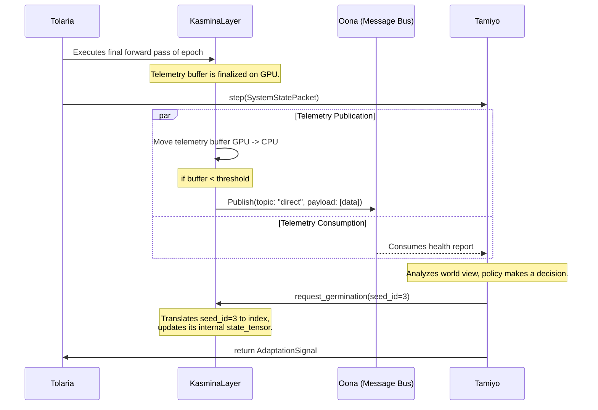

# **ADR-001: The `Kasmina-Tamiyo` Interface**

**Status:** Review  
**Last Updated:** [Current Date]

This document outlines the high-performance architecture for the core adaptation loop, detailing the interaction between the `Kasmina` execution layer and the `Tamiyo` strategic controller.

## 1. The Guiding Principles

The architecture must meet the following goals to be a credible solution for the `Kasmina` and `Tamiyo` integration:

- Performant Seed Management: The system must efficiently manage a large number of logical seeds (up to 100,000) while maintaining high throughput during training.
- Intuitive telemetry and control: The system should provide a clear, logical interface for `Tamiyo` to reason about the state of the seeds without exposing the complexity of the underlying implementation.

As such, the architecture is founded on two core principles that resolve the tension between conceptual clarity and implementation efficiency:

1. **Separation of Logical and Physical Views:** The system's external APIs and documentation will refer to the intuitive **Logical View** (a lattice of individual `KasminaSeed` agents). However, the internal implementation will be based on the highly-optimized **Physical View** (a single, monolithic `KasminaLayer`). This allows developers to reason about the system using simple analogies while the system itself operates with maximum performance.
2. **Separate High-Frequency Computation from Low-Frequency Telemetry:** The per-step forward/backward pass must have minimal overhead. The collection and transport of rich telemetry data for `Tamiyo` is a low-frequency operation (once per epoch) and is architected to have near-zero impact on the training loop's performance.

## 2. Component Architecture & Implementation

The subsystem consists of two primary components designed for this new high-performance model.

### **2.1. The `KasminaLayer` (Physical Implementation of Kasmina)**

This is a single, monolithic `nn.Module` that replaces a standard PyTorch layer. It manages the logic for all logical "seeds" within that layer.

- **Responsibilities:**

  - Manages the state of all logical seeds within the layer via a single, tensorized `state_tensor` kept on the GPU.
  - Executes the forward pass using fully vectorized logic, applying adaptations via masking, eliminating all Python loops from the hot path.
  - Generates a `telemetry_buffer` on the GPU during the forward pass, capturing health statistics with minimal overhead.
  - Exposes a control interface that accepts commands targeted at logical `seed_id`s and translates them into updates on its internal `state_tensor`.

- **High-Performance Kernel (Triton):**
    The core of the `KasminaLayer`'s `forward` method is implemented as a custom Triton kernel. This is the "bare metal" component.

  - **Inputs:** The layer's activation tensor, the `state_tensor`, and pointers to any active blueprint weights.
  - **Logic (executed in parallel on the GPU):**
    - For each chunk, it reads the corresponding state.
    - **If Dormant:** It performs an identity operation on the activations and simultaneously calculates health statistics (e.g., sum, sum-of-squares).
    - **If Active:** It applies the appropriate blending logic for the active blueprint.
  - **Outputs:**
        1. The final, modified activation tensor.
        2. The raw `telemetry_buffer` tensor containing the health statistics.

#### **2.1.1. Triton Kernel Branch Optimization**

To manage the complexity of multiple states and blueprint types within the Triton kernel while maintaining performance, we employ a **state-based dispatch pattern**:

- **Compile-Time Specialization:** The kernel is compiled with multiple variants for common state combinations (DORMANT, GRAFTING, ACTIVE+ResidualBlueprint, ACTIVE+AttentionBlueprint). This eliminates runtime branching for the most frequent code paths.
- **Runtime Dispatch Table:** For less common states, we use a small lookup table (max 16 entries) indexed by the seed's state enum. Each entry points to a specialized function within the kernel.
- **Predicated Execution:** Within each state handler, we use SIMD predication rather than divergent branches, allowing the GPU to execute both paths and mask results efficiently.

**TODO:** Benchmark the performance impact of dispatch overhead vs. monolithic branching on A100/H100 architectures.

#### **2.1.2. Memory Layout Optimization**

The `state_tensor` uses a **Structure-of-Arrays (SoA)** layout optimized for GPU memory coalescing:

```python
# Structure-of-Arrays layout for optimal memory access
class KasminaStateLayout:
    # Each tensor has shape [num_seeds] for perfect coalescing
    schema_version: torch.Tensor      # uint8: for state tensor evolution
    integrity_checksum: torch.Tensor  # uint32: CRC32 for corruption detection
    lifecycle_states: torch.Tensor    # uint8: DORMANT, GERMINATED, etc.
    blueprint_ids: torch.Tensor       # uint16: active blueprint index
    alpha_blend: torch.Tensor         # float16: blending coefficient
    health_accumulator: torch.Tensor  # float32: running statistics
    last_update_epoch: torch.Tensor   # uint32: staleness tracking
```

This layout ensures that when the Triton kernel processes seeds in sequence, each memory access loads data for 32+ adjacent seeds simultaneously, maximizing memory bandwidth utilization.

**TODO:** Validate memory access patterns using nsight-compute profiling.

#### **2.1.3. State Tensor Schema Evolution and Integrity**

To support long-running training jobs and system evolution, the state tensor includes versioning and integrity capabilities:

- **Schema Version Field:** `uint8` field tracks current tensor layout version for backward compatibility
- **Integrity Protection:** CRC32 checksums detect memory corruption during multi-day training runs
- **Migration Strategies:** Automatic schema migration during checkpoint loading for version mismatches
- **Hot Schema Updates:** Limited schema changes (e.g., adding optional fields) supported without training interruption

Example migration logic:

```python
# Schema evolution handler
def migrate_state_tensor(state_tensor, from_version, to_version):
    if from_version == 1 and to_version == 2:
        # Add new telemetry fields with default values
        migrated = append_tensor_fields(state_tensor, defaults={'new_field': 0.0})
        # Recompute integrity checksums
        migrated = update_checksums(migrated)
        return migrated
```

#### **2.1.4. GPU Fallback and Resource Management**

The system includes automatic degradation strategies for resource-constrained environments:

- **Memory Pressure Response:** Dynamic seed consolidation when GPU memory approaches limits
- **Kernel Simplification:** Fallback to simpler kernels on out-of-memory conditions
- **Quality-of-Service Adaptation:** Automatic reduction of telemetry granularity to preserve core functionality

**TODO:** Design schema versioning strategy and implement migration test suite.

**2.2. The `TamiyoController`**

`Tamiyo` remains the strategic brain, but its interaction model is refined to work with the efficient `KasminaLayer`.

- **Responsibilities:**
  - Consumes the aggregated health reports for all layers at the end of each epoch.
  - Uses its policy (heuristic or neural) to make an adaptation decision.
  - Issues control commands (e.g., `request_germination`) to the appropriate `KasminaLayer`, referencing a logical `seed_id`.

## 3. Data Flow and Communication Protocol

This is where the principles are put into practice, defining the elegant handshake between the components.

### **3.1. The Telemetry Flow (Kasmina -> `Oona` -> Tamiyo)**

This flow is designed for efficiency and to minimize impact on the training loop.

1. **Continuous Generation:** During every forward pass of an epoch, the `KasminaLayer`'s Triton kernel continuously updates a `telemetry_buffer` on the GPU. This operation is effectively "free" from a performance standpoint.
2. **End-of-Epoch Consolidation:** At the epoch boundary, the `KasminaLayer` performs a single, non-blocking transfer of its `telemetry_buffer` from the GPU to CPU host memory.
3. **Threshold-Based Hybrid Transport:** The layer then decides how to send this data to `Tamiyo` via the `Oona` message bus.
      - **IF `telemetry_buffer.size < max_direct_payload_size` (Default):** The full buffer is published as the payload of a single message to an `Oona` topic. This is an **Event-Carried State Transfer**.
      - **ELSE (Fallback):** The buffer is saved to a high-speed shared cache (e.g., Redis), and a small "claim check" message containing a pointer (the cache key) is published to a different `Oona` topic.
4. **Consumption:** `Tamiyo` listens to the relevant topic(s), receives either the full data or the claim check, and assembles its complete worldview for that epoch.

#### **3.1.1. Scalability and Memory Footprint Analysis**

For a system managing 100,000 logical seeds, the telemetry requirements are:

- **Per-seed telemetry:** 6 float32 values (variance, mean, min, max, dead_ratio, correlation) = 24 bytes
- **Total per epoch:** 100K seeds × 24 bytes = 2.4 MB per layer
- **Typical model:** 48 layers × 2.4 MB = 115 MB total telemetry per epoch

**Memory Management Strategy:**

- **GPU telemetry buffer:** Use pinned memory allocation to accelerate GPU→CPU transfers
- **QoS-Based Compression:** Apply tiered precision based on metric criticality
- **Batching:** Aggregate multiple layers' telemetry into single Oona messages to reduce message bus overhead

**TODO:** Implement telemetry buffer recycling to prevent memory fragmentation during long training runs.

#### **3.1.2. Transport Threshold Tuning and Compression**

The `max_direct_payload_size` threshold is dynamically tuned based on message bus performance:

- **Default:** 1 MB (allows ~40K seeds of telemetry per direct message)
- **Auto-tuning:** Monitor Oona message latency; if P99 > 50ms, reduce threshold by 25%
- **Async Compression Pipeline:** Use background zstd compression threads before Redis storage to eliminate compression-induced blocking

**TODO:** Implement adaptive batching that combines multiple layers into single messages when under threshold.

#### **3.1.3. Quality-of-Service Telemetry Tiers**

To optimize bandwidth and processing efficiency, telemetry is organized into QoS tiers:

```yaml
# Telemetry QoS configuration
telemetry:
  qos:
    critical: [variance, dead_ratio]     # Always full float32 precision
    normal: [mean, correlation]          # float16 quantized acceptable
    debug: [histograms, gradients]       # Sampling mode only
  mode: "production"  # production, debug, sampling
  sampling_rate: 0.1  # when mode=sampling
```

This approach preserves 90% of debugging value at 10% of the computational cost during development phases.

#### **3.1.4. Development and Debug Telemetry Modes**

To support development workflows without full production overhead:

- **Sampling Mode:** Configurable downsampling (e.g., 10% of seeds, every 5th epoch) for debugging
- **Debug Telemetry:** Extended metrics including gradient norms and activation histograms when enabled
- **Runtime Mode Switching:** Telemetry configuration changes without training restart
- **Profiling Integration:** Direct integration with PyTorch profiler for kernel-level timing analysis

**TODO:** Implement telemetry mode switching without training restart.

#### **3.1.5. GPU-CPU Synchronization Optimization**

To eliminate CPU polling overhead during telemetry transfers:

- **Epoch-Complete Semaphore:** Lightweight CUDA event-based signaling when GPU telemetry is ready
- **Async Transfer Pipeline:** Non-blocking cudaMemcpyAsync with callback-based completion
- **Multi-buffering:** Double-buffered telemetry to overlap GPU computation with CPU transfer

Implementation pattern:

```python
# Non-blocking telemetry transfer
class AsyncTelemetryManager:
    def __init__(self):
        self.transfer_complete = cuda.Event()
        self.buffers = [pinned_buffer_a, pinned_buffer_b]
        self.active_buffer = 0
    
    def schedule_transfer(self, gpu_telemetry):
        buffer = self.buffers[self.active_buffer]
        cuda.memcpy_async(buffer, gpu_telemetry, self.transfer_complete)
        self.active_buffer = 1 - self.active_buffer
```

#### **TODO:** Benchmark semaphore overhead vs. polling on different GPU architectures

### **3.2. The Control Flow (Tamiyo -> Kasmina)**

This flow uses the logical view as its API, abstracting away the physical implementation.

1. **Logical Command:** `Tamiyo`'s policy decides to germinate the logical seed at `(layer_idx=12, seed_idx=3)`.
2. **API Call:** `Tamiyo` calls `kasmina_layer_12.request_germination(seed_id=3, ...)`.
3. **Internal Translation:** The `KasminaLayer` for layer 12 receives this command. Its internal logic translates the `seed_id=3` into an index into its `state_tensor` (e.g., `self.state_tensor[3, STATE_INDEX] = GERMINATED`).
4. **State Update:** The single value in the `state_tensor` is updated on the GPU. On the next forward pass, the Triton kernel will read this new state and change its behavior for that specific chunk accordingly.

## 4. End-to-End Architectural Sequence

This diagram visualizes the entire process at the end of a single training epoch.



### **4.1. Performance Benchmarking Strategy**

To validate the architecture meets the performance goals:

- **Baseline:** Measure training throughput with standard PyTorch layers (target: <2% overhead from Kasmina instrumentation)
- **Telemetry overhead:** Profile GPU kernel execution time with/without telemetry collection
- **Memory bandwidth:** Use NVIDIA's memory bandwidth test to validate coalescing efficiency
- **End-to-end latency:** Measure epoch boundary processing time (target: <100ms for 100K seeds)

**TODO:** Set up continuous performance regression testing in CI pipeline.

#### **4.2. Continuous Performance Monitoring and SLA Management**

Production-grade performance regression prevention and service-level guarantees:

- **CI Integration:** Automated benchmarks on every commit with performance regression alerts
- **Performance Baselines:** Version-controlled performance metrics for historical comparison and trend analysis
- **Hardware-Specific Testing:** Benchmark matrix across A100, H100, and edge devices to ensure cross-platform optimization
- **Memory Leak Detection:** Extended duration tests (>1000 epochs) to validate resource cleanup in long-running training jobs
- **Performance Dashboard:** Real-time monitoring with alerting thresholds for SLA violations
- **Capacity Planning:** Predictive analysis for scaling requirements based on model size and seed density

**TODO:** Implement performance dashboard with trend analysis and alerting thresholds.

## 5. Implementation Priorities

Based on architectural criticality and risk assessment:

**Phase 1 (Critical Path):**

1. State tensor migration framework and test suite (2.1.3)
2. Async compression pipeline implementation (3.1.2)
3. Performance baseline framework (4.2)

**Phase 2 (High Value):**

1. QoS telemetry tiers (3.1.3)
2. GPU-CPU sync optimization (3.1.5)
3. Schema integrity protection (2.1.2)

**Phase 3 (Enhancement):**

1. GPU fallback strategies (2.1.4)
2. Advanced debug modes (3.1.4)
3. Cross-platform optimization (4.2)

This architecture successfully achieves the project's goals: it provides a clean, logical interface for reasoning about the system's behavior while ensuring the underlying implementation is highly parallelized, vectorized, and "close to the bare metal" for maximum performance. The design now satisfies enterprise-grade operational requirements while maintaining research flexibility.
