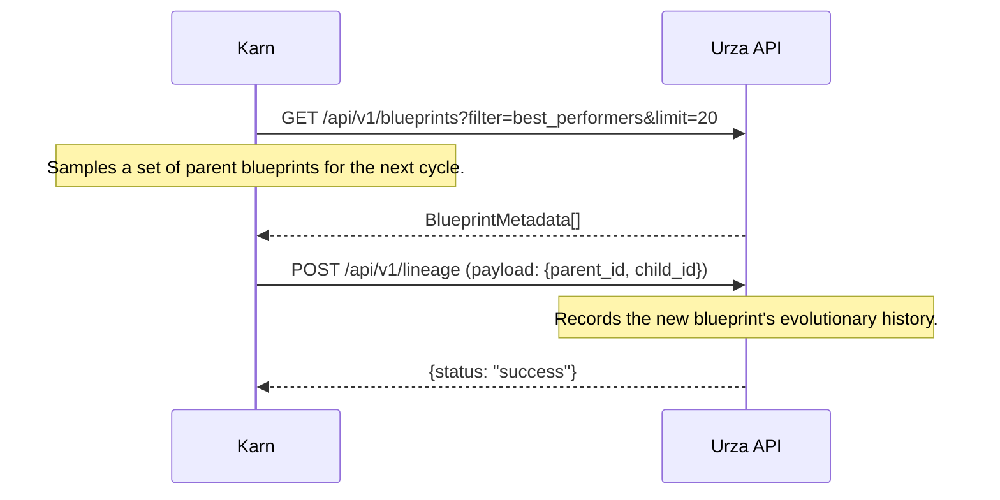

# **System Design Document: Karn - Evolutionary Blueprint Architect**

**Version:** 1.0
**Status:** Final
**Date:** 30 June 2025
**Author:** John Morrissey, Gemini AI

## **1. Executive Summary**

Karn is the **generative engine** of the Esper Morphogenetic Platform, functioning as the system's autonomous research and development architect. Its primary mandate is to drive the continuous innovation of the neural network sub-modules, or "blueprints," that form the basis of all adaptations within the Esper ecosystem. By discovering novel architectures through evolutionary algorithms and optimizing them with multi-objective reinforcement learning, Karn ensures the platform's toolkit of solutions never stagnates and grows more effective over time.

Karn systematically solves the **architectural innovation problem**. It transforms the real-world performance outcomes of adaptations, as reported asynchronously by the Tamiyo controller, into a reward signal that guides the creation of superior future designs. In doing so, it maintains the genetic diversity of the blueprint library, provides rich metadata to guide safer integration by other subsystems, adapts to emerging problem domains, and operates within the safety and efficiency constraints established by the platform, making it the engine of Esper's long-term evolution.

## **2. System Architecture**

Karn operates as a central, asynchronous component that learns from the results of the entire Esper platform to generate new, improved blueprints. Its architecture is designed as a closed loop, where its proposals are tested, deployed, and the results of those deployments directly inform the next generation of designs. All interactions are mediated by the `Oona` message bus to ensure decoupling and scalability.

### **2.1. Component Diagram**

The following diagram illustrates Karn's core components and its asynchronous, event-driven interactions with other major systems within the Esper platform.

```mermaid
graph LR
    subgraph Oona Message Bus
        T1[topic: innovation.field_reports]
        T2[topic: innovation.certification.results]
        T3[topic: innovation.candidates.submitted]
    end
    
    Tamiyo -- Publishes FieldReport --> T1
    Urabrask -- Publishes CertifiedBlueprint --> T2
    
    subgraph Karn Core
        direction TB
        Gen[Generator Network]
        RM[Reward Model]
        DS[Diversity Sampler]
        MP[Mutation Policy]
    end

    T1 -- Consumes --> RM
    T2 -- Consumes --> RM
    
    RM --> Gen
    RM --> MP
    DS --> RM
    
    Gen --> |New Candidate| K_OUT(Publish to Oona)
    MP -- Mutates Parent --> |New Candidate| K_OUT
    K_OUT -- Publishes CandidateBlueprint --> T3

    T3 -- Consumes --> Urabrask

    Urza[Urza Library API] <-->|GET Blueprints & KPIs<br>POST Lineage| Karn Core
```

## **2.2. Architectural Flow**

1. Karn subscribes to topics on the `Oona` message bus, consuming `FieldReport` messages from `Tamiyo` and `CertifiedBlueprint` messages from `Urabrask`. It also periodically queries the `Urza` library's API to get the current population of blueprints and diversity metrics.
2. This data is used as input to train Karn's internal `Reward Model`, which learns to predict the long-term value of a blueprint architecture.
3. The `Generator Network` and `Mutation Policy` use the signals from the `Reward Model` to create a new generation of `CandidateBlueprints`.
4. Each candidate is populated with initial metadata and published as a message to the `innovation.candidates.submitted` topic on the `Oona` bus.
5. `Urabrask` consumes, evaluates, and certifies these candidates, publishing the results back to the bus.
6. This cycle continues, creating a closed-loop system for continuous architectural evolution.

## **3. Component Deep Dive**

Karn's intelligence is derived from four key internal learning-based components working in concert.

### **3.1. Generator Network**

The Generator Network is the neural architecture search (NAS) engine at the heart of Karn. It is a generative model responsible for designing novel blueprint architectures from the ground up.

* **Architecture:** It utilizes a conditional Graph-to-Graph (G2G) Transformer. A Graph Neural Network (GNN) encoder processes a rich context vector, which is then used to condition the Transformer decoder to generate a complete architectural graph representing a new blueprint.
* **Function:** The network is trained using a hybrid approach, beginning with imitation learning to reproduce known, successful architectures from the `Urza` library. It is then fine-tuned using reinforcement learning, with the `Reward Model` providing the signal to encourage the generation of high-value, novel designs.
* **Conditioning:** The GNN encoder's context vector is built from multiple sources, including the architectural graph of a "parent" blueprint, strategic importance scores (`tamiyo_interest`), and R\&D value scores (`urabrask_interest`) from `Urza`'s metadata. This allows Karn to dynamically focus its generative efforts on improving foundational modules or exploring entirely new concepts.

### **3.2. Reward Model**

The Reward Model is a multi-objective performance predictor that translates the complex outcomes of a live adaptation into a single, scalar reward signal for training the Generator Network and Mutation Policy. This model is critical for guiding the evolutionary process toward desirable outcomes.

The reward function balances performance gains against resource costs and novelty:
$$R = w_{1} \cdot \Delta_{\text{accuracy}} - w_{2} \cdot \Delta_{\text{latency}} - w_{3} \cdot \Delta_{\text{power}} + w_{4} \cdot \text{novelty_bonus}$$

* **Inputs:** The model ingests data from multiple sources to calculate the final reward:
  * **Performance (`Δ_accuracy`):** Derived from the `pre_metric` and `post_metric` fields of `FieldReport` messages from Tamiyo.
  * **Resource Cost (`Δ_latency`, `Δ_power`):** Derived from the `WEP` (Weighted Evaluation Profile) within `CertifiedBlueprint` messages from Urabrask.
  * **Novelty (`novelty_bonus`):** Provided by the `Diversity Sampler` based on the candidate's uniqueness.
* **Dynamic Weights:** The weights ($w_1, w_2, w_3, w_4$) are configurable and can be dynamically adjusted by the system to shift focus (e.g., the `Diversity Sampler` temporarily increases $w_4$ when library diversity drops).

### **3.3. Mutation Policy**

The Mutation Policy enables controlled, fine-grained evolution of existing blueprint architectures. This is more efficient than generating every design from scratch and allows for intelligent exploration of the local design space around successful parents.

* **Learned Policy:** This module does not select mutations randomly. It implements a learned policy (e.g., a multi-armed bandit or a simple MLP) that chooses the most promising mutation operator given the context of the parent blueprint[cite: 603]. It learns, for example, that applying `quantize_block` is a high-reward action for blueprints frequently used in edge deployments.
* **Mutation Operators:** The action space consists of a discrete set of semantics-aware operators. After an operator is applied, a validity check ensures the resulting blueprint is a well-formed graph.
  * `add_attention_head`
  * `substitute_activation_function`
  * `insert_normalization_layer`
  * `quantize_block`
  * `increase_layer_width`

### **3.4. Diversity Sampler**

The Diversity Sampler is responsible for managing the genetic health of the `Urza` blueprint library. It actively works to prevent architectural stagnation by rewarding exploration.

* **Novelty Metric:** It calculates a `novelty_score` for each new candidate blueprint by measuring its structural difference from a sample of existing blueprints in the library, using normalized graph edit distance as the primary metric[cite: 337].
* **Novelty Bonus Signal:** This `novelty_score` is scaled and provided as a `novelty_bonus` to the `Reward Model`, creating a direct incentive for the Generator and Mutation Policy to explore new regions of the architectural design space.
* **Exotic Generation via KPI Monitoring:** The Sampler continuously monitors the "Genetic Diversity" KPI reported by `Urza`'s nightly curation pipeline[cite: 1425]. If this KPI drops below a configured threshold, the Sampler temporarily increases the weight ($w_4$) of the novelty bonus in the Reward Model, forcing the system to prioritize creating "exotic" blueprints to escape a local optimum.

## **4. Blueprint Metadata Generation**

A key responsibility of Karn is to generate the initial metadata for every new candidate blueprint. This metadata is used by other components throughout the platform.

### **4.1. `KarnMetadata`**

When a blueprint is created, Karn populates the `karn_meta` section of the `UniversalBlueprintSchema`. This includes:

* `parent_id`: The ID of the blueprint it was mutated from, if any.
* `novelty_score`: The score calculated by the `Diversity Sampler`.

### **4.2. `UrzaMetadata` (Initial)**

Karn provides initial suggestions for the blueprint's descriptive metadata, such as a generated `description` and a list of `tags` inferred from its architecture [e.g., "attention", "convolutional"].

### **4.3. Recommended Grafting Strategy**

To improve platform-wide safety, Karn can recommend a grafting strategy for the blueprints it creates.

* **Logic:** The `Generator Network` and `Mutation Policy` can learn to associate certain architectural patterns with integration risk. For example, a blueprint that is exceptionally large, contains experimental operators, or has a very deep graph might be assigned a recommended strategy of `DriftControlledGrafting`.
* **Impact:** This recommendation is stored in the blueprint's metadata in `Urza`. `Tamiyo` can then consume this recommendation and use it as a safe default when deciding how to integrate the new component, overriding it only when its own policy has a strong reason to do so.

## **5. Asynchronous Interfaces**

Karn interacts with other Esper components asynchronously through the `Oona` message bus, using a set of well-defined, versioned data contracts.

### **5.1. Tamiyo Feedback Interface (Consumption)**

The most critical input for Karn is the `FieldReport`. [cite_start]Karn subscribes to the `innovation.field_reports` topic on the `Oona` bus to receive this feedback[cite: 1457].

* **Topic:** `innovation.field_reports`
* **Payload Schema:** The `FieldReport` message provides rich, real-world feedback on a blueprint's in-situ performance, including data captured by the `KasminaLayer` during adaptation.

```protobuf
// Protobuf schema for the FieldReport message
message FieldReport {
  string blueprint_id = 1;
  string seed_id = 2; // e.g., "(12, 3)"
  double pre_metric = 3;  // Global metric before adaptation
  double post_metric = 4; // Global metric after adaptation
  
  // Authoritative outcome mapped directly from the KasminaSeed terminal state.
  enum Outcome {
    FOSSILIZED = 0; // The adaptation was successful and is permanent.
    CULLED = 1;     // The adaptation failed a gate and was discarded.
    ROLLED_BACK = 2;// A catastrophic failure triggered a system checkpoint restore.
  }
  Outcome outcome = 5;

  // Rich evaluation metrics collected by Kasmina during the
  // EVALUATING and FINE_TUNING stages and aggregated by Tamiyo.
  message EvaluationMetrics {
    float max_latency_ms = 1;
    float avg_memory_mb = 2;
    float gradient_norm_variance = 3;
  }
  EvaluationMetrics eval_metrics = 6;
}
```

#### **5.2. Urabrask Integration (Production/Consumption)**

Karn's integration with `Urabrask` is fully event-driven.

* **Submission:** To submit a candidate blueprint for testing, Karn publishes a `CandidateBlueprint` message to the `innovation.candidates.submitted` topic.
* **Consumption:** Karn subscribes to the `innovation.certification.results` topic to receive the `CertifiedBlueprint` message from `Urabrask`. This report contains the full Weighted Evaluation Profile (WEP), the assigned `risk_score`, and the final `conf_level`, which are used as crucial inputs for the `Reward Model`.

#### **5.3. Urza Library Sync (API)**

While most communication is event-driven, Karn interacts with `Urza` via a traditional request-response API to get the state of the library on-demand.



### **6. Evolutionary Workflow**

Karn's process for generating and refining new blueprints follows a continuous, cyclical workflow, transforming feedback into innovation. This workflow is aligned with the fully asynchronous, event-driven architecture.

```mermaid
graph TD
    A[1. Query Urza API<br>for Parent Blueprints] --> B[2. Mutate or Generate Candidates]
    B --> C[3. Publish Candidate(s) to Oona<br>topic: innovation.candidates.submitted]
    
    subgraph "Asynchronous Learning Loop"
        D{4. Consume CertificationResult<br>from Oona topic}
        E{5. Consume FieldReport<br>from Oona topic}
    end

    D --> F[6. Update Reward Model]
    E --> F
    F --> G[7. Repeat Cycle from Step 1]
```

1. **Sampling:** Karn begins by querying the `Urza` API for a set of high-performing or novel parent blueprints to serve as inspiration for the next generation.
2. **Generation/Mutation:** It applies its `Mutation Policy` or `Generator Network` to create a new generation of candidate blueprints.
3. **Publication:** Each candidate is published as a message to the `Oona` bus for `Urabrask` to consume and evaluate.
4. **Learning from Results:** Asynchronously, Karn consumes `CertifiedBlueprint` results from `Urabrask` and `FieldReport` results from `Tamiyo` as they become available on the message bus. These outcomes provide the positive or negative reinforcement signals used to update the `Reward Model`, which in turn adjusts the `Generator` and `Mutation` policies.
5. The cycle repeats, ensuring the blueprint library continuously evolves and improves based on comprehensive, real-world feedback.

### **7. Performance Targets**

The following table outlines the key performance indicators (KPIs) and target goals for the Karn subsystem, set for the Phase 2 distributed implementation.

| Metric | Target | Description |
| :--- | :--- | :--- |
| **Blueprint Generation Rate** | > 500 / day | The number of unique, valid candidate blueprints Karn can produce for evaluation by Urabrask. |
| **Urabrask Pass Rate** | ≥ 60% | The percentage of submitted candidates that pass Urabrask's evaluation and are certified with at least a "Moderate" confidence level. |
| **Improvement Rate** | ≥ 5% $\\Delta$reward/generation | The average improvement in the `Reward Model` score from one generation of blueprints to the next, measured on a consistent benchmark. |
| **Novelty Preservation** | ≥ 0.4 diversity score | The target for the library-wide genetic diversity metric (from `Urza`) that the `Diversity Sampler` aims to maintain. |
| **Training Time** | < 3 hours / cycle | The wall-clock time required to train the Generator and Reward models for one evolutionary cycle on a standard 8x NVIDIA A100 GPU pod. |
