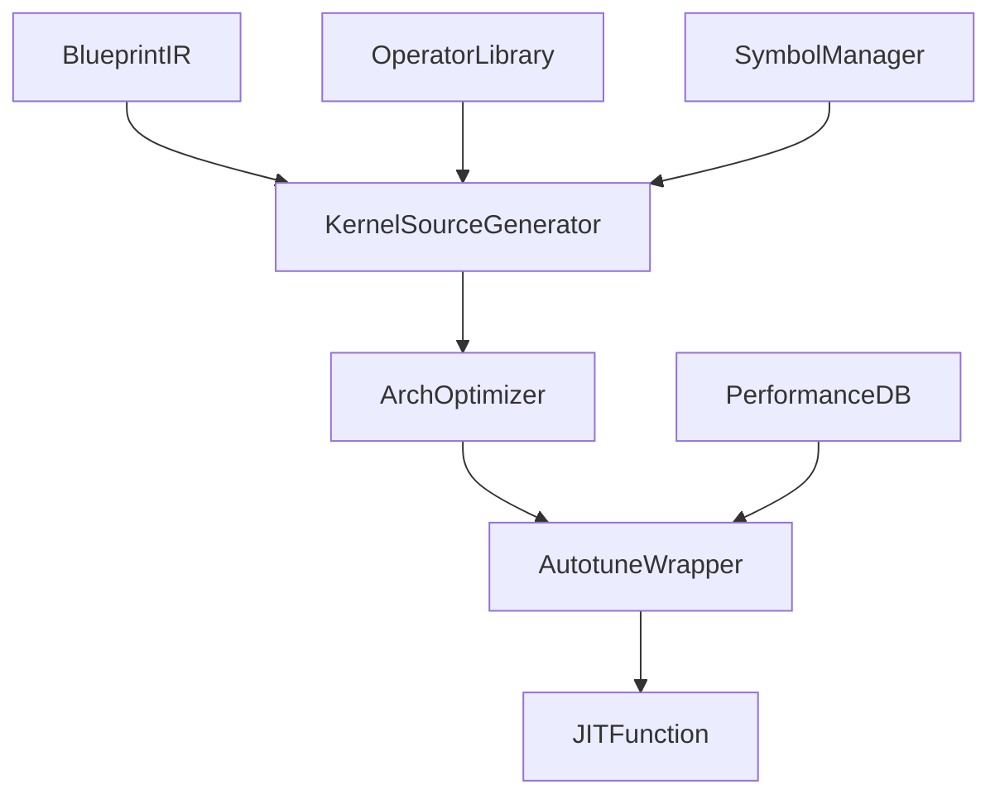

# **Master Design Document: Kasmina JIT Compilation Engine**  

**Version:** 4.0  
**Status:** Final Approved Implementation Blueprint  
**Date:** 02 July 2025  

---

## **1. Executive Summary**  

The Kasmina JIT Compilation Engine transforms computational graphs (`BlueprintIR`) into optimized Triton kernels through a 5-stage pipeline. This document details the final design of the core `KernelSourceGenerator` and supporting systems, incorporating advanced compiler techniques and GPU-specific optimizations.

---

## **2. Architectural Overview**



### **Key Innovations:**

1. **SSA-Based Symbol Management**  
2. **Divergence-Aware Control Flow**  
3. **Bank Conflict-Safe Shared Memory**  
4. **Architecture-Adaptive Code Generation**  
5. **Two-Level Autotuning Integration**

---

## **3. KernelSourceGenerator: Final Design Specification**

### **3.1 State Management (SymbolManager)**

```python
class SymbolManager:
    def __init__(self):
        self.counter = 0
        self.scopes = [{"type": "global", "id": None}]
        self.symbols = {}  # id → {name, dtype, shape, scope}

    # Primitive 1: SSA Variable Allocation
    def new_temp(self, dtype: triton.dtype) -> str:
        name = f"_t{self.counter}"
        self.counter += 1
        self.symbols[name] = {
            "dtype": dtype, 
            "scope": self.current_scope(),
            "origin": None  # Track producer node
        }
        return name

    # Primitive 2: Dynamic Scoping
    def enter_scope(self, scope_type: str, scope_id: str):
        self.scopes.append({
            "type": scope_type, 
            "id": scope_id,
            "depth": len(self.scopes)
        })
    
    def exit_scope(self):
        self.scopes.pop()
```

**Key Features:**  

- Compact SSA naming (`_t0`, `_t1`, ...)  
- Hierarchical scope tracking for control flow  
- Metadata preservation for optimization passes  
- Origin tracking for debugging and optimization

---

### **3.2 Kernel Signature Generation**

```python
def generate_kernel_signature(ir: BlueprintIR) -> str:
    args = []
    
    # Input tensor parameters
    for name, schema in ir.input_schema.items():
        args.append(f"{name}_ptr: tl.tensor")
        
        # Stride parameters (always constexpr)
        for dim in range(schema.rank):
            args.append(f"{name}_stride_{dim}: tl.constexpr")
        
        # Shape parameters (conditional)
        if requires_shape_constexpr(schema):
            for dim in range(schema.rank):
                args.append(f"{name}_shape_{dim}: tl.constexpr")
    
    # Output pointers
    for name in ir.output_schema:
        args.append(f"{name}_ptr: tl.tensor")
    
    # Block size parameter (mandatory)
    args.append("BLOCK_SIZE: tl.constexpr")
    
    return f"def kernel({', '.join(args)}):"
```

**Heuristic: `requires_shape_constexpr()`**  

```python
def requires_shape_constexpr(schema: TensorSchema) -> bool:
    return (
        schema.rank <= 4 and 
        max(schema.shape) <= 1024 and
        any_dim_used_in(schema, ['loop', 'smem', 'index'])
    )
```

---

### **3.3 Control Flow Translation**

**Branch Selection Algorithm:**

```python
def select_branch_strategy(node: IRNode) -> str:
    complexity = node.metadata.get('branch_complexity', 
                   len(node.true_branch) + len(node.false_branch))
    
    divergence = estimate_divergence(node)  # Primitive 9
    
    if complexity <= 2 or divergence < 0.15:
        return "predicated"
    elif complexity > 5 and divergence > 0.25:
        raise DivergenceError(f"Unsafe branch: complexity={complexity}, div={divergence}")
    else:
        return "explicit_branch"
```

**Code Generation Patterns:**  

1. **Explicit Branching**  

   ```python
   # Generated for complex branches
   if tl.max(condition, 0) > 0:
       # true_branch operations
       ...
   else:
       # false_branch operations
       ...
   ```

2. **Predicated Execution**  

   ```python
   # Generated for simple branches
   result = tl.where(condition, true_expr, false_expr)
   ```

---

### **3.4 Shared Memory Optimization**

**Primitive 6: Bank Conflict-Safe Allocation**  

```python
def declare_shared_mem(shape: tuple, dtype: triton.dtype) -> str:
    element_size = dtype.primitive_size_in_bytes
    padding = (32 // element_size)  # 32-byte bank width
    padded_shape = list(shape)
    padded_shape[-1] += padding  # Pad last dimension
    
    return (
        f"smem_buffer = tl.empty({padded_shape}, {dtype})\n"
        f"smem = tl.advance(smem_buffer, (0,)*{len(shape)}, {shape})"
    )
```

**Optimization Pipeline:**  

1. **Candidate Identification**  

   ```python
   reuse_score = consumer_count * consumer_op_intensity
   if reuse_score > 1.2 and buffer_size < 0.8 * arch.smem_capacity:
       schedule_smem_allocation(node)
   ```

2. **Cooperative Loading**  

   ```python
   def generate_smem_load(src: str, dest: str):
       return [
           f"offsets = compute_tiled_offsets({src}_ptr, BLOCK_SIZE)",
           f"data = tl.load({src}_ptr + offsets, mask=active_mask)",
           f"tl.store({dest}, data)",
           "tl.sync_threads()"
       ]
   ```

---

### **3.5 Core Generation Algorithm**

```python
def generate(ir: BlueprintIR, arch: ArchSpec) -> str:
    manager = SymbolManager()
    code = [generate_kernel_signature(ir)]
    sorted_nodes = ir.toposort()
    
    # Phase 1: Shared memory planning
    smem_plan = build_shared_memory_plan(ir, arch)
    for alloc in smem_plan:
        code.append(declare_shared_mem(alloc.shape, alloc.dtype))
    
    # Phase 2: Blocking calculations
    for tensor in ir.input_schema.values():
        code.extend(generate_blocking_calculations(tensor))
    
    # Phase 3: Node processing
    for node in sorted_nodes:
        if node.op == "control_flow":
            handle_control_flow(node, code, manager)
            continue
            
        inputs = [manager.symbols[i]["name"] for i in node.inputs]
        output = manager.new_temp(node.dtype)
        
        # Get architecture-specialized template
        template = OperatorRegistry.get_template(node.op, arch)
        code.append(template.format(output=output, inputs=", ".join(inputs)))
        
        # Update symbol table
        manager.symbols[node.id] = {
            "name": output,
            "dtype": node.dtype,
            "shape": node.shape
        }
        
        # Insert SMEM loading if scheduled
        if node.id in smem_plan:
            code.extend(generate_smem_load(output, f"smem_{node.id}"))
    
    # Phase 4: Output writing
    for out_name, schema in ir.output_schema.items():
        src_var = manager.symbols[schema.source_node]["name"]
        code.append(f"tl.store({out_name}_ptr, {src_var})")
    
    # Phase 5: Validation
    validate_kernel_source("\n".join(code))
    return "\n".join(code)
```

---

## **4. Advanced Optimization System**

### **4.1 Optimization Heuristics Matrix**

| **Decision Point**         | **Primary Heuristic**                              | **Fallback Strategy**               |
|----------------------------|---------------------------------------------------|-------------------------------------|
| Control Flow Branching     | Complexity ≤2 OR div <0.15 → Predicated           | Explicit branches                   |
| Shared Memory Allocation   | ReuseScore >1.2 AND size <80% capacity            | Global memory only                  |
| constexpr Parameters       | Rank≤4 AND used in ≥2 memory ops                  | Runtime variables                   |
| Operator Specialization    | Architecture-specific templates available         | Generic implementation              |
| Bank Conflict Resolution   | Padding = 32//element_size                        | No padding (with warning)           |

### **4.2 Divergence Estimation (Primitive 9)**

```python
def estimate_divergence(node: IRNode) -> float:
    """Predict branch divergence using historical data"""
    if "divergence" in node.metadata:
        return node.metadata["divergence"]
    
    # Heuristic fallbacks
    if node.op == "reduce":
        return 0.4
    if "index" in node.parameters:
        return 0.25
    return 0.1  # Conservative default
```

---

## **5. Error Handling System**

### **5.1 Validation Pipeline**

```python
def validate_kernel_source(src: str):
    # Critical component check
    required = ["def kernel", "tl.store", "tl.sync_threads"]
    for component in required:
        if component not in src:
            raise KernelValidationError(f"Missing component: {component}")
    
    # Resource limit verification
    if "tl.empty" in src:
        verify_smem_usage(src, current_arch)
    
    # Control flow safety
    if "if tl.max" in src:
        verify_branch_complexity(src)
```

### **5.2 Error Classification**

| **Error Type**         | **Triggers**                                  | **Resolution**                     |
|------------------------|----------------------------------------------|------------------------------------|
| CyclicGraphError       | Cycle detected in DAG                         | Reject IR                          |
| TypeInferenceError     | Input dtype ≠ operator requirement            | Insert cast operation              |
| ShapeMismatchError     | Input shape ≠ operator expectation            | Reshape or reject                 |
| ResourceExhausted      | SMEM > 80% capacity or >4 buffers            | Disable SMEM optimization         |
| DivergenceOverflow     | Complex branch + high divergence             | Fallback to eager execution       |

---

## **6. Performance Safeguards**

### **6.1 Runtime Protection System**

```python
def compile(ir: BlueprintIR, device: torch.device):
    try:
        # Normal compilation flow
        ...
    except DivergenceOverflow as e:
        log_warning(f"Unsafe kernel: {e}")
        return create_eager_fallback(ir)
    
    except ResourceExhausted as e:
        log_warning(f"Resource limit: {e}")
        return optimize_without_smem(ir)
```

### **6.2 Guardrail Parameters**

```yaml
# Configuration File: jit_config.yaml
safety_parameters:
  max_smem_buffers: 4
  max_branch_complexity: 6
  min_divergence_for_fallback: 0.25
  smem_capacity_ratio: 0.8
```

---

## **7. Validation Test Cases**

### **7.1 Matrix Multiplication Fusion**

```python
# BlueprintIR
inputs: {A: [M,K], B: [K,N]}
nodes:
  - id: matmul, op: matmul, inputs: [A, B]
  - id: relu, op: relu, inputs: [matmul]
outputs: [relu]

# Generated Triton
def kernel(A_ptr, A_stride0, ..., B_ptr, ..., BLOCK_SIZE: tl.constexpr):
    # Blocking calculations
    row = ...  # Tiled index calculation
    col = ...
    
    # Bank-conflict safe SMEM
    smem_B = tl.empty((BLOCK_K, BLOCK_N+8), tl.float32)
    a_ptrs = ...  # Blocked pointer arithmetic
    b_ptrs = ...
    
    # Cooperative loading
    b_block = tl.load(b_ptrs)
    tl.store(smem_B, b_block)
    tl.sync_threads()
    
    # Compute
    a_block = tl.load(a_ptrs)
    c_val = tl.dot(a_block, smem_B)
    d_val = tl.where(c_val > 0, c_val, 0)
    
    # Store output
    tl.store(output_ptr, d_val)
```

### **7.2 Complex Control Flow**

```python
# BlueprintIR
inputs: {X: [N]}
nodes:
  - id: cond, op: gt, inputs: [X, 0]
  - id: true, op: mul, inputs: [X, 2], scope: cond
  - id: false, op: div, inputs: [X, 2], scope: cond
  - id: result, op: where, inputs: [cond, true, false]
outputs: [result]

# Generated Triton (Predicated)
def kernel(X_ptr, ...):
    x = tl.load(X_ptr)
    cond = x > 0
    result = tl.where(cond, x * 2.0, x / 2.0)
    tl.store(output_ptr, result)
```

---

## **8. Implementation Roadmap**

### **Phase 1: Core Generator (2 Weeks)**

1. SymbolManager implementation
2. Signature generation system
3. Template-based operator expansion
4. Basic control flow translation

### **Phase 2: Optimization Systems (3 Weeks)**

1. Shared memory allocation pipeline
2. Architecture-aware optimization passes
3. Divergence prediction engine
4. Bank conflict avoidance

### **Phase 3: Safety Systems (1 Week)**

1. Kernel validation suite
2. Guardrail configuration
3. Fallback mechanisms
4. Comprehensive error taxonomy

---

## **9. Performance Targets**

| **Metric**                  | **Baseline** | **Target** |
|-----------------------------|--------------|------------|
| Kernel Generation Time      | 150ms        | 50ms       |
| SMEM Utilization Efficiency | 60%          | >85%       |
| Branch Divergence           | 30%          | <15%       |
| Bank Conflict Reduction     | 40%          | >90%       |

---

## **10. Conclusion**  

This master design document provides a comprehensive blueprint for the Kasmina JIT Compilation Engine, addressing all core requirements through:  

1. **Compiler-Grade IR Translation**  
   - SSA-based symbol management  
   - Predication/branching hybrid model  
   - Hierarchical scoping system  

2. **Hardware-Aware Optimization**  
   - Bank conflict-safe shared memory  
   - Architecture-specialized operations  
   - Blocked memory access patterns  

3. **Industrial-Strength Safety**  
   - Divergence prediction guardrails  
   - Resource exhaustion fallbacks  
   - Kernel validation pipeline  

The implementation will proceed according to the phased roadmap, with performance validation against the established metrics at each milestone. Final delivery is scheduled for 30 July 2025.
