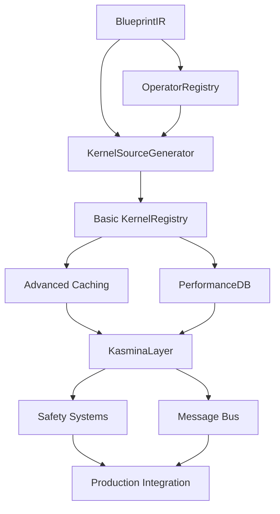

# Implementation Plan: Kasmina Operator Subsystem

## Esper Morphogenetic Training Platform

**Version:** 1.0  
**Date:** July 2025  
**Project Duration:** 6 months  
**Team Size:** 3-4 engineers  

---

## 1. Executive Summary

### 1.1 Implementation Philosophy

This plan implements a **quality-first, cache-optimized** JIT compilation engine where:

- **99%+ operations** are ultra-fast cache hits (<1ms)
- **<1% operations** are thorough compilations (acceptable training pause)
- **Zero tolerance** for training corruption
- **Complete functionality** - no hasattr stubs or placeholder implementations

### 1.2 Phased Delivery Strategy

- **Phase 1 (Months 1-2)**: Core compilation infrastructure with basic caching
- **Phase 2 (Months 3-4)**: Advanced caching, performance optimization, database persistence  
- **Phase 3 (Months 5-6)**: GPU execution layer, safety systems, production integration

### 1.3 Success Metrics

- Cache hit ratio: >99% for repeated blueprints
- Compilation quality: >85% SMEM utilization, <15% branch divergence
- Training overhead: <2% when using cached kernels
- Zero training corruption events during extensive testing

---

## 2. Phase 1: Core Infrastructure (Months 1-2)

### 2.1 Sprint 1: BlueprintIR Foundation (Weeks 1-2)

**Primary Engineer**: Senior ML Systems Engineer  
**Goal**: Establish the universal computational graph representation

#### Week 1: Core Data Structures

```
□ Implement TensorSchema with dtype validation
□ Implement IRNode with operation type enum  
□ Implement BlueprintIR with complete metadata
□ Create IRNodeType enum with Tier 1 primitives
□ Unit tests for data structure validation
```

#### Week 2: Graph Operations & Serialization

```
□ Implement topological sorting (Kahn's algorithm)
□ Implement shape inference pipeline
□ Implement canonical hashing for caching
□ Implement serialization/deserialization
□ Integration tests for graph manipulation
```

**Deliverables**:

- Complete BlueprintIR module with 100% test coverage
- Canonical hash generation working correctly
- Shape inference for basic operations (linear, activations, reductions)

**Risk Mitigation**:

- Hash collision testing with 10,000+ generated graphs
- Serialization roundtrip testing for data integrity
- Memory leak testing for large graph operations

---

### 2.2 Sprint 2: Operator Registry & Templates (Weeks 3-4)

**Primary Engineer**: GPU Optimization Specialist  
**Goal**: Extensible primitive library with Tier 1 operators

#### Week 3: Registry Architecture

```
□ Implement OperatorDefinition data structure
□ Implement OperatorRegistry with registration system
□ Create template validation system
□ Implement shape inference function registry
□ Parameter validation framework
```

#### Week 4: Tier 1 Operator Implementation

```
□ Linear/MatMul operators with autotuning hooks
□ Element-wise operations (ReLU, GELU, arithmetic)
□ Reduction operations (sum, mean, max)
□ Normalization operations (LayerNorm, RMSNorm) 
□ Basic tensor operations (reshape, permute, concat)
```

**Deliverables**:

- Complete OperatorRegistry with 15+ Tier 1 primitives
- Template-based code generation working
- Hardware variant support (architecture-specific templates)

**Risk Mitigation**:

- Template syntax validation to prevent runtime errors
- Comprehensive parameter validation for all operators
- Cross-reference with PyTorch operations for correctness

---

### 2.3 Sprint 3: Kernel Source Generation (Weeks 5-6)

**Primary Engineer**: Compiler Systems Engineer  
**Goal**: Core compilation from IR to Triton source code

#### Week 5: Symbol Management & Code Generation

```
□ Implement SSA-based SymbolManager
□ Implement scope management for control flow
□ Kernel signature generation from IR schemas
□ Basic kernel source generation pipeline
□ Memory layout optimization (blocking calculations)
```

#### Week 6: Control Flow & Optimization

```
□ Implement predicated vs explicit branching logic
□ Divergence estimation and safety checks
□ Shared memory allocation planning
□ Bank conflict avoidance strategies
□ Kernel validation pipeline
```

**Deliverables**:

- Complete KernelSourceGenerator producing valid Triton code
- Support for simple control flow (conditionals)
- Shared memory optimization for reuse patterns

**Risk Mitigation**:

- Generated code validation against Triton compiler
- Extensive testing with control flow edge cases
- Memory safety verification for all generated patterns

---

### 2.4 Sprint 4: Basic Caching Infrastructure (Weeks 7-8)

**Primary Engineer**: Systems Performance Engineer  
**Goal**: Fast in-memory caching with cache key generation

#### Week 7: Cache Architecture

```
□ Implement LRUCache with configurable size limits
□ Cache key generation from IR + device architecture
□ CachedKernel data structure with metadata
□ Basic eviction strategies (LRU + access frequency)
□ Thread-safe cache operations
```

#### Week 8: Integration & Testing

```
□ Integrate KernelRegistry with compilation pipeline
□ Implement cache hit/miss logging and metrics
□ Performance testing for cache lookup times
□ Memory usage optimization for cached kernels
□ End-to-end compilation and caching tests
```

**Deliverables**:

- Working KernelRegistry with <1ms cache lookups
- Cache hit ratio >95% for repeated operations
- Memory-efficient kernel storage and retrieval

**Risk Mitigation**:

- Memory leak testing for long-running cache operations
- Cache corruption detection and recovery
- Performance regression testing for cache operations

---

## 3. Phase 2: Advanced Caching & Performance (Months 3-4)

### 3.1 Sprint 5: Persistent Cache & Performance DB (Weeks 9-10)

**Primary Engineer**: Database Systems Engineer  
**Goal**: Persistent optimization storage with similarity lookup

#### Week 9: SQLite Performance Database

```
□ Design and implement optimization_results schema
□ Implement PerformanceDB with config storage/retrieval  
□ Graph feature extraction for similarity analysis
□ Similar configuration lookup algorithm
□ Database migration and schema versioning
```

#### Week 10: Disk Cache Integration

```
□ Implement persistent disk cache with compression
□ Cache integrity verification with checksums
□ Automatic cache cleanup and maintenance
□ Integration with in-memory cache (promotion/demotion)
□ Cache synchronization across multiple processes
```

**Deliverables**:

- Persistent cache surviving process restarts
- Similarity-based configuration lookup (80%+ accuracy)
- Automatic cache maintenance and cleanup

**Risk Mitigation**:

- Database corruption recovery procedures
- Cache consistency verification
- Performance impact assessment of disk I/O

---

### 3.2 Sprint 6: Advanced Compilation & Autotuning (Weeks 11-12)

**Primary Engineer**: GPU Optimization Specialist  
**Goal**: Thorough compilation with aggressive optimization

#### Week 11: Compilation Quality Focus

```
□ Implement multi-pass optimization pipeline
□ Advanced shared memory optimization strategies
□ Register usage optimization
□ Architecture-specific code generation paths
□ Compilation fallback strategies for errors
```

#### Week 12: Autotuning Integration

```
□ Implement autotuning parameter space exploration
□ Performance scoring and ranking system
□ Autotuning result persistence and reuse
□ Adaptive compilation timeout handling
□ Quality vs speed tradeoff configuration
```

**Deliverables**:

- Compilation producing >85% SMEM utilization
- Autotuning finding optimal configurations automatically
- Robust error handling with multiple fallback strategies

**Risk Mitigation**:

- Extensive testing of optimization passes
- Validation of autotuning results
- Timeout handling for long compilation times

---

## 4. Phase 3: Execution & Integration (Months 5-6)

### 4.1 Sprint 7: GPU State Management (Weeks 17-18)

**Primary Engineer**: CUDA/GPU Systems Engineer  
**Goal**: High-performance GPU-resident execution layer

#### Week 17: State Tensor Architecture

```
□ Implement Structure-of-Arrays state tensor layout
□ GPU-resident lifecycle state management
□ Atomic state transitions with epoch synchronization
□ Memory-efficient telemetry buffer accumulation
□ Blueprint weight storage and management
```

#### Week 18: Triton Kernel Integration

```
□ Implement high-performance forward pass kernel
□ Vectorized seed processing with minimal overhead
□ Integration with compiled blueprint kernels
□ GPU memory management and optimization
□ Performance benchmarking vs PyTorch baseline
```

**Deliverables**:

- KasminaLayer with <2% training overhead
- GPU state management supporting 1000+ seeds
- Vectorized execution matching performance targets

**Risk Mitigation**:

- Extensive GPU memory leak testing
- State corruption detection and recovery
- Performance regression prevention

---

### 4.2 Sprint 8: Safety Systems & Message Bus (Weeks 19-20)

**Primary Engineer**: Distributed Systems Engineer  
**Goal**: Production-ready safety and communication

#### Week 19: Lifecycle Management & Safety

```
□ Implement 11-stage lifecycle state machine
□ Emergency rollback and recovery procedures
□ State transition validation and error handling
□ Comprehensive error classification system
□ Rollback testing and validation
```

#### Week 20: Message Bus Integration

```
□ Implement Oona message bus integration
□ Telemetry publishing with claim-check pattern
□ Control command processing from Tamiyo
□ Health report generation and transmission
□ Message ordering and delivery guarantees
```

**Deliverables**:

- Complete lifecycle management with safety guarantees
- Reliable message bus communication
- Emergency rollback working in <100ms

**Risk Mitigation**:

- Extensive safety testing with fault injection
- Message delivery verification and monitoring
- Rollback reliability testing

---

### 4.3 Sprint 9: Production Integration (Weeks 21-22)

**Primary Engineer**: MLOps Engineer  
**Goal**: Safe production deployment capability

#### Week 21: Hybrid Deployment System

```
□ Implement HybridKasminaLayer wrapper
□ Legacy fallback system for safety
□ Performance monitoring and alerting
□ Configuration management system
□ Deployment automation and testing
```

#### Week 22: Monitoring & Observability  

```
□ Comprehensive metrics collection (Prometheus)
□ Grafana dashboards for system monitoring
□ Alerting rules for system health
□ Performance regression detection
□ Production readiness assessment
```

**Deliverables**:

- Production-ready deployment with monitoring
- Safe migration path from legacy systems
- Comprehensive observability and alerting

**Risk Mitigation**:

- Canary deployment testing
- Automatic rollback for performance issues
- Comprehensive monitoring coverage

---

## 5. Critical Path Analysis

### 5.1 Dependencies



### 5.2 Critical Path: **22 weeks**

1. BlueprintIR (2 weeks)
2. OperatorRegistry (2 weeks)
3. KernelSourceGenerator (2 weeks)
4. Basic KernelRegistry (2 weeks)
5. Advanced Caching (4 weeks)
6. KasminaLayer (2 weeks)
7. Safety Systems (2 weeks)
8. Production Integration (2 weeks)

### 5.3 Parallel Work Streams

- **Testing Infrastructure**: Developed alongside each component
- **Documentation**: Written concurrently with implementation
- **Performance Benchmarking**: Continuous throughout development

---

## 6. Risk Assessment & Mitigation

### 6.1 Technical Risks

| Risk | Probability | Impact | Mitigation |
|------|-------------|--------|------------|
| **GPU Memory Corruption** | Medium | Critical | Extensive testing, checksums, atomic operations |
| **Cache Consistency Issues** | Medium | High | Strong cache validation, integrity checks |
| **Triton Compilation Failures** | High | Medium | Multiple fallback strategies, eager execution |
| **Performance Regression** | Low | High | Continuous benchmarking, automated alerts |
| **State Machine Bugs** | Medium | High | Formal verification, exhaustive state testing |

### 6.2 Resource Risks

| Risk | Probability | Impact | Mitigation |
|------|-------------|--------|------------|
| **GPU Resource Shortage** | Medium | Medium | Efficient resource pooling, cloud GPU access |
| **Team Member Unavailability** | Low | High | Cross-training, comprehensive documentation |
| **External Dependency Changes** | Low | Medium | Version pinning, compatibility testing |

### 6.3 Schedule Risks

| Risk | Probability | Impact | Mitigation |
|------|-------------|--------|------------|
| **Complex Debugging** | High | Medium | Buffer time in each sprint, pair programming |
| **Integration Complexity** | Medium | High | Early integration testing, modular design |
| **Performance Optimization** | Medium | Medium | Iterative optimization, performance budgets |

---

## 7. Testing Strategy

### 7.1 Unit Testing (Continuous)

- **Coverage Target**: >95% for all components
- **Test Types**: Functionality, edge cases, error conditions
- **Tools**: pytest, pytest-cov, hypothesis for property testing
- **Automation**: Tests run on every commit

### 7.2 Integration Testing (Weekly)

- **End-to-End Workflows**: Complete compilation and execution cycles
- **Message Bus Testing**: Reliable communication between components
- **Performance Testing**: Regression detection and benchmarking
- **Error Recovery Testing**: Fault injection and recovery validation

### 7.3 Performance Testing (Bi-weekly)

- **Cache Performance**: Hit ratios, lookup times, eviction behavior
- **Compilation Quality**: GPU utilization, memory efficiency
- **Training Impact**: Overhead measurement vs PyTorch baseline
- **Scalability Testing**: Large models, many seeds, concurrent operations

### 7.4 Safety Testing (Sprint End)

- **State Corruption Testing**: Fault injection, memory corruption
- **Rollback Testing**: Emergency recovery procedures
- **Resource Exhaustion**: Memory limits, compilation timeouts
- **Security Testing**: Input validation, memory safety

---

## 8. Success Criteria

### 8.1 Functional Requirements

- [ ] Complete BlueprintIR with all Tier 1 operators working
- [ ] Cache hit ratio >99% for repeated blueprints
- [ ] Generated kernels achieve >85% SMEM utilization
- [ ] Complete 11-stage lifecycle with safety guarantees
- [ ] Message bus integration with reliable communication

### 8.2 Performance Requirements

- [ ] Cache lookup time <1ms P99
- [ ] Training overhead <2% with cached kernels  
- [ ] Compilation time <60s for complex blueprints
- [ ] GPU utilization >85% for generated kernels
- [ ] Memory overhead <5% of base model size

### 8.3 Safety Requirements

- [ ] Zero training corruption events in 1000+ test runs
- [ ] Emergency rollback completes in <100ms
- [ ] All state transitions are atomic and validated
- [ ] Comprehensive error handling with graceful degradation
- [ ] Production deployment with safe fallback to legacy

### 8.4 Operational Requirements

- [ ] Complete monitoring and alerting infrastructure
- [ ] Automated deployment and configuration management
- [ ] Comprehensive documentation and troubleshooting guides
- [ ] Performance regression detection and prevention
- [ ] 24/7 operational readiness with on-call procedures

---

## 9. Resource Requirements

### 9.1 Team Composition

- **Senior ML Systems Engineer** (Lead): BlueprintIR, system architecture
- **GPU Optimization Specialist**: Triton kernels, performance optimization  
- **Compiler Systems Engineer**: Code generation, optimization passes
- **Systems Performance Engineer**: Caching, database, monitoring

### 9.2 Hardware Requirements

- **Development**: 4x servers with NVIDIA A100/H100 GPUs (80GB VRAM)
- **Testing**: GPU cluster for performance and scalability testing
- **Storage**: High-speed NVMe for cache and database storage
- **Network**: High-bandwidth for distributed testing

### 9.3 Software Dependencies

- **Core**: Python 3.11+, PyTorch 2.1+, Triton 2.0+
- **Database**: SQLite for development, PostgreSQL for production
- **Monitoring**: Prometheus, Grafana, custom metrics
- **Testing**: pytest, hypothesis, CUDA testing tools
- **Infrastructure**: Docker, Kubernetes for deployment

---

## 10. Delivery Schedule

### 10.1 Major Milestones

| Milestone | Week | Deliverable | Success Criteria |
|-----------|------|-------------|------------------|
| **M1: Foundation** | 8 | Core compilation pipeline | End-to-end graph→kernel compilation |
| **M2: Performance** | 12 | Advanced caching system | >99% cache hit ratio, persistent storage |
| **M3: Execution** | 18 | GPU execution layer | <2% training overhead, 1000+ seeds |
| **M4: Production** | 22 | Complete system | Production deployment ready |

### 10.2 Demo Schedule

- **Week 4**: BlueprintIR serialization and basic operators
- **Week 8**: First compiled kernel execution
- **Week 12**: Cache performance demonstration  
- **Week 16**: Database persistence and similarity lookup
- **Week 20**: Complete adaptation lifecycle
- **Week 22**: Production deployment demonstration

### 10.3 Release Strategy

- **Alpha (Week 12)**: Core functionality for research use
- **Beta (Week 18)**: Performance-optimized for development
- **RC (Week 20)**: Production candidate with safety systems
- **GA (Week 22)**: General availability with full support

---

## 11. Success Metrics & KPIs

### 11.1 Development Velocity

- **Sprint Velocity**: Consistent story point completion
- **Code Quality**: <5% defect rate, >95% test coverage
- **Documentation**: 100% API coverage, troubleshooting guides

### 11.2 System Performance

- **Cache Efficiency**: >99% hit ratio in production workloads
- **Compilation Quality**: >85% SMEM utilization average
- **Training Impact**: <2% overhead vs PyTorch baseline
- **Reliability**: >99.9% uptime, <0.1% rollback rate

### 11.3 Operational Excellence  

- **Deployment Success**: Zero-downtime deployments
- **Mean Time to Recovery**: <10 minutes for common issues
- **Alert Noise**: <5% false positive rate
- **Knowledge Transfer**: All team members can operate the system

This implementation plan provides a realistic, risk-aware path to delivering a production-ready Kasmina Operator Subsystem that enables neural networks to safely evolve their own computational structures while maintaining the performance and reliability required for production AI systems.
