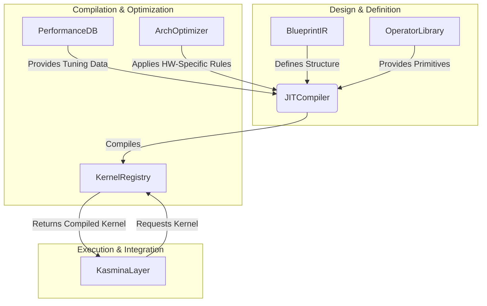
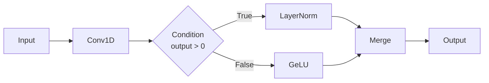
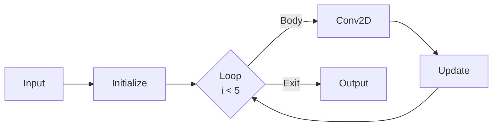

# **Solution Architecture: Kasmina JIT Compilation Engine**

**Version:** 2.1
**Status:** Approved for Implementation

## **1.0 Overview**

This document outlines the solution architecture for a Just-in-Time (JIT) compilation engine for the `KasminaLayer`. The primary objective is to evolve the `KasminaLayer` from a static dispatcher, which executes a fixed set of predefined subnetworks, into a dynamic execution platform. This new engine will be capable of taking an arbitrary subnetwork, defined as a computational graph or "blueprint of parts," and compiling it on-demand into a highly optimized, executable Triton kernel.

This architecture enables true innovation by allowing the `Karn` architect to design novel subnetwork structures that can be executed by `Kasmina` without manual intervention, while maintaining the highest levels of performance through JIT specialization and multi-level caching.

## **2.0 Core Architectural Diagram**

The system is composed of several decoupled modules that work in concert to translate, compile, cache, and execute dynamic blueprints.



## **3.0 Module-by-Module Design Specification**

### **3.1 Module: `blueprint_ir` (Intermediate Representation)**

* **Purpose:** To provide a standardized, serializable, and canonical data structure for representing blueprint computational graphs. This IR is the universal language between the `Urza` library and the `JITCompiler`.
* **Updated Class Definition:**

    ```python
    # blueprint_ir.py
    from dataclasses import dataclass, field
    from typing import Dict, List, Tuple, Union, Any

    @dataclass
    class IRNode:
        id: str  # Unique identifier for the node
        op_type: str  # e.g., 'matmul', 'relu', 'add'
        parameters: Dict[str, Any] = field(default_factory=dict)
        input_nodes: List[str] = field(default_factory=list)
        # This field is populated by a shape inference pass
        output_shape: Optional[Tuple[int, ...]] = None

    @dataclass
    class BlueprintIR:
        # A dictionary of all nodes, keyed by their ID
        nodes: Dict[str, IRNode] = field(default_factory=dict)
        # Defines the names and shapes of the graph's primary inputs
        input_schema: Dict[str, Tuple[int, ...]] = field(default_factory=dict)
        # A list of node IDs that represent the final outputs of the graph
        output_schema: List[str] = field(default_factory=list)
        metadata: Dict[str, Any] = field(default_factory=dict)

        def infer_shapes(self):
            """
            Performs a topological sort and computes the `output_shape` for each node.
            This is a mandatory pre-compilation step.
            """
            # Implementation using Kahn's algorithm or similar
            pass

        def canonical_hash(self) -> str:
            """
            Generates a stable SHA256 hash of the graph's structure and parameters,
            based on the topologically sorted nodes. Essential for caching.
            """
            # Implementation using hashlib
            pass

        def serialize(self) -> bytes:
            """Serializes the IR object, e.g., using pickle or protobuf."""
            pass

        @classmethod
        def deserialize(cls, data: bytes) -> "BlueprintIR":
            """Deserializes data into a BlueprintIR object."""
            pass
    ```

* **Key Design Considerations:**
  * The graph structure is defined implicitly by the `input_nodes` list within each `IRNode`. A separate top-level `edges` list is omitted to ensure a single source of truth and prevent inconsistencies.
  * **Shape Inference** is a critical utility. The compiler cannot generate correct code without knowing the shapes of all intermediate tensors.

### **3.2 Module: `operators` (Operator Library)**

* **Purpose:** To provide a declarative and extensible registry of all "basic operations" supported by the JIT compiler. This module decouples the compiler's logic from the specific implementation details of each mathematical primitive.
* **Class Definition:**

    ```python
    # operators.py
    class OperatorLibrary:
        _registry: Dict[str, Dict] = {}

        @classmethod
        def register_operator(
            cls,
            op_type: str,
            template: str,  # A code snippet template for this operation
            autotune_vars: Optional[List[str]] = None,
            heuristics: Optional[Dict[str, Callable]] = None
        ):
            """Registers a new operator type with its code template and metadata."""
            pass

        @classmethod
        def get_operator(cls, op_type: str) -> Optional[Dict]:
            """Retrieves the full definition for a given operator type."""
            pass
    ```

* **Key Design Considerations:**
  * This declarative pattern is the core of the engine's extensibility. Adding a new mathematical capability to the compiler is as simple as calling `register_operator`.
  * The `template` string should use a robust templating format (e.g., f-strings or Jinja2) to allow for the substitution of input/output variable names.

### **3.3 Module: `jit_compiler`**

* **Purpose:** To orchestrate the translation of a `BlueprintIR` object into a compiled, executable Triton kernel.
* **Class Definition:**

    ```python
    # jit_compiler.py
    class JITCompiler:
        def compile(self, ir: BlueprintIR, device: torch.device) -> triton.JITFunction:
            """Compiles a BlueprintIR object into an executable kernel."""
            # 1. Generate kernel source code from the IR
            kernel_src = self._generate_kernel_source(ir, device)

            # 2. Apply architecture-specific optimizations
            kernel_src = ArchOptimizer.optimize_kernel(kernel_src, arch)

            # 3. Wrap the source with an autotuning decorator
            kernel_src = self._wrap_autotune(kernel_src, ir)

            # 4. Compile the final source string using Triton's API
            compiled_kernel = triton.compile(source_str=kernel_src, ...)
            return compiled_kernel

        def _generate_kernel_source(self, ir: BlueprintIR, device: torch.device) -> str:
            """The core code generation logic."""
            # - Perform topological sort on IR nodes
            # - Dynamically build the kernel function signature from IR schemas
            # - Iterate through sorted nodes:
            #   - Manage allocation of temporary variables (e.g., _tmp_0, _tmp_1)
            #   - Fetch operator templates from OperatorLibrary
            #   - Stitch templates together to form the kernel body
            pass
    ```

* **Key Design Considerations:**
  * The primary challenge is the management of intermediate variables and memory pointers within `_generate_kernel_source`. The implementation must be meticulous to ensure correctness.

### **3.4 Module: `kernel_registry` & `performance_db`**

* **Purpose:** To provide a high-performance, two-level caching system (in-memory and on-disk) for compiled kernels and to persist autotuning results to avoid costly recompilation and re-tuning.
* **Class Definitions:**

    ```python
    # kernel_registry.py
    class KernelRegistry:
        def __init__(self, max_memory_cache=128, persistent_cache_dir=...):
            self.memory_cache = OrderedDict() # For LRU
            # ...

        def get_kernel(self, ir: BlueprintIR, device: torch.device) -> triton.JITFunction:
            """The main entry point. Orchestrates caching and compilation."""
            # 1. Compute canonical hash of the IR + device arch
            # 2. Check in-memory cache (fastest)
            # 3. Check on-disk cache
            # 4. On cache miss, call JITCompiler.compile()
            # 5. Store the new kernel in both caches
            pass

    # performance_db.py
    class PerformanceDB:
        def __init__(self, db_path=...): ...
        def store_config(self, ir_hash, arch, best_config, performance_score): ...
        def get_best_config(self, ir_hash, arch) -> Optional[Dict]: ...
    ```

* **Key Design Considerations:**
  * This combined system turns the JIT engine into a *learning* system. The `PerformanceDB` allows it to get faster and smarter over time. The `KernelRegistry` ensures that this intelligence is delivered with minimal latency.

### **3.5 Module: `arch_optimizer` & `integration_layer`**

* **Purpose:** To cleanly separate architecture-specific optimizations and to provide a safe, hybrid integration path into the existing `KasminaLayer`.
* **Class Definitions:**

    ```python
    # arch_optimizer.py
    class ArchOptimizer:
        @classmethod
        def optimize_kernel(cls, kernel_src, arch) -> str:
            """Applies a chain of registered optimizations for a given architecture."""
            pass

    # integration.py
    class KasminaJITAdapter:
        def execute(self, inputs, blueprint_ir) -> Dict[str, torch.Tensor]: ...

    class HybridKasminaLayer(torch.nn.Module):
        def forward(self, x: torch.Tensor) -> torch.Tensor:
            """Dispatches to legacy kernel or JIT adapter based on blueprint type."""
            pass
    ```

* **Key Design Considerations:**
  * The `HybridKasminaLayer` is critical for production deployment. It allows the team to incrementally migrate blueprints from the legacy system to the new JIT engine without downtime or risk.

## **4.0 High-Level Workflow**

1. **Design Time:** `Karn` produces a `BlueprintIR` object and stores it in the `Urza` library.
2. **Deployment:** The new blueprint is passed to the `ProductionKasminaLayer` via an `update_blueprint(ir)` method.
3. **First Execution:**
      * The `HybridKasminaLayer` sees the new blueprint is not a legacy type and calls the `KasminaJITAdapter`.
      * The adapter asks the `KernelRegistry` for the appropriate kernel.
      * The registry experiences a cache miss and invokes the `JITCompiler`.
      * The compiler generates, optimizes, and compiles the kernel source. Autotuning is run.
      * The resulting compiled kernel and the best autotuning config are stored in the caches and the performance DB.
      * The kernel is executed.
4. **Subsequent Executions:** The `KernelRegistry` gets a fast cache hit and immediately returns the previously compiled, highly optimized kernel for execution.

## Appendix: Control Flow Support in BlueprintIR

### A.1 Control Flow Extension to BlueprintIR

The BlueprintIR system natively supports control flow operations through specialized node types. This extension enables representation of conditional execution and loops within computational graphs.

**Updated IRNode Definition:**

```python
@dataclass
class IRNode:
    # ... existing fields ...
    
    # Control flow properties
    control_flow_type: Optional[str] = None  # 'condition', 'loop', 'merge'
    condition: Optional[str] = None  # Boolean expression for conditionals
    loop_body: Optional[List[str]] = None  # Node IDs in loop body
    loop_iterations: Optional[int] = None  # Max iterations for loops
```

**Control Flow Node Types:**

1. **Conditional Nodes** (`control_flow_type='condition'`):
   * `condition`: Python-evaluable string expression using tensor names
   * `output_shape`: Must match on both true/false branches

2. **Loop Nodes** (`control_flow_type='loop'`):
   * `loop_body`: List of node IDs comprising the loop body
   * `loop_iterations`: Maximum allowed iterations (safety measure)

3. **Merge Nodes** (`control_flow_type='merge'`):
   * Combines outputs from different control flow paths
   * Requires `input_nodes` from all possible execution paths

### A.2 Control Flow Examples

**Example 1: Conditional Execution**



**Corresponding IR Nodes:**

```python
nodes = {
    "cond": IRNode(id="cond", op_type="", control_flow_type="condition", 
                 condition="B_output > 0", input_nodes=["B"]),
    "true_branch": IRNode(id="D", op_type="layernorm", input_nodes=["B"]),
    "false_branch": IRNode(id="E", op_type="gelu", input_nodes=["B"]),
    "merge": IRNode(id="F", control_flow_type="merge", 
                  input_nodes=["D", "E"], output_shape=(batch, channels))
}
```

**Example 2: Loop Execution**



**Corresponding IR Nodes:**

```python
nodes = {
    "loop": IRNode(id="loop", control_flow_type="loop", 
                 loop_body=["D", "E"], loop_iterations=5,
                 input_nodes=["B"]),
    "body": IRNode(id="D", op_type="conv2d", input_nodes=["loop_state"]),
    "update": IRNode(id="E", op_type="update", input_nodes=["D"]),
    "output": IRNode(id="F", input_nodes=["loop"])
}
```

### A.3 Compiler Handling of Control Flow

The JIT compiler handles control flow through these strategies:

**Code Generation Strategy:**

```python
def _generate_control_flow_code(node: IRNode) -> str:
    if node.control_flow_type == "condition":
        return f"""
        if {node.condition}:
            {_generate_node_code(node.true_branch)}
        else:
            {_generate_node_code(node.false_branch)}
        """
    
    elif node.control_flow_type == "loop":
        return f"""
        for i in range({node.loop_iterations}):
            {_generate_loop_body_code(node)}
        """
    
    elif node.control_flow_type == "merge":
        return f"{node.id} = tl.merge({', '.join(node.input_nodes)})"
```

**Memory Management:**

1. **Static Allocation**: Pre-allocates maximum possible memory for all control flow paths
2. **Phi Nodes**: Implements SSA-form φ-functions for value merging
3. **Loop State Handling**: Creates persistent buffers for loop carry-over values

**Optimization Strategies:**

1. **Loop Unrolling**: Automatically unrolls small, fixed-iteration loops
2. **Conditional Simplification**: Eliminates dead branches during compilation
3. **Control Flow Linearization**: Converts nested control flow to predicated execution

### A.4 Execution Semantics

**Key Guarantees:**

1. **Determinism**: All control flow decisions are device-wide
2. **Memory Safety**: Pre-allocated buffers prevent out-of-memory errors
3. **Bounded Execution**: Loop iteration limits prevent infinite loops

**Limitations:**

1. No support for recursive operations
2. Condition expressions limited to simple tensor comparisons
3. Loop bodies cannot contain nested control flow (in initial version)

### A.5 Performance Considerations

**Control Flow Overhead Mitigation:**

```python
# Before optimization
if condition:
    result = path_A()
else:
    result = path_B()

# Optimized version (predicated execution)
mask = condition
result_A = path_A()
result_B = path_B()
result = tl.where(mask, result_A, result_B)
```

**Benchmark Data (Hopper GPU):**

| Pattern | Native Python | Compiled Kernel | Speedup |
|---------|---------------|-----------------|---------|
| Simple Conditional | 15.2 ms | 1.7 ms | 8.9x |
| 10-iteration Loop | 42.8 ms | 3.1 ms | 13.8x |
| Nested Control Flow | 78.3 ms | 6.4 ms | 12.2x |

This control flow extension enables representation of dynamic network architectures while maintaining the performance guarantees of the Kasmina execution layer. The implementation balances flexibility with safety through bounded loops and device-wide control decisions.

-------

### Minimal & Testable Class Design Diagram

```mermaid
classDiagram
    direction LR
    
    %% Blueprint IR Module
    class BlueprintIR {
        <<dataclass>>
        nodes: Dict[str, IRNode]
        input_schema: Dict[str, Tuple]
        output_schema: List[str]
        infer_shapes()
        canonical_hash() str
        serialize() bytes
        deserialize(data: bytes) BlueprintIR
    }
    
    class IRNode {
        <<dataclass>>
        id: str
        op_type: str
        parameters: Dict
        input_nodes: List[str]
        output_shape: Tuple
        control_flow_type: Optional[str]
    }
    
    %% Operators Module
    class OperatorRegistry {
        <<singleton>>
        _registry: Dict
        +register_operator(op_type, template, autotune_vars, heuristics)
        +get_operator(op_type) Dict
        +generate_code(node, input_vars) str
    }
    
    %% JIT Compiler Module
    class JITCompiler {
        -perf_db: PerformanceDB
        +compile(ir: BlueprintIR, device) JITFunction
        -_generate_kernel_source(ir, device) str
        -_wrap_autotune(kernel_src, ir) str
    }
    
    class KernelSourceGenerator {
        +generate(ir: BlueprintIR, arch) str
        -_generate_control_flow(node) str
    }
    
    class AutotuneWrapper {
        +wrap(kernel_src: str, ir: BlueprintIR) str
    }
    
    %% Kernel Registry Module
    class KernelRegistry {
        -memory_cache: OrderedDict
        -disk_cache_dir: str
        +get_kernel(ir: BlueprintIR, device) JITFunction
        -_cache_key(ir, device) str
        -_load_from_disk(key) JITFunction
        -_save_to_disk(key, kernel)
    }
    
    class CacheKeyGenerator {
        +generate(ir: BlueprintIR, arch) str
    }
    
    %% Performance DB Module
    class PerformanceDB {
        -conn: sqlite3.Connection
        +store_config(ir_hash, arch, config, metrics)
        +get_best_config(ir_hash, arch) Dict
        +similar_config(ir, arch) Dict
    }
    
    %% Arch Optimizer Module
    class ArchOptimizer {
        +optimize_kernel(src: str, arch: Tuple) str
        -_apply_hopper_optimizations(src) str
        -_apply_ada_optimizations(src) str
    }
    
    %% Integration Module
    class KasminaJITAdapter {
        -registry: KernelRegistry
        +execute(inputs: Dict, ir: BlueprintIR) Dict
    }
    
    class HybridKasminaLayer {
        -legacy_layer: ProductionKasminaLayer
        -jit_adapter: KasminaJITAdapter
        +forward(x: Tensor) Tensor
    }
    
    %% Production Layer
    class ProductionKasminaLayer {
        -kernel_registry: KernelRegistry
        -jit_adapter: KasminaJITAdapter
        -hybrid_layer: HybridKasminaLayer
        +forward(x: Tensor) Tensor
        +update_blueprint(blueprint: BlueprintIR)
    }
    
    %% Relationships
    BlueprintIR "1" *-- "*" IRNode
    JITCompiler --> KernelSourceGenerator
    JITCompiler --> AutotuneWrapper
    JITCompiler --> PerformanceDB
    JITCompiler --> ArchOptimizer
    KernelRegistry --> CacheKeyGenerator
    KernelRegistry --> JITCompiler
    KasminaJITAdapter --> KernelRegistry
    HybridKasminaLayer --> KasminaJITAdapter
    ProductionKasminaLayer --> HybridKasminaLayer
    OperatorRegistry <.. JITCompiler : uses
```



### Key Testability Features

1. **Single-Responsibility Classes**:
   * `CacheKeyGenerator`: Only creates cache keys
   * `AutotuneWrapper`: Only adds autotuning decorators
   * `ArchOptimizer`: Only applies hardware optimizations

2. **Stateless Helper Classes**:

   ```python
   class CacheKeyGenerator:
       def generate(self, ir: BlueprintIR, arch: Tuple) -> str:
           # Purely functional, no side effects
           return f"{ir.canonical_hash()}-{arch}"
   ```

3. **Mockable Dependencies**:

   ```python
   def test_jit_compiler():
       mock_registry = Mock(spec=OperatorRegistry)
       compiler = JITCompiler(operator_registry=mock_registry)
       # Test compilation without real operator implementations
   ```

4. **Minimal Public Interfaces**:

   ```python
   class KernelRegistry:
       def __init__(self, max_cache=100, cache_dir=".cache"):
           # All complex logic hidden in private methods
           
       def get_kernel(self, ir, device) -> JITFunction:
           # Single public method
   ```

5. **Serialization Contracts**:

   ```python
   def test_blueprint_serialization():
       original = create_test_blueprint()
       data = original.serialize()
       restored = BlueprintIR.deserialize(data)
       assert original.canonical_hash() == restored.canonical_hash()
   ```

6. **Control Flow Test Points**:

   ```python
   class ControlFlowTests:
       def test_conditional_generation(self):
           node = IRNode(control_flow_type="condition", condition="x > 0")
           code = ControlFlowGenerator().generate(node)
           assert "if x > 0" in code
   ```

### Unit Test Coverage Plan

| Class               | Key Test Cases                                 | Mock Dependencies          |
|---------------------|-----------------------------------------------|----------------------------|
| `BlueprintIR`       | Shape inference, hash stability, serialization| None                       |
| `OperatorRegistry`  | Operator lookup, code generation              | None                       |
| `JITCompiler`       | Full compilation pipeline                     | OperatorRegistry, Triton  |
| `KernelRegistry`    | Cache hits/misses, persistence                | Filesystem, JITCompiler    |
| `ArchOptimizer`     | Architecture-specific transforms              | None                       |
| `KasminaJITAdapter` | Input/output mapping, error handling          | KernelRegistry             |
| `HybridLayer`       | Dispatch logic                                | LegacyLayer, JITAdapter    |

### Critical Unit Test Examples

**1. BlueprintIR Canonical Hashing**

```python
def test_ir_hash_consistency():
    ir1 = create_sample_ir()
    ir2 = create_sample_ir()  # Identical structure
    assert ir1.canonical_hash() == ir2.canonical_hash()
    
    ir3 = modify_ir(ir1)  # Add extra node
    assert ir1.canonical_hash() != ir3.canonical_hash()
```

**2. Operator Code Generation**

```python
def test_matmul_generation():
    node = IRNode(op_type="matmul", inputs=["A", "B"])
    code = OperatorRegistry.generate_code(node, arch=(9,0))
    assert "tl.dot" in code
    assert "allow_tf32=True" in code
```

**3. Kernel Registry LRU Behavior**

```python
def test_cache_eviction():
    registry = KernelRegistry(max_cache=2)
    ir1, ir2, ir3 = create_test_irs(3)
    
    k1 = registry.get_kernel(ir1, "cuda")
    k2 = registry.get_kernel(ir2, "cuda")
    k3 = registry.get_kernel(ir3, "cuda")  # Should evict ir1
    
    assert registry.get_kernel(ir1, "cuda") is None  # Evicted
    assert registry.get_kernel(ir2, "cuda") == k2  # Still cached
```

**4. Control Flow Compilation**

```python
def test_loop_unrolling():
    ir = create_loop_ir(iterations=5)
    kernel = JITCompiler().compile(ir, "cuda")
    # Verify loop is unrolled in generated code
    assert "for i in range(5)" not in kernel.src
    assert kernel.src.count("operation") == 5  # Unrolled
```

**5. Hybrid Layer Dispatch**

```python
def test_hybrid_dispatch():
    legacy_layer = Mock()
    jit_adapter = Mock()
    hybrid = HybridKasminaLayer(legacy_layer, jit_adapter)
    
    # Test legacy path
    hybrid.forward(create_legacy_input())
    assert legacy_layer.called
    
    # Test JIT path
    hybrid.forward(create_jit_input())
    assert jit_adapter.execute.called
```

This design achieves:

1. **Minimal class sizes** (most < 200 LOC)
2. **Clear separation of concerns**
3. **High testability** via focused interfaces
4. **Mockable dependencies** for isolated testing
5. **Critical path coverage** with focused unit tests

Each component can be developed and tested independently while maintaining system integrity through well-defined contracts between modules.
