### Minimal & Testable Class Design Diagram

```mermaid
classDiagram
    direction LR
    
    %% Blueprint IR Module
    class BlueprintIR {
        <<dataclass>>
        nodes: Dict[str, IRNode]
        input_schema: Dict[str, Tuple]
        output_schema: List[str]
        infer_shapes()
        canonical_hash() str
        serialize() bytes
        deserialize(data: bytes) BlueprintIR
    }
    
    class IRNode {
        <<dataclass>>
        id: str
        op_type: str
        parameters: Dict
        input_nodes: List[str]
        output_shape: Tuple
        control_flow_type: Optional[str]
    }
    
    %% Operators Module
    class OperatorRegistry {
        <<singleton>>
        _registry: Dict
        +register_operator(op_type, template, autotune_vars, heuristics)
        +get_operator(op_type) Dict
        +generate_code(node, input_vars) str
    }
    
    %% JIT Compiler Module
    class JITCompiler {
        -perf_db: PerformanceDB
        +compile(ir: BlueprintIR, device) JITFunction
        -_generate_kernel_source(ir, device) str
        -_wrap_autotune(kernel_src, ir) str
    }
    
    class KernelSourceGenerator {
        +generate(ir: BlueprintIR, arch) str
        -_generate_control_flow(node) str
    }
    
    class AutotuneWrapper {
        +wrap(kernel_src: str, ir: BlueprintIR) str
    }
    
    %% Kernel Registry Module
    class KernelRegistry {
        -memory_cache: OrderedDict
        -disk_cache_dir: str
        +get_kernel(ir: BlueprintIR, device) JITFunction
        -_cache_key(ir, device) str
        -_load_from_disk(key) JITFunction
        -_save_to_disk(key, kernel)
    }
    
    class CacheKeyGenerator {
        +generate(ir: BlueprintIR, arch) str
    }
    
    %% Performance DB Module
    class PerformanceDB {
        -conn: sqlite3.Connection
        +store_config(ir_hash, arch, config, metrics)
        +get_best_config(ir_hash, arch) Dict
        +similar_config(ir, arch) Dict
    }
    
    %% Arch Optimizer Module
    class ArchOptimizer {
        +optimize_kernel(src: str, arch: Tuple) str
        -_apply_hopper_optimizations(src) str
        -_apply_ada_optimizations(src) str
    }
    
    %% Integration Module
    class KasminaJITAdapter {
        -registry: KernelRegistry
        +execute(inputs: Dict, ir: BlueprintIR) Dict
    }
    
    class HybridKasminaLayer {
        -legacy_layer: ProductionKasminaLayer
        -jit_adapter: KasminaJITAdapter
        +forward(x: Tensor) Tensor
    }
    
    %% Production Layer
    class ProductionKasminaLayer {
        -kernel_registry: KernelRegistry
        -jit_adapter: KasminaJITAdapter
        -hybrid_layer: HybridKasminaLayer
        +forward(x: Tensor) Tensor
        +update_blueprint(blueprint: BlueprintIR)
    }
    
    %% Relationships
    BlueprintIR "1" *-- "*" IRNode
    JITCompiler --> KernelSourceGenerator
    JITCompiler --> AutotuneWrapper
    JITCompiler --> PerformanceDB
    JITCompiler --> ArchOptimizer
    KernelRegistry --> CacheKeyGenerator
    KernelRegistry --> JITCompiler
    KasminaJITAdapter --> KernelRegistry
    HybridKasminaLayer --> KasminaJITAdapter
    ProductionKasminaLayer --> HybridKasminaLayer
    OperatorRegistry <.. JITCompiler : uses
```



### Key Testability Features

1. **Single-Responsibility Classes**:
   - `CacheKeyGenerator`: Only creates cache keys
   - `AutotuneWrapper`: Only adds autotuning decorators
   - `ArchOptimizer`: Only applies hardware optimizations

2. **Stateless Helper Classes**:

   ```python
   class CacheKeyGenerator:
       def generate(self, ir: BlueprintIR, arch: Tuple) -> str:
           # Purely functional, no side effects
           return f"{ir.canonical_hash()}-{arch}"
   ```

3. **Mockable Dependencies**:

   ```python
   def test_jit_compiler():
       mock_registry = Mock(spec=OperatorRegistry)
       compiler = JITCompiler(operator_registry=mock_registry)
       # Test compilation without real operator implementations
   ```

4. **Minimal Public Interfaces**:

   ```python
   class KernelRegistry:
       def __init__(self, max_cache=100, cache_dir=".cache"):
           # All complex logic hidden in private methods
           
       def get_kernel(self, ir, device) -> JITFunction:
           # Single public method
   ```

5. **Serialization Contracts**:

   ```python
   def test_blueprint_serialization():
       original = create_test_blueprint()
       data = original.serialize()
       restored = BlueprintIR.deserialize(data)
       assert original.canonical_hash() == restored.canonical_hash()
   ```

6. **Control Flow Test Points**:

   ```python
   class ControlFlowTests:
       def test_conditional_generation(self):
           node = IRNode(control_flow_type="condition", condition="x > 0")
           code = ControlFlowGenerator().generate(node)
           assert "if x > 0" in code
   ```

### Unit Test Coverage Plan

| Class               | Key Test Cases                                 | Mock Dependencies          |
|---------------------|-----------------------------------------------|----------------------------|
| `BlueprintIR`       | Shape inference, hash stability, serialization| None                       |
| `OperatorRegistry`  | Operator lookup, code generation              | None                       |
| `JITCompiler`       | Full compilation pipeline                     | OperatorRegistry, Triton  |
| `KernelRegistry`    | Cache hits/misses, persistence                | Filesystem, JITCompiler    |
| `ArchOptimizer`     | Architecture-specific transforms              | None                       |
| `KasminaJITAdapter` | Input/output mapping, error handling          | KernelRegistry             |
| `HybridLayer`       | Dispatch logic                                | LegacyLayer, JITAdapter    |

### Critical Unit Test Examples

**1. BlueprintIR Canonical Hashing**

```python
def test_ir_hash_consistency():
    ir1 = create_sample_ir()
    ir2 = create_sample_ir()  # Identical structure
    assert ir1.canonical_hash() == ir2.canonical_hash()
    
    ir3 = modify_ir(ir1)  # Add extra node
    assert ir1.canonical_hash() != ir3.canonical_hash()
```

**2. Operator Code Generation**

```python
def test_matmul_generation():
    node = IRNode(op_type="matmul", inputs=["A", "B"])
    code = OperatorRegistry.generate_code(node, arch=(9,0))
    assert "tl.dot" in code
    assert "allow_tf32=True" in code
```

**3. Kernel Registry LRU Behavior**

```python
def test_cache_eviction():
    registry = KernelRegistry(max_cache=2)
    ir1, ir2, ir3 = create_test_irs(3)
    
    k1 = registry.get_kernel(ir1, "cuda")
    k2 = registry.get_kernel(ir2, "cuda")
    k3 = registry.get_kernel(ir3, "cuda")  # Should evict ir1
    
    assert registry.get_kernel(ir1, "cuda") is None  # Evicted
    assert registry.get_kernel(ir2, "cuda") == k2  # Still cached
```

**4. Control Flow Compilation**

```python
def test_loop_unrolling():
    ir = create_loop_ir(iterations=5)
    kernel = JITCompiler().compile(ir, "cuda")
    # Verify loop is unrolled in generated code
    assert "for i in range(5)" not in kernel.src
    assert kernel.src.count("operation") == 5  # Unrolled
```

**5. Hybrid Layer Dispatch**

```python
def test_hybrid_dispatch():
    legacy_layer = Mock()
    jit_adapter = Mock()
    hybrid = HybridKasminaLayer(legacy_layer, jit_adapter)
    
    # Test legacy path
    hybrid.forward(create_legacy_input())
    assert legacy_layer.called
    
    # Test JIT path
    hybrid.forward(create_jit_input())
    assert jit_adapter.execute.called
```

This design achieves:

1. **Minimal class sizes** (most < 200 LOC)
2. **Clear separation of concerns**
3. **High testability** via focused interfaces
4. **Mockable dependencies** for isolated testing
5. **Critical path coverage** with focused unit tests

Each component can be developed and tested independently while maintaining system integrity through well-defined contracts between modules.
