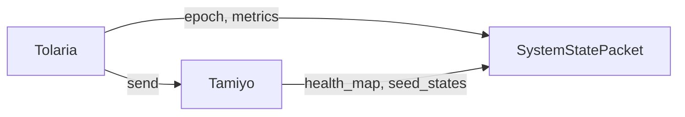
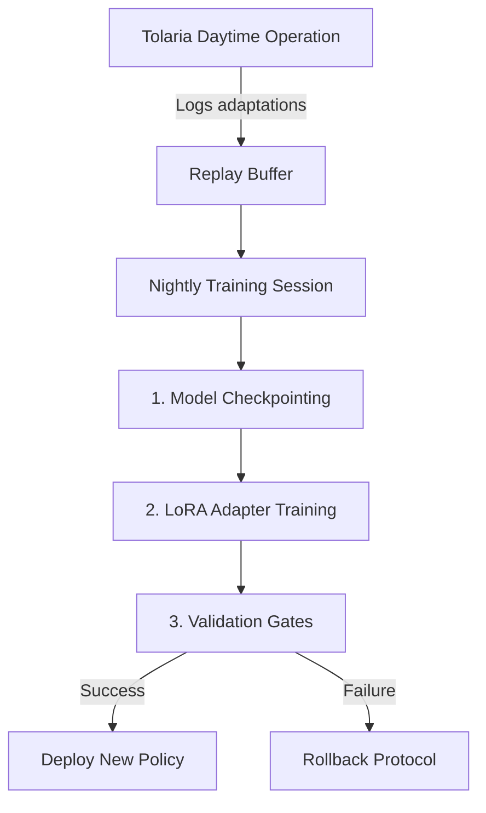
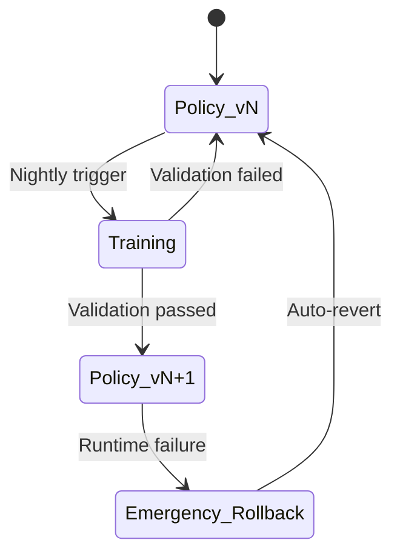

# **System Design Document: Tolaria, The Training Academy**

Version: 0.1a  
Status: Drafting  
Date: 23 June 2025  
Author: John Morrissey, Gemini AI

## **1. Overview and Purpose**

### **1.1. Role in the Esper Ecosystem**

**Tolaria** is the foundational training environment for the Esper Morphogenetic Platform. It is not a passive script but an intelligent, state-aware training academy responsible for orchestrating the entire learning process. Tolaria provides the structured, temporal context—the epochs and steps—within which the host model learns, and all other Esper components operate.

Its mandate is to:

* Manage the master training and validation loops.
* Load and serve data to the host model.
* Own and manage the core optimizer and learning rate schedulers.
* Provide the "heartbeat" for the Esper system by invoking the Tamiyo controller at the correct cadence.
* Dynamically rebuild the model's optimizer after a successful Kasmina graft operation.
* Check the `AdaptationSignal` object returned by `tamiyo.step()`. This object contains two critical flags: `optimizer_rebuild_required` and `emergency_rollback_required`, which Tolaria uses to manage the model's state.
* Execute an emergency rollback by restoring a checkpoint if the `emergency_rollback_required` flag is true.

Tolaria is the master process, the "world" in which the host model lives and evolves. It provides the stability and structure required for the dynamic adaptations orchestrated by Tamiyo and executed by Kasmina.

## **2. Architectural Model: The Epoch Lifecycle**

The core logic of Tolaria is defined by its epoch lifecycle. This sequence of operations ensures that training, validation, and morphogenetic adaptation occur in a well-defined, predictable order.

```mermaid
graph TD
    subgraph Tolaria Epoch Lifecycle
        A[Start Epoch] --> B[Training Loop];
        B --> C{For each batch in training_dataloader};
        C --> D[1. Forward Pass<br>(Model processes data, Kasmina seeds monitor)];
        D --> E[2. Calculate Loss];
        E --> F[3. Backward Pass<br>(Calculate gradients)];
        F --> G[4. Optimizer Step<br>(Update weights)];
        G --> C;

        C -- End of Training Batches --> H[Validation Loop];
        H --> I{For each batch in validation_dataloader};
        I --> J[1. Forward Pass (Inference Mode)];
        J --> K[2. Aggregate Global Metrics<br>(val_accuracy, val_loss)];
        K --> I;

        I -- End of Validation Batches --> L[End of Epoch Hook];
        L --> M[1. Assemble SystemStatePacket<br>(global_metrics, hardware_context, etc.)];
        M --> N[2. Invoke Tamiyo Controller<br><b>adaptation_signal = tamiyo.step(SystemStatePacket)</b>];
        N --> O{3. Check for Emergency Rollback<br><b>adaptation_signal.emergency_rollback_required?</b>};
        O -- Yes --> P[Restore Checkpoint<br>(Model & Tamiyo state)];
        P --> R[End Epoch];
        O -- No --> Q{4. Check for Optimizer Rebuild<br><b>adaptation_signal.optimizer_rebuild_required?</b>};
        Q -- Yes --> S[Rebuild Optimizer<br>with DynamicOptimizerManager];
        Q -- No --> R;
        S --> R;
    end
```

### **2.1. Lifecycle Stages Explained**

1. **Training Loop:** Tolaria iterates through the training dataset. During each forward pass, the `KasminaSeed` modules embedded in the model silently monitor their assigned chunks. Tolaria's optimizer updates the model weights as in a standard training regimen.
2. **Validation Loop:** After the training loop, Tolaria evaluates the model's performance on a held-out validation set. It computes the global performance metrics (e.g., validation\_accuracy, validation\_loss) that are critical inputs for Tamiyo's decision-making process.
3. **End-of-Epoch Hook:** This is the crucial integration point for the Esper system.
      * Tolaria gathers all global metrics into a `SystemStatePacket`.
      * It calls the `tamiyo.step()` method, ceding control to the morphogenetic controller and receiving an `AdaptationSignal` object in return.
      * It first checks the `emergency_rollback_required` flag. If true, it restores the last checkpoint and ends the epoch to ensure system stability.
      * If no rollback is needed, it then checks the `optimizer_rebuild_required` flag. This flag is set by Tamiyo after a blueprint has been successfully integrated (`FOSSILIZED`).
4. **Dynamic Optimizer Rebuilding:** If the `optimizer_rebuild_required` flag is set, Tolaria invokes its `DynamicOptimizerManager`. This component scans the newly modified model, identifies the new parameters from the grafted blueprint, and re-initializes the optimizer to include them in the training process. This is a critical step to ensure new capacity is actually trained.

## **3. Core Components and Data Structures**

### **3.1. The TolariaTrainer Class**

The TolariaTrainer class is the heart of the Tolaria system. It encapsulates the entire training process, managing the model, data loaders, optimizer, and interaction with the Tamiyo controller.

```python
class TolariaTrainer:
    def __init__(self, model: nn.Module, tamiyo: TamiyoController, config: TolariaConfig):
        self.model = model  
        self.tamiyo = tamiyo  
        self.config = config  
        self.train_loader, self.val_loader = self.setup_dataloaders()  
        self.optimizer_manager = DynamicOptimizerManager(model, config.optimizer_config)  
        self.optimizer = self.optimizer_manager.get_optimizer()  
        self.current_epoch = 0

class TolariaTrainer:
    def train(self):
        for epoch in range(config.num_epochs):
            self.current_epoch = epoch
            self._run_train_epoch()
            
            # Validation returns metrics AND stores state
            global_metrics = self._run_validation_epoch()
            
            # Use stored state from validation phase
            adaptation_signal = self.tamiyo.step(self.validation_state)

            if adaptation_signal.emergency_rollback_required:  
                print("Emergency rollback triggered. Restoring from checkpoint...")
                self.restore_from_checkpoint()
            else:
                self.create_checkpoint()  # Save the current state

            if adaptation_signal.optimizer_rebuild_required:  
                self.optimizer = self.optimizer_manager.rebuild_optimizer()

    def _run_train_epoch(self):  
        # Standard training loop logic...  
        pass

    def _run_validation_epoch(self) -> dict:
        """Runs validation and returns metrics."""
        self.tamiyo.on_epoch_boundary(self.current_epoch)
        global_metrics = self._run_validation()  # Your validation logic
        return global_metrics        

    def _run_validation_epoch(self) -> dict:
        """Runs validation and returns metrics."""
        # 1. Signal epoch boundary to Tamiyo FIRST
        self.tamiyo.on_epoch_boundary(self.current_epoch)
        
        # 2. Run validation (Tamiyo state now updated)
        global_metrics = self._run_validation()
        
        # 3. ASSEMBLE state packet in Tolaria
        system_state = SystemStatePacket(
            current_epoch=self.current_epoch,
            validation_accuracy=global_metrics['accuracy'],
            validation_loss=global_metrics['loss'],
            hardware_context=self.hardware_monitor.current(),
            health_map=self.tamiyo.health_map,  # Tamiyo provides
            seed_states=self.tamiyo.seed_states  # Tamiyo provides
        )
        
        # 4. PASS to Tamiyo's step() method
        return global_metrics  # For checkpointing

    def _assemble_system_state(self, metrics: dict) -> SystemStatePacket:  
        # Gathers metrics and context into the packet for Tamiyo  
        pass
    
    def create_checkpoint(self):
        """Saves the state of the model and the Tamiyo controller."""
        # Logic to save both model.state_dict() and tamiyo.save_state_dict()
        pass

    def restore_from_checkpoint(self):
        """Restores the state of the model and the Tamiyo controller."""
        # Logic to load both model.state_dict() and tamiyo.load_state_dict()
        pass
```



Figure 1. Information flow between Tolaria and Tamiyo at the end of each epoch.

```sequenceDiagram
    participant Tolaria
    participant KasminaSeeds
    participant Tamiyo

    Tolaria->>KasminaSeeds: Run training epoch
    KasminaSeeds->>Tamiyo: Push telemetry (async)
    Tolaria->>Tamiyo: on_epoch_boundary(epoch)
    Tamiyo->>Tamiyo: Rotate state (epoch_state = next_epoch_state)
    Tolaria->>Tolaria: Run validation
    Tolaria->>Tamiyo: Assemble SystemStatePacket
    Tamiyo->>KasminaSeeds: State transition commands
    Tamiyo->>Tolaria: AdaptationSignal
    alt Rollback needed
        Tolaria->>Tolaria: restore_from_checkpoint()
    else
        Tolaria->>Tolaria: create_checkpoint()
    end
```

Figure 2. Sequence diagram showing the interaction between Tolaria, KasminaSeeds, and Tamiyo during an epoch.

### **3.2. DynamicOptimizerManager**

This is a critical, non-standard component required for morphogenetic training. It is responsible for managing an optimizer whose parameter groups can change during the training run.

* **Responsibilities:**  
  * Initializes the optimizer with the model's starting parameters.  
  * Maintains a manifest of all parameters currently being trained.  
  * Provides a rebuild_optimizer method that scans the model for any new parameters (from a grafted blueprint) that are not in its manifest.  
  * Re-initializes the optimizer, preserving the state (e.g., momentum buffers in Adam) for existing parameters while creating new state for the new parameters.

### **3.3. TolariaConfig**

A unified configuration structure for the entire training run.

## **4. Integration Points**

Tolaria serves as the primary integration hub, connecting the static training world with the dynamic Esper components.

* **Tolaria → Tamiyo:**  
  * **Invocation:** At the end of each epoch, TolariaTrainer calls tamiyo.step(system_state).  
  * **Data Passed:** It provides the SystemStatePacket, containing validation_accuracy, validation_loss, current_epoch, and hardware context.  
  * **Signal Received:** It checks the optimizer_rebuild_required boolean flag returned by Tamiyo to know when to update its optimizer.  
* **Tolaria → Model (with Kasmina):**  
  * Tolaria treats the host model as a standard nn.Module. It is unaware of the internal KasminaSeed operations during the forward/backward pass.  
  * The key interaction is indirect: when Tolaria's DynamicOptimizerManager scans the model for new parameters, it discovers the components that Kasmina has added to the graph.

## **5. Initialization Sequence**

Setting up a training run with Tolaria follows a strict order:

1. **Load Configurations:** Load the TolariaConfig, which contains the subordinate TamiyoConfig and KasminaConfig.  
2. **Instantiate Model:** Build the host neural network. During this process, the KasminaSeed modules are injected into the specified layers according to the KasminaConfig.  
3. **Instantiate Tamiyo:** Create the TamiyoController instance using its configuration. Each KasminaSeed in the model is registered with this Tamiyo instance, establishing the link for commands and telemetry.  
4. **Instantiate Tolaria:** Create the TolariaTrainer instance, passing it the fully constructed model and the Tamiyo controller.  
5. **Begin Training:** Call tolaria_trainer.train() to start the academy.

### **6. Enabling Continuous Controller Learning**

**TODO: Evaluate whether Tamiyo and Karn will be trained inside this system, a separate subsystem or an external process, either way the methodology is the same.**

Tolaria provides the foundational infrastructure for Tamiyo's continuous improvement through nightly training sessions. This system enables safe policy evolution while maintaining operational stability.

#### **6.1. Training Pipeline Architecture**



#### **6.2. Core Mechanisms**

1. **State-Preserving Checkpoints**  
   Tolaria snapshots three critical states nightly:

   ```python
   def create_training_snapshot():
       return {
           'model': model.state_dict(),
           'tamiyo': tamiyo.save_state_dict(),
           'optimizer': optimizer_manager.manifest(),
           'hardware_env': hardware_monitor.current()
       }
   ```

2. **Hardware-Aware Training Sandbox**  
   Tolaria spins up isolated environments matching production specs:

   ```python
   class TrainingSandbox:
       def __init__(self, snapshot):
           # Mirror production hardware
           self.device = clone_hardware(snapshot['hardware_env'])
           # Load state-preserved models
           self.model.load_state_dict(snapshot['model'])
           self.tamiyo.load_state_dict(snapshot['tamiyo'])
           # Enable morphogenetic operations
           self.allow_adaptations = True
   ```

3. **Rollback-Safe LoRA Training**  
   Policy updates are isolated to modular adapters:

   ```python
   def train_nightly_policy(sandbox, replay_data):
       # Freeze base policy
       freeze_parameters(sandbox.tamiyo.base_policy)
       
       # Attach new LoRA adapter
       adapter = LoRAAdapter(previous_adapter=sandbox.tamiyo.active_adapter)
       sandbox.tamiyo.attach_adapter(adapter)
       
       # Train with EWC regularization
       loss = compute_ewc_loss(
           adapter, 
           replay_data,
           fisher_matrix=load_fisher('tamiyo_base')
       )
       adapter.update(loss)
       
       return adapter
   ```

#### **6.3. Validation Gates**

Before deployment, policies must pass:

```python
def validate_policy(adapter):
    # Historical task performance
    history_score = test_historical_tasks(adapter)
    
    # Hardware robustness
    hardware_stability = test_hardware_variations(adapter)
    
    # Novelty preservation
    diversity_score = compute_behavioral_diversity(adapter)
    
    return (history_score > 0.95 and 
            hardware_stability > 0.97 and
            diversity_score > 0.4)
```

#### **6.4. Version Control & Rollback**



### **7. Metrics & Monitoring***

Tolaria exposes key training metrics through its dashboard:

| **Metric** | Target | Alert Threshold |
|------------|--------|-----------------|
| Policy Update Success | ≥95% | <90% |
| Validation Divergence | ≤0.05 | >0.1 |
| Adapter Training Time | <30 min | >60 min |
| Hardware Coverage | 100% | <95% |

```python
class TrainingMonitor:
    def track_metrics(self):
        return {
            'policy_success_rate': self.successful_deploys / self.total_attempts,
            'hardware_coverage': len(self.tested_configs) / len(PRODUCTION_CONFIGS),
            'resource_utilization': self.training_time / self.allotted_time
        }
```

---
