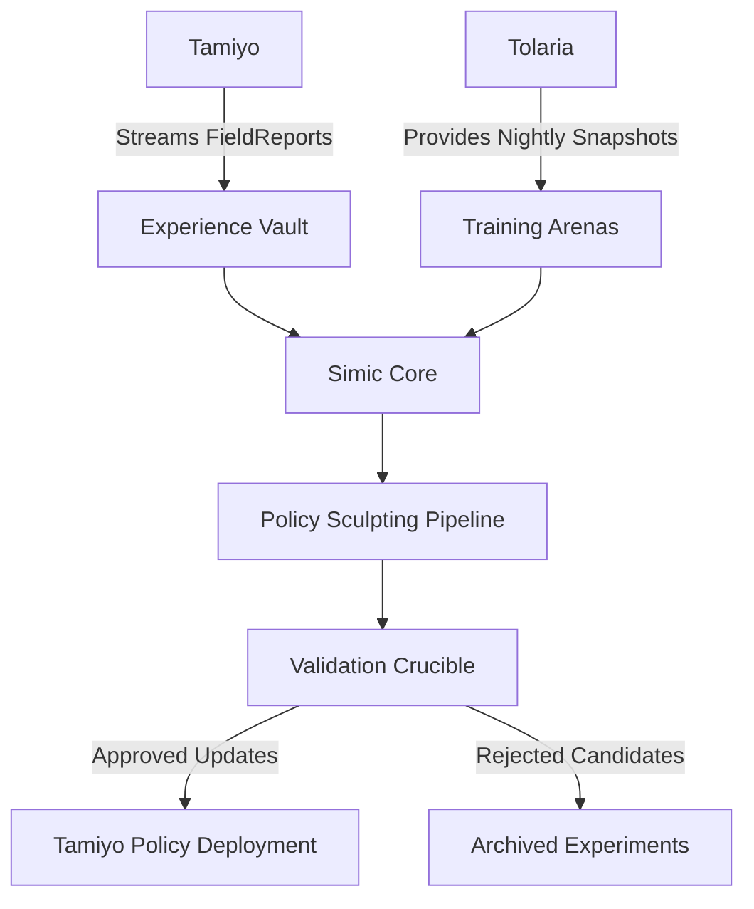
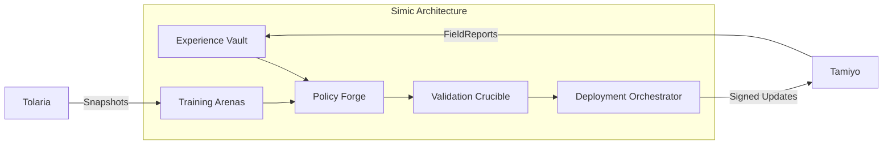
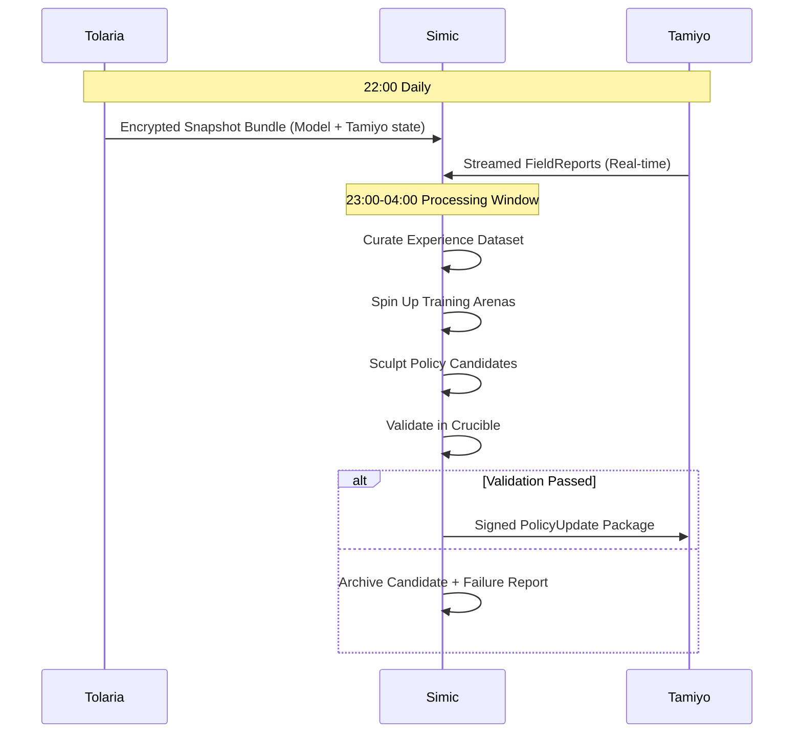
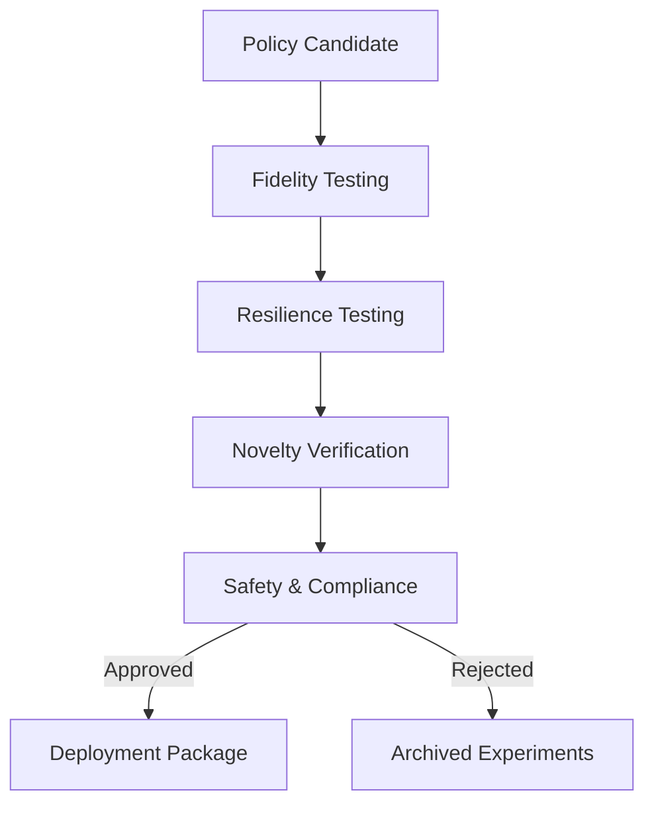
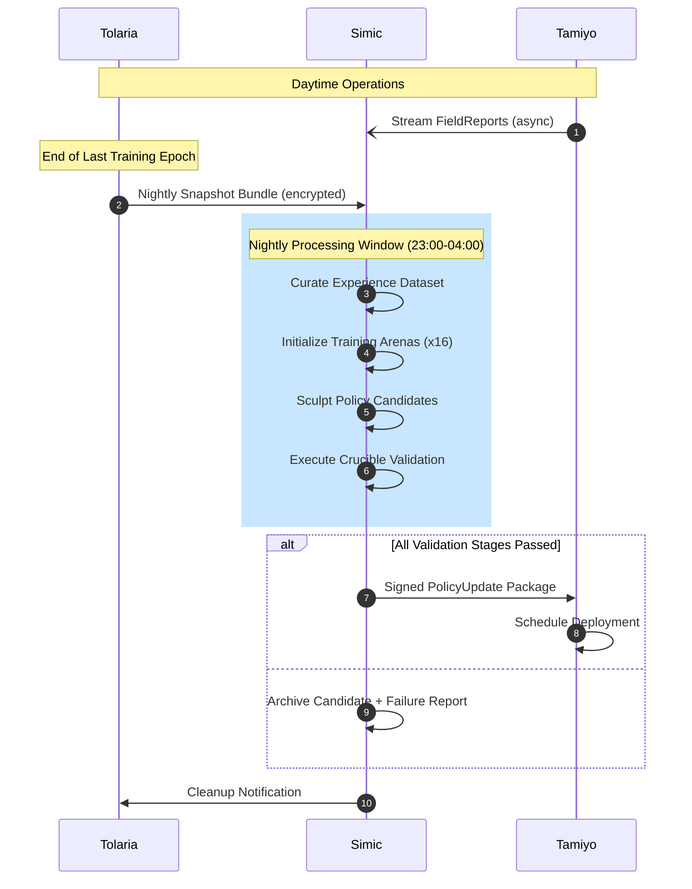
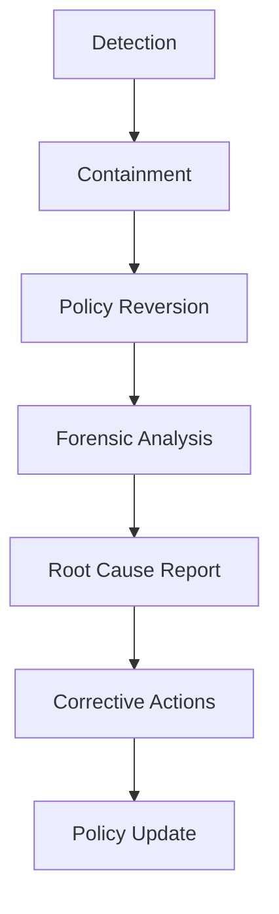

# **System Design Document: Simic, The Policy Sculptor**

**Version:** 0.2  
**Status:** Approved  
**Date:** 25 June 2025  
**Author:** John Morrissey, Gemini AI  

---

## **1. Mandate & Scope**

Simic is the autonomous policy evolution engine of the Esper Morphogenetic Platform. It is responsible for the **continuous improvement of Tamiyo's neural policy** through safe, offline experimentation that transforms adaptation experiences into strategic enhancements. Simic operates under three core principles:

1. **Evolutionary Stability**: Policy updates must preserve core competencies while enabling growth  
2. **Risk Containment**: All experimentation occurs in isolated environments with rollback guarantees  
3. **Contextual Intelligence**: Policies evolve with awareness of hardware, task domains, and regulatory requirements  



---

## **2. Architectural Overview**

### **2.1 System Components**



### **2.2 Data Flow**



---

## **3. Core Components**

### **3.1 Experience Vault**

Immutable, versioned store for all adaptation outcomes with cryptographic integrity guarantees.

**Schema:**

```python
class ExperienceKey(NamedTuple):
    blueprint_id: str
    hardware_profile: str
    task_domain: str
    outcome: Literal["FOSSILIZED", "CULLED", "ROLLED_BACK"]
    training_phase: int  # Curriculum stage
    host_model_hash: str  # SHA256 of host model config
    timestamp: datetime
    performance_metrics: dict  # Latency, memory, accuracy deltas

class ExperienceVault:
    def __init__(self):
        self.store = ImmutableBTree()
        self.index = MultiIndex([
            ('hardware_profile', 'task_domain'),
            ('blueprint_id', 'outcome'),
            ('training_phase', 'timestamp')
        ])
    
    def append(self, report: FieldReport):
        key = ExperienceKey(
            blueprint_id=report.blueprint_id,
            hardware_profile=report.hardware_context.device_type,
            task_domain=report.task_domain,
            outcome=report.outcome,
            training_phase=report.training_phase,
            host_model_hash=report.host_model_hash,
            timestamp=datetime.utcnow(),
            performance_metrics=report.eval_metrics
        )
        self.store[key] = report.raw_data
        self.index.add(key)
```

### **3.2 Training Arenas**

Hardware-accurate sandboxes with lifecycle management for policy experimentation.

```python
class TrainingArena:
    def __init__(self, snapshot: TolariaSnapshot):
        self.id = uuid4()
        self.hardware = self._clone_hardware(snapshot.hw_profile)
        self.model = self._load_model(snapshot.model_state)
        self.tamiyo = self._load_controller(snapshot.controller_state)
        self.isolation_level = HardwareVirtualization.LOCKED
    
    def _clone_hardware(self, profile):
        """Create hardware-equivalent environment"""
        return VirtualHardware(
            device_type=profile.device_type,
            memory=profile.memory_available_gb,
            compute=profile.compute_capacity_tflops,
            quantization=profile.supports_quantization
        )
    
    def execute_policy_update(self, policy_candidate):
        """Safe execution of policy experiments"""
        with self.isolation_context():
            # 1. Apply candidate policy
            self.tamiyo.load_policy(policy_candidate)
            
            # 2. Replay historical adaptations
            results = []
            for experience in self.vault.sample_validation_set():
                outcome = self.tamiyo.simulate_adaptation(experience)
                results.append(outcome)
            
            return PolicyTestResult(results)

class ArenaManager:
    def spin_up_arenas(self, count, snapshot):
        """Orchestrate parallel experimentation"""
        return [TrainingArena(snapshot) for _ in range(count)]
```

### **3.3 Policy Forge**

Neural policy refinement engine implementing cutting-edge ML techniques.

```python
class PolicyForge:
    def __init__(self, base_policy):
        self.fisher_matrix = self._compute_fisher(base_policy)
        self.ewc_anchor = EWCRegularizer(base_policy, self.fisher_matrix)
    
    def sculpt_policy(self, arena, experiences):
        # 1. Initialize from previous adapter
        lora = LoRAAdapter.load(arena.tamiyo.active_adapter)
        
        # 2. Apply hardware-aware dropout
        lora.add_module(
            "hw_dropout", 
            HardwareAwareDropout(p=0.15)
        )
        
        # 3. Configure trainer with EWC regularization
        trainer = PolicyTrainer(
            regularizers=[self.ewc_anchor],
            optimizer=HybridAdamW(lr=3e-5),
            callbacks=[NoveltyBoostSampler()]
        )
        
        # 4. Train on balanced experience dataset
        trainer.fit(
            model=lora,
            dataloader=experiences.balanced_dataloader(
                strategy="hardware_task_weighted"
            )
        )
        
        # 5. Embed forensic watermark
        lora.embed_watermark(
            method="model_steganography",
            data=f"Simic:{datetime.utcnow().isoformat()}:Arena:{arena.id}"
        )
        
        return lora
```

### **3.4 Validation Crucible**

Four-stage validation framework ensuring policy robustness and compliance.



**Validation Stages:**

| Stage | Test Methodology | Pass Condition | Tools |
|-------|------------------|----------------|-------|
| **Fidelity** | Replay 500 historical adaptations | ≥98% decision parity | Adaptation Replayer |
| **Resilience** | Inject hardware faults (memory, clock, IO) | ≤3% performance delta | Chaos Engineering Toolkit |
| **Novelty** | Compare to last 5 policies | Cosine distance ≥0.25 | PolicyDiff Analyzer |
| **Safety** | Execute on HIPAA/FDA benchmark tasks | Zero compliance violations | Regulatory Compliance Suite |

---

## **4. Workflow**

### **4.1 Daily Processing Cycle**



### **4.2 Policy Rollout Protocol**

```python
class PolicyDeployer:
    DEPLOYMENT_WINDOW = range(1, 4)  # 01:00-04:00 Local Time
    
    def deploy(self, update: PolicyUpdate):
        # Phase 0: Pre-flight checks
        if datetime.now().hour not in self.DEPLOYMENT_WINDOW:
            raise DeploymentWindowError("Outside maintenance hours")
        
        if not update.validate_signature():
            raise SecurityError("Invalid package signature")
            
        # Phase 1: Shadow mode deployment
        tamiyo.enable_shadow_mode(update)
        shadow_metrics = collect_shadow_metrics(duration=30)
        
        # Phase 2: Canary deployment (5% of seeds)
        canary_seeds = select_canary_seeds(coverage=0.05)
        for seed in canary_seeds:
            seed.activate_with(update, monitoring_level=Monitoring.FULL)
        
        # Phase 3: Evaluation and full rollout
        if self._evaluate_deployment(shadow_metrics, canary_seeds):
            tamiyo.activate_policy(update)
            log_event(f"Policy {update.version} fully deployed")
        else:
            tamiyo.revert_policy(update.previous_version)
            alert(f"Rollback initiated for {update.version}")
    
    def _evaluate_deployment(self, shadow_metrics, canary_seeds):
        return (
            shadow_metrics.decision_parity >= 0.97 and
            canary_success_rate(canary_seeds) >= 0.95 and
            canary_health_metrics.stability >= 0.98
        )
```

---

## **5. Integration Points**

### **5.1 Input Interfaces**

**From Tolaria:**

```protobuf
message SnapshotBundle {
    bytes model_checkpoint = 1;
    bytes tamiyo_state = 2;
    HardwareContext hardware = 3;
    uint32 snapshot_version = 4;
    fixed64 timestamp = 5;
    bytes signature = 6;
}
```

**From Tamiyo:**

```protobuf
message FieldReportStream {
    repeated FieldReport reports = 1;
    bool end_of_stream = 2;
    uint32 sequence_id = 3;
    bytes integrity_hash = 4;
}
```

### **5.2 Output Interface**

**To Tamiyo:**

```protobuf
message PolicyUpdate {
    bytes adapter_weights = 1;
    string version = 2;  # Format: SIMIC_YYYYMMDD_REV
    bytes validation_report = 3;
    bytes watermark = 4;
    CompatibilityMatrix compatibility = 5;
    bytes signature = 6;  # ECDSA-P384 signature
    
    message CompatibilityMatrix {
        uint32 min_snapshot_version = 1;
        repeated string supported_hardware = 2;
        fixed64 valid_until = 3;
    }
}
```

---

## **6. Safety Mechanisms**

### **6.1 Containment Protocols**

| Mechanism | Description | Trigger Condition |
|-----------|-------------|-------------------|
| Arena Isolation | Hardware-virtualized containers | Always active |
| Network Quarantine | Zero external connectivity | During policy execution |
| Memory Lockdown | RWX permission enforcement | Always active |
| Execution Timeout | 45-minute hard limit | Per policy candidate |

### **6.2 Rollback Triggers**

```python
def monitor_crucible_execution():
    while crucible.active:
        # Monitor novelty preservation
        if novelty_score < 0.20:  
            crucible.halt("Novelty collapse detected")
            tamiyo.revert_policy(STABLE_VERSION)
        
        # Monitor hardware stability
        if hw_variance > 0.15:
            crucible.halt("Hardware instability")
            tamiyo.revert_policy(STABLE_VERSION)
        
        # Regulatory compliance failsafe
        if hipaa_violations > 0:
            crucible.halt("Compliance violation")
            tamiyo.revert_policy(STABLE_VERSION)
            alert_security_team()
```

### **6.3 Bounded Experimentation**

```python
def assign_experiment_profile(arena_id):
    # 70% standard experiments
    if arena_id % 10 < 7:
        return ExperimentProfile(
            risk_level="MODERATE",
            novelty_bound=0.35,
            blueprint_allow_list="STABLE"
        )
    
    # 30% high-novelty experiments
    return ExperimentProfile(
        risk_level="HIGH",
        novelty_bound=0.60,
        blueprint_allow_list="EXPERIMENTAL"
    )
```

---

## **7. Operational SLAs**

| Service Level Objective | Target | Measurement | Consequence |
|-------------------------|--------|-------------|-------------|
| Snapshot Delivery Latency | 95% <2hr after last epoch | Tolaria to Simic transfer time | Priority demotion |
| Policy Update Availability | 90% by 06:00 local | Successful daily deployments | Training credit refund |
| Crucible Validation Time | 99% <45min | Candidate processing time | Free retest |
| Rollback Execution | 100% <5min | Alert to stable recovery | Incident response review |
| Experience Freshness | 95% <15min ingestion | FieldReport receipt to vault storage | Data quality audit |

---

## **8. Recovery & Forensics**

### **8.1 Policy Reversion API**

```python
class TamiyoController:
    def revert_policy(self, version: str):
        """Rollback to specified policy version"""
        if version not in self.policy_registry:
            raise VersionError(f"Unknown policy version: {version}")
            
        self.active_adapter = self.policy_registry[version]
        self._notify_simic(f"Reverted to {version}")
        self.metrics.log_reversion_event(version)
```

### **8.2 Forensic Watermarking**

All policies contain embedded identifiers:

```python
class PolicyWatermark:
    def embed(self, policy, metadata):
        """Steganographic embedding in policy weights"""
        # 1. Generate identifier string
        watermark = f"SIMIC|{metadata['arena_id']}|{metadata['timestamp']}"
        
        # 2. Encode via least significant bits
        with torch.no_grad():
            for param in policy.parameters():
                flat = param.flatten()
                for i in range(min(len(watermark)*8, len(flat))):
                    bit = (watermark[i//8] >> (i % 8)) & 1
                    flat[i] = (flat[i] & ~1) | bit
```

### **8.3 Incident Response**



---

## **9. Evolution Roadmap**

| Quarter | Capability | Success Metrics |
|---------|------------|-----------------|
| **2025 Q3** | Baseline implementation | 85% successful nightly updates |
| **2025 Q4** | Regulatory compliance modules | HIPAA/FDA certification |
| **2026 Q1** | Multi-policy ensemble support | 5% decision quality improvement |
| **2026 Q2** | Federated policy learning | Cross-client knowledge sharing |
| **2026 Q3** | Autonomous meta-learning | 30% reduction in human oversight |

---

## **Conclusion**

Simic transforms Tamiyo from a static controller into a **continuously evolving strategic partner** that grows wiser with each adaptation cycle. By combining hardware-accurate arenas, EWC-anchored learning, and rigorous validation protocols, Simic enables safe policy evolution while maintaining operational stability. The subsystem exemplifies Esper's core philosophy of structured innovation through separation of concerns, providing the policy evolution plane that completes our triad of training, innovation, and strategic adaptation capabilities.
